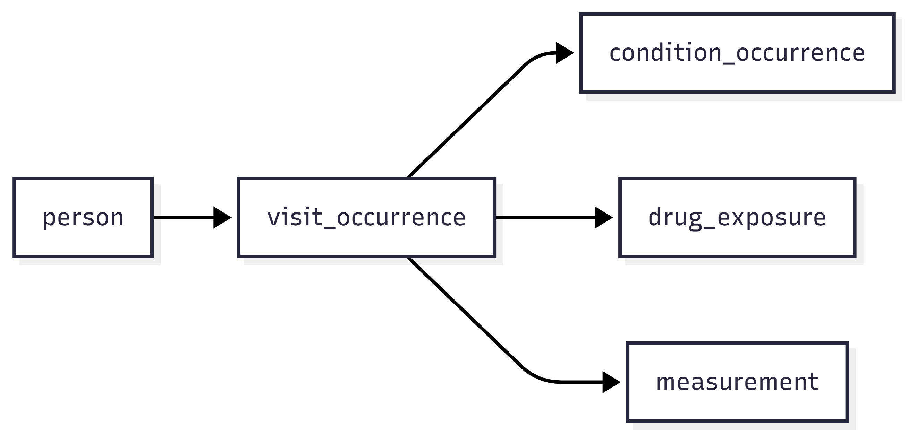

:::::::::::::::::::::::::::::::::::::: questions 

- Where does clinical data come from?
- Why is raw EHR data difficult to analyse directly?
- What does a data model do?
- Why is OMOP organised as linked tables?
- Why might OMOP data be stored in a relational database or as parquet files?

::::::::::::::::::::::::::::::::::::::::::::::::

::::::::::::::::::::::::::::::::::::: objectives

- describe where clinical data usually comes from
- explain why raw EHR data is often not analysis-ready
- explain the purpose of a common data model
- describe, at a high level, how OMOP organises clinical data
- distinguish between relational databases and parquet files as ways of storing and accessing OMOP data

::::::::::::::::::::::::::::::::::::::::::::::::

## Overview

Clinical data is generated during routine healthcare and usually first recorded in Electronic Health Record (EHR) systems. Although this data is rich and valuable, it is not collected mainly for research, so it often needs to be reorganised and standardised before analysis. This section introduces that journey from EHR data, to a common data model such as OMOP, to practical storage formats such as relational databases and parquet files.

## Clinical data starts in healthcare delivery

Clinical data is the information generated during routine healthcare. This includes things like

- demographic information
- visits and admissions
- diagnoses
- procedures
- medications
- laboratory results
- observations
- measurements such as blood pressure, height, and weight

In most organisations, this information is first recorded in an **Electronic Health Record (EHR)** system.

EHR systems are designed to support healthcare delivery. They help clinicians document what happened, communicate with colleagues, and manage the practical work of patient care. They may also support scheduling, billing, and legal record-keeping.

This means that EHR data is very valuable, but it is not automatically organised in a way that makes analysis easy.

### Why raw EHR data is difficult to analyse

Raw EHR data reflects the realities of clinical practice. That makes it rich, but it also makes it messy from an analytical point of view.

Common challenges include

- data being recorded for care rather than research
- similar information being stored differently across organisations
- information being spread across multiple systems or tables
- local coding systems and workflows varying from place to place
- records being incomplete, duplicated, or inconsistent

:::::::::::::::::::::::::::::::::::::::::::: callout

A useful way to think about this is:

EHR data reflects real clinical work, and real clinical work is complicated.

:::::::::::::::::::::::::::::::::::::::::::::::::::

For this reason, we often need to transform source data before using it for reproducible analysis.

## Why use a data model?

A **data model** is a shared blueprint for how data should be organised.

It defines

- what tables exist
- what each table represents
- how tables relate to one another
- how important concepts should be represented

Using a data model makes it easier to organise data consistently and reuse analyses across datasets.

In this course, we use the **OMOP Common Data Model**. OMOP provides standard tables for common types of healthcare data, such as people, visits, conditions, drugs, measurements, and observations. It also supports the use of standard vocabularies so that similar concepts can be represented more consistently across datasets.

This standardisation is one of the reasons OMOP is useful in collaborative and multi-site research.

### OMOP as linked tables

Clinical data is naturally relational.

For example

- one person can have many visits
- one visit can have many diagnoses
- one visit can have many measurements
- one patient can have repeated events over time

Because of that, OMOP is organised as a set of linked tables rather than one large flat file.

A simplified example looks like this.

{alt='A diagram showing how person data is recorded in an EHR, with different pieces of information stored in different tables.'}

## Why relational databases?

A **relational database** stores data in multiple tables that are linked together.

This works well for clinical data because healthcare events are naturally connected. For example

- one person can have many visits
- one visit can have many diagnoses
- one visit can have many measurements
- one patient can have many records over time

Instead of storing all of this in one large table, a relational database keeps different kinds of information in separate tables and links them using identifiers.

The flow chart for data is the same as above

This structure is useful because it

- reduces duplication
- preserves relationships between records
- supports efficient joins and queries
- fits the way OMOP organises data

When we ask analytical questions such as which patients had a particular diagnosis during a visit, or which lab results were recorded after a drug exposure, relational databases make it easier to combine information from multiple tables.

### Why not use one large flat table?

 A single flat table would repeat the same patient and visit information many times.

 This can make the data

 - harder to maintain
 - less efficient to store
 - more difficult to query correctly
 - more likely to contain duplication and inconsistency

 Relational databases avoid this by storing different kinds of information separately and linking them when needed.

::::::::::::::::::::::::::::::::::: challenge

 Imagine you are storing the following information

 - one patient
 - three visits
 - two diagnoses recorded during one visit
 - four measurements recorded across two visits

 Discuss with a partner

 1. Why might one large spreadsheet contain repeated information?
 2. Which pieces of information would make sense to store in separate tables?
 3. What would need to link those tables together?

:::::::::::::::::::::::: solution 

 In one large spreadsheet, the patient's details would need to be repeated on many rows. Visit details might also be repeated for each diagnosis or measurement linked to that visit.

 A relational structure would usually separate this into tables such as:

 - a person table for patient-level information
 - a visit table for visit-level information
 - a condition table for diagnoses
 - a measurement table for laboratory tests or vital signs

 These tables would be linked using identifiers such as a person identifier and a visit identifier.

:::::::::::::::::::::::::::::::::

:::::::::::::::::::::::::::::::::::::::::::::::

## Why parquet files?

**Parquet** is a file format designed for efficient analytical work.

Unlike a relational database, parquet stores data as files rather than as tables managed by a database server. It uses a **columnar** layout, which means values from the same column are stored together.

This is useful for analytical tasks because we often do not need every column in a table. For example, if we only need a person identifier, a date, and a measurement value, parquet can read those columns without loading everything else.

Parquet is useful because it

- stores data compactly
- supports good compression
- is fast to read for analytical queries
- works well with modern data tools
- is portable across computing environments

In an OMOP dataset, each table can be stored as parquet files while keeping the same structure and meaning as the database version.

### Columnar storage

 In a row-based layout, all values from one row are stored together.

 In a columnar layout, all values from one column are stored together.

 Columnar storage is often more efficient for analytics because many tasks use only a subset of columns.

::::::::::::::::::::::::::::::::::: challenge

 Imagine you are analysing a large **measurement** table and only need these columns

 - `person_id`
 - `measurement_date`
 - `value_as_number`

 Discuss with a partner

 1. Why might parquet be efficient for this task?
 2. What might be wasteful about reading the whole table if many other columns are not needed?
 3. Why might parquet be useful in a workflow that uses tools such as Arrow or DuckDB?

:::::::::::::::::::::::: solution 

 Parquet can be efficient because it allows analytical tools to read only the columns needed for the task.

 Reading the whole table would be wasteful if many columns are irrelevant, because it would use more memory and more reading time than necessary.

 Parquet is also useful with tools such as Arrow or DuckDB because those tools are designed to work efficiently with columnar file formats for large-scale analysis.

:::::::::::::::::::::::::::::::::

:::::::::::::::::::::::::::::::::::::::::::::::

::::::::::::::::::::::::::::::::::::: keypoints 

- Relational databases store data in multiple linked tables.
- This fits clinical data well because patients, visits, diagnoses, and measurements are naturally related.
- Separate tables reduce duplication and make querying easier.
- OMOP is well suited to relational databases because it is organised as linked tables.
- Parquet is a columnar file format designed for analytical workloads.
- It is efficient when only some columns from a table are needed.
- Parquet files are compact, portable, and work well with modern analytics tools.
- OMOP tables can be stored as parquet files while keeping the same data model structure.

::::::::::::::::::::::::::::::::::::::::::::::::
