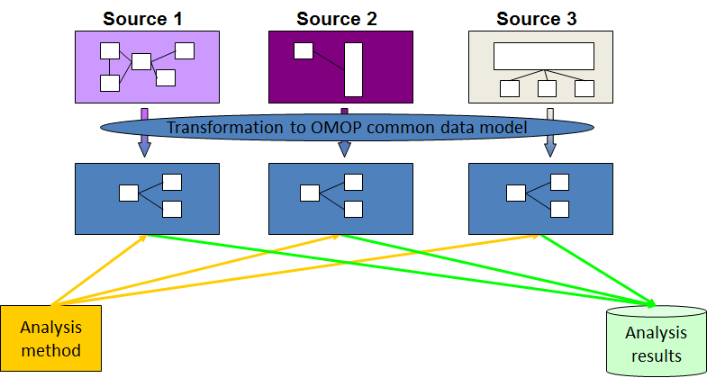

:::::::::::::::::::::::::::::::::::::: questions 

- What is OMOP?
- Why is using a standard important in healthcare data?
- How do OMOP tables relate to each other?
- What are concept_ids and how can we get an humanly readable name for them?

::::::::::::::::::::::::::::::::::::::::::::::::

::::::::::::::::::::::::::::::::::::: objectives
- Examine the diagram of the OMOP tables and the data specification
- Understand OMOP standardization and vocabularies
- Connect to an OMOP database and explore the `concept` table
- Get a humanly readable name for a concept_id
::::::::::::::::::::::::::::::::::::::::::::::::

## Setting up R

### Getting started

The "Projects" interface in RStudio not only creates a working directory for
you, but also remembers its location (allowing you to quickly navigate to it).
The interface also (optionally) preserves custom settings and open files to
make it easier to resume work after a break.

### Create a new project


::::::::::::::::::::::::::::::::::::: group-tab

### Experienced

Create a new project in the `workshop` directory from the course setup.

### Need a reminder

- Under the `File` menu in RStudio, click on `New project`, choose
  `Existing directory`, then browse to the workshop directory from the source step (e.g., `~/Desktop/omop_course/workshop`).
- Click on `Create project`
- Create a new file where we will type our scripts. Go to File > New File > R
  script. Click the save icon on your toolbar and save your script as
  "`lessons.R`".
:::::::::::::::::::::::::::::::::::::::::::::::
 
### Connect to a database

For this episode we will be using the `CDMConnector` package to connect to an OMOP Common Data Model database. We define a function that will open this package and connect an appropriate dataset. It is listed below but you will also find it in the `workshop/code/CDMConnector` directory that you should have downloaded. This package also contains synthetic example data that can be used to demonstrate querying the data.


``` r
library(dplyr)

# Connect to GiBleed if not already connected
if (!exists("cdm") || !inherits(cdm, "cdm_reference")) {
  db_name <- "GiBleed"
  CDMConnector::requireEunomia(datasetName = db_name)
  con <- DBI::dbConnect(duckdb::duckdb(),
                        dbdir = CDMConnector::eunomiaDir(datasetName = db_name))
  cdm <- CDMConnector::cdmFromCon(con, cdmSchema = "main", writeSchema = "main")
}
```

``` output

Download completed!
```

:::::::::::::::::::::::::::::::::::::::::::::::::::::::::::::::::::: instructor

Make sure everyone 
- has R open 
- has a project
- has managed to connect to the database

::::::::::::::::::::::::::::::::::::::::::::::::::::::::::::::::::::::::::::::::

## Introduction

OMOP is a format for recording Electronic Healthcare Records. It allows you to follow a patient journey through a hospital by linking every aspect to a standard vocabulary thus enabling easy sharing of data between hospitals, trusts and even countries.

### OMOP CDM Diagram

{alt='A diagram showing the tables that occur in the OMOP-CDM , how they relate to each other and standard vocabularies.'}

OMOP CDM stands for the Observational Medical Outcomes Partnership Common Data Model. You don't really need to remember what OMOP stands for. Remembering that CDM stands for Common Data Model can help you remember that it is a data standard that can be applied to different data sources to create data in a Common (same) format.
The table diagram will look confusing to start with but you can use data in the OMOP CDM without needing to understand (or populate) all 37 tables.

::::::::::::::::::::::::::::::::::: challenge

Look at the OMOP-CDM figure and answer the following questions:

1. Which table is the key to all the other tables?

2. Which table allows you to distinguish between different stays in hospital?

:::::::::::::::::::::::: solution 

1. The **Person** table

2. The **Visit_occurrence** table

:::::::::::::::::::::::::::::::::

:::::::::::::::::::::::::::::::::::::::::::::::

## Why use OMOP?

{alt='A diagram showing that different sources of data, transformed to OMOP, can then be used by multiple analysis tools.'}

Once a database has been converted to the OMOP CDM, evidence can be generated using standardized analytics tools. This means that different tools can also be shared and reused. So using OMOP can help make your research FAIR.

:::::::::::::::::::::::::::::::::::::::::::::::::::::::::::::::::::: instructor

Check that everyone knows what FAIR stands for

::::::::::::::::::::::::::::::::::::::::::::::::::::::::::::::::::::::::::::::::

Read in the database as above.

The data themselves are not actually read into the created cdm object.
Rather it is a reference that allows us to query the data from the database.

Typing `names(cdm)` will give a summary of the tables in the database  and we can look at these individually using the `$` operator and the `colnames` command.


### OMOP Tables


``` r
names(cdm)
```

``` output
 [1] "person"                "observation_period"    "visit_occurrence"     
 [4] "visit_detail"          "condition_occurrence"  "drug_exposure"        
 [7] "procedure_occurrence"  "device_exposure"       "measurement"          
[10] "observation"           "death"                 "note"                 
[13] "note_nlp"              "specimen"              "fact_relationship"    
[16] "location"              "care_site"             "provider"             
[19] "payer_plan_period"     "cost"                  "drug_era"             
[22] "dose_era"              "condition_era"         "metadata"             
[25] "cdm_source"            "concept"               "vocabulary"           
[28] "domain"                "concept_class"         "concept_relationship" 
[31] "relationship"          "concept_synonym"       "concept_ancestor"     
[34] "source_to_concept_map" "drug_strength"        
```

### Looking at the column names in each table


``` r
colnames(cdm$person)
```

``` output
 [1] "person_id"                   "gender_concept_id"          
 [3] "year_of_birth"               "month_of_birth"             
 [5] "day_of_birth"                "birth_datetime"             
 [7] "race_concept_id"             "ethnicity_concept_id"       
 [9] "location_id"                 "provider_id"                
[11] "care_site_id"                "person_source_value"        
[13] "gender_source_value"         "gender_source_concept_id"   
[15] "race_source_value"           "race_source_concept_id"     
[17] "ethnicity_source_value"      "ethnicity_source_concept_id"
```

:::::::::::::::::::::::::::::::::::::::::::::::::::::::::::::::::::: challenge

How do you think the `visit_occurrence` table is used to connect to the `person` table?

:::::::::::::::::::::::::::::::::::::::::::::::::::::::::::::::::::: solution


``` r
colnames(cdm$visit_occurrence)
```

``` output
 [1] "visit_occurrence_id"           "person_id"                    
 [3] "visit_concept_id"              "visit_start_date"             
 [5] "visit_start_datetime"          "visit_end_date"               
 [7] "visit_end_datetime"            "visit_type_concept_id"        
 [9] "provider_id"                   "care_site_id"                 
[11] "visit_source_value"            "visit_source_concept_id"      
[13] "admitting_source_concept_id"   "admitting_source_value"       
[15] "discharge_to_concept_id"       "discharge_to_source_value"    
[17] "preceding_visit_occurrence_id"
```

Looking at both tables we can see that they both have a column labelled `person_id` which could be used to link them together.

::::::::::::::::::::::::::::::::::::::::::::::::::::::::::::::::::::::::::::::::

::::::::::::::::::::::::::::::::::::::::::::::::::::::::::::::::::::::::::::::::

Notice that the `visit_concept_id` column in the `visit_occurrence` table is also a concept_id. This concept_id can be used to find out more information about the type of visit (e.g. inpatient, outpatient etc) by looking it up in the `concept` table. In this case the `visit_concept_id` is 9201 which relates to an inpatient visit. We can find this out by filtering the `concept` table for `concept_id` 9201 and selecting the `concept_name` column.


``` r
cdm$concept |>
  filter(concept_id == 9201) |>
  select(concept_name)
```

``` output
# Source:   SQL [?? x 1]
# Database: DuckDB 1.4.1 [unknown@Linux 6.8.0-1044-azure:R 4.5.3//tmp/Rtmpg3UJKh/file10701c9da98a.duckdb]
  concept_name   
  <chr>          
1 Inpatient Visit
```

**CODING_NOTE**: We use `filter` to identify the row(s) we want and `select` to choose the column(s) we want. These are functions from the dplyr package that can make code clearer by chaining instructions together and can be used for a local R object or database connection. If we were working with a local R object we could use also base R code: `cdm$concept$concept_name[cdm$concept$concept_id == 9201]` to get the same result - however this would command would not work with a database connection.

### A useful function

Finding the humanly readable name for a `concept_id` will be a useful function. We can create a function `get_concept_name()` that takes the 'cdm' object and a `concept_id` as an input and returns the `concept_name`.

:::::::::::::::::::::::::::::::::::::::::::::::::::::::::::::::::::: challenge

Create the function `get_concept_name()` that takes the 'cdm' object and a `concept_id` as an input and returns the `concept_name`.

:::::::::::::::::::::::::::::::::::::::::::::::::::::::::::::::::::: solution


``` r
get_concept_name <- function(cdm_obj, id) {
  cdm_obj$concept |>
    filter(concept_id == id) |>
    select(concept_name) |>
    pull()
}
```

::::::::::::::::::::::::::::::::::::::::::::::::::::::::::::::::::::::::::::::::

::::::::::::::::::::::::::::::::::::::::::::::::::::::::::::::::::::::::::::::::

#### Explanation of function code
- The function is called `get_concept_name` and it takes two arguments, `cdm_obj` and `id`.
- Inside the function, we query the `concept` table from the `cdm_obj` object.
- We use the `filter` function to select rows where the `concept_id` matches the input `id`.
- We then use `select` to choose only the `concept_name` column from the filtered results.
- Finally, we use `pull()` to extract the `concept_name` as a vector, which is returned by the function. We need to use this because we are querying a remote database, not one that is local.

::::::::::::::::::::::::::::::::::::: keypoints 

- Using a standard makes it much easier to share data
- OMOP uses concepts to link different tables together
- The `concept` table contains humanly readable names for concept_ids

::::::::::::::::::::::::::::::::::::::::::::::::
