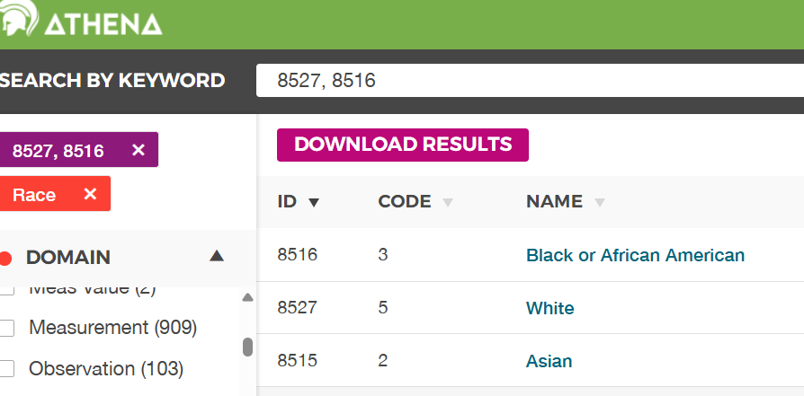

:::::::::::::::::::::::::::::::::::::: questions 

- Where to find other concept_ids in OMOP

- How to link OMOP tables

::::::::::::::::::::::::::::::::::::::::::::::::

::::::::::::::::::::::::::::::::::::: objectives

- Understand that there are many other concept_ids in OMOP tables and that these are usually named with a _concept_id suffix.

- Learn how to link OMOP tables using common identifiers such as person_id and visit_occurrence_id.

- Be able to use the concept table to look up humanly readable names for various concept_ids.

- Use joins to combine data from multiple OMOP tables based on common identifiers.

::::::::::::::::::::::::::::::::::::::::::::::::

## Introduction

In this episode, we will explore more concepts related to the OMOP Common Data Model (CDM). We will focus on understanding how different tables in the OMOP CDM are linked together through common identifiers. This knowledge is crucial for effectively querying and analysing healthcare data stored in the OMOP format.

::::::::::::::::::::::::::::::::::::::::::::::::callout

### Set up the database connection and import the get_concept_name function


``` r
library(CDMConnector)

db_name <- "GiBleed"
CDMConnector::requireEunomia(datasetName = db_name)
```

``` output

Download completed!
```

``` r
db <- DBI::dbConnect(duckdb::duckdb(),
                     dbdir = CDMConnector::eunomiaDir(datasetName = db_name))

cdm <- CDMConnector::cdmFromCon(con = db, cdmSchema = "main",
                                writeSchema = "main")
```


``` r
library(dplyr)
get_concept_name <- function(id) {
  cdm$concept |>
    filter(concept_id == !!id) |>
    select(concept_name) |>
    pull()
}
```

::::::::::::::::::::::::::::::::::::::::::::::::

## Other concept_ids in OMOP

In addition to the `concept_id` column in various OMOP tables, there are several other columns that use *_concept_ids provide information.

Look at the column names of the `person` table.

``` r
colnames(cdm$person)    
```

``` output
 [1] "person_id"                   "gender_concept_id"          
 [3] "year_of_birth"               "month_of_birth"             
 [5] "day_of_birth"                "birth_datetime"             
 [7] "race_concept_id"             "ethnicity_concept_id"       
 [9] "location_id"                 "provider_id"                
[11] "care_site_id"                "person_source_value"        
[13] "gender_source_value"         "gender_source_concept_id"   
[15] "race_source_value"           "race_source_concept_id"     
[17] "ethnicity_source_value"      "ethnicity_source_concept_id"
```

Several of these columns end with `_concept_id`, such as `gender_concept_id`, `race_concept_id`, and `ethnicity_concept_id`. These columns link to the `concept` table to provide humanly readable names for the concepts represented by these IDs.

For example, to get the gender name for a person, you can use the `gender_concept_id` column in the `person` table and look it up in the `concept` table.

Unfortunately, the database we are using does not have any concept data relating to the `race_concept_id` so we have provided a snapshot of the relevant Athena data below.

{alt='A snapshot of the Athena concepts table showing some race concept ids.'}

::::::::::::::::::::::::::::::::::: callout

Use the lists of concept ideas and the code below to create some mini tables.


``` r
library(dplyr)


patients <- c(1, 2, 3, 5, 6, 7, 9, 11, 12, 16)

visits <- c(79, 107, 262, 493, 561, 630, 771, 943, 1017, 1196)

mini_person <-
  cdm$person |>
    filter(person_id %in% patients) |>
    select(
      person_id, 
      year_of_birth, 
      gender_concept_id, 
      race_concept_id
    ) |>
    arrange(person_id) |>
    collect()

mini_condition_occurrence <-
  cdm$condition_occurrence |>
    filter(visit_occurrence_id %in% visits) |>
    select(
      condition_occurrence_id,
      person_id,
      condition_concept_id,
      condition_start_date,
      visit_occurrence_id
    ) |> 
    arrange(person_id) |>
    collect()    

mini_drug_exposure <-
  cdm$drug_exposure |>
    filter(visit_occurrence_id %in% visits) |>
    select(
      drug_exposure_id,
      person_id,
      drug_concept_id,
      visit_occurrence_id
    ) |> 
    arrange(person_id) |>
    collect()    
```
::::::::::::::::::::::::::::::::::::::::::::::::

Using the tables above, try to find the humanly readable names for the various concept_ids using the `get_concept_name()` function we created earlier.

::::::::::::::::::::::::::::::::::: challenge

Using the `mini_person`, `mini_condition_occurrence`, and `mini_drug_exposure` tables created above, find the humanly readable names for the various concept_ids using the `get_concept_name()` function and answer the following questions:

1. What is the gender of the Asian patient in the `mini_person` table?

2. How many men and women are in the table?

3. What condition is associated with the drug "Aspirin 81 MG Oral Tablet" ?

::::::::::::::::::::::::::::::::::: solution

1. From the diagram above, we can see that the race_concept_id for an Asian person is 8515. There is only one person in the `mini_person` table with this race concept. 
They have a gender_concept_id of 8507. Using the `get_concept_name()` function, 


``` r
get_concept_name(8507)
```

``` output
[1] "MALE"
```

The asian patient is male.


2. The table is small enough to actually count by hand but also we can use dplyr to count the number of men and women.


``` r
# Because we are getting our data from a database, let's create a mini version # of the concepts we want

gender_concept <- cdm$concept |> 
  filter(concept_id %in% c(8507, 8532)) |>
  select(concept_id, concept_name) |> 
  collect()

# Now we can join to get the names
mini_person |> 
  left_join(gender_concept, by = c("gender_concept_id" = "concept_id")) |>
  group_by(concept_name) |>
  summarise(count = n()) 
```

``` output
# A tibble: 2 × 2
  concept_name count
  <chr>        <int>
1 FEMALE           6
2 MALE             4
```

3. First, we need to find the concept_id for "Aspirin 81 MG Oral Tablet".


``` r
aspirin_concept_id <- cdm$concept |>
  filter(concept_name == "Aspirin 81 MG Oral Tablet") |>
  select(concept_id) |>
  pull()
```
Next, we can use this concept_id to find the associated condition in the `mini_drug_exposure` table and then look up the condition name.


``` r
condition_concept_id <- mini_drug_exposure |>
  filter(drug_concept_id == aspirin_concept_id) |>
  select(person_id) |>
  left_join(mini_condition_occurrence, by = "person_id") |>
  select(condition_concept_id) |>
  pull()  
get_concept_name(condition_concept_id)
```

``` output
[1] "Otitis media"
```
::::::::::::::::::::::::::::::::::::::::::::::::

::::::::::::::::::::::::::::::::::::::::::::::::

::::::::::::::::::::::::::::::::::::: keypoints 

- OMOP tables contain many concept_ids, usually named with a _concept_id suffix.

- The concept table can be used to look up humanly readable names for various concept_ids.

- OMOP tables can be linked using common identifier.

::::::::::::::::::::::::::::::::::::::::::::::::
