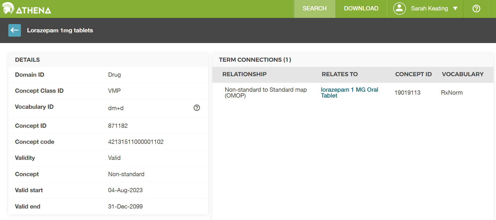

    
:::::::::::::::::::::::::::::::::::::: questions 

- Where are medications stored ?

- How do you trace the relationship between concepts from different vocabularies?

::::::::::::::::::::::::::::::::::::::::::::::::

::::::::::::::::::::::::::::::::::::: objectives

- Know that exposure of a patient to medications is mainly stored in the drug_exposure table

- Understand that drug concepts can be at different levels of granularity

- Understand that source values are mapped to a standard vocabulary

::::::::::::::::::::::::::::::::::::::::::::::::

## Introduction

This episode considers medications (the drug exposure table) in the OMOP Common Data Model (CDM).

:::::::::::::::::::::::::::::::::::::::::::::::: callout

For this episode we will be using a sample OMOP CDM database that is pre-loaded with data. This database is a simplified version of a real-world OMOP CDM database and is intended for educational purposes only.

(UCLH only) This will come in the same form as you would get data if you asked for a data extract via the SAFEHR platform (i.e. a set of parquet files).

As part of the setup prior to this course you were asked to download and install the sample database. If you have not done this yet, please refer to the setup instructions provided earlier in the course. For now, we will assume that you have the sample OMOP CDM database available on your local machine at the following path: `workshop/data/public/` and the functions in a folder `workshop/code`.

You will then need to load the database as shown in the previous episode.


``` r
open_omop_dataset <- function(dir) {
  open_omop_schema <- function(path) {
    # iterate table level folders
    list.dirs(path, recursive = FALSE) |>
      # exclude folder name from path
      # and use it as index for named list
      purrr::set_names(~ basename(.)) |>
      # "lazy-open" list of parquet files
      # from specified folder
      purrr::map(arrow::open_dataset)
  }
  # iterate top-level folders
  list.dirs(dir, recursive = FALSE) |>
    # exclude folder name from path
    # and use it as index for named list
    purrr::set_names(~ basename(.)) |>
    purrr::map(open_omop_schema)
}
```


``` r
omop <- open_omop_dataset("./data/")
```

and the useful functions we created in the previous episode to look up concept names/ids.


``` r
library(arrow)
library(dplyr)
get_concept_name <- function(id) {
  omop$public$concept |>
    filter(concept_id == !!id) |>
    select(concept_name) |>
    collect()
}
```


``` r
get_concept_id <- function(name) {
  omop$public$concept |>
    filter(concept_name == !!name) |>
    select(concept_id) |>
    collect()
}
```

::::::::::::::::::::::::::::::::::::::::::::::::

## Drug exposure

The OMOP [drug_exposure](https://ohdsi.github.io/CommonDataModel/cdm54.html#drug_exposure) table stores exposure of a patient to medications. The purpose of records in this table is to indicate an exposure to a certain drug as best as possible. In this context a drug is defined as an active ingredient. Drug Exposures are defined by Concepts from the Drug domain, which form a complex hierarchy. As a result, one `drug_source_concept_id` may map to multiple standard `concept_id`s if it is a combination product. Records in this table represent prescriptions written, prescriptions dispensed, and drugs administered by a provider to name a few. The `drug_type_concept_id` can be used to find and filter on these types. This table includes additional information about the drug products, the quantity given, and route of administration.

### The `drug_exposure` table contains the following columns (among others not listed here):
| Column Names          | Description of content |
|-----------------------|---------------------------------------|
| **drug_exposure_id** | Unique identifier for each drug exposure |
| **person_id** | Identifier for the patient |
| **drug_concept_id** | Standard concept identifier for the drug |
| **drug_exposure_start_date** | Date the drug exposure started |
| **drug_exposure_start_datetime** | Date and time the drug exposure started |
| **drug_exposure_end_date** | Date the drug exposure ended |
| **drug_exposure_end_datetime** | Date and time the drug exposure ended |
| **drug_type_concept_id** | Concept identifier for the type of drug exposure |
| **quantity** | The quantity of the drug administered |
| **route_concept_id** | Concept identifier for the route of administration |
| **visit_occurrence_id** | Identifier for the visit during which the drug was administered |
| **drug_source_concept_id** | OMOP concept ID for the source value |

Drug data can be very complicated, as can the process of converting from the source data to OMOP. You may not find what you expect depending on this and the quality of the source data. 

## Drug concepts

The standard OHDSI drug vocabularies are called `RxNorm` and `RxNormExtension`. `RxNorm` contains all drugs currently on the US market. `RxNormExtension` is maintained by the OHDSI community and contains all other drugs.

A particular concept_id can be at one of a number of different levels in a drug hierarchy. 

::::::::::::::::::::::::::::::::: challenge

List the main levels of drug concepts in RxNorm.

::::::::::::::::::::::::::::::::: solution


``` r
omop$public$concept |>
  filter(vocabulary_id == "RxNorm") |>
  select(concept_class_id) |>
  collect() |>
  distinct() |>
  arrange(concept_class_id)
```

``` output
# A tibble: 4 × 1
  concept_class_id  
  <chr>             
1 Clinical Drug     
2 Clinical Drug Form
3 Ingredient        
4 Quant Branded Drug
```

***Answer:*** There are more levels than shown here, but that is a disadvantage of using a small sample database. In a full OMOP CDM database you would see more levels.

**CODING NOTE**: The `distinct()` function is used to get unique values of `concept_class_id` for the RxNorm vocabulary. The `arrange()` function is then used to sort these values in alphabetical order for easier reading.

::::::::::::::::::::::::::::::::::::::::::::::::::
::::::::::::::::::::::::::::::::::::::::::::::::::

A fuller example of the drug concept hierarchy in RxNorm is shown in the table below.

| RxNorm concept_class_id                | Description |
|--------------------------------|-------------|
| **Clinical Drug**              | A combination of an ingredient, strength, and dose form (e.g., *Ibuprofen 200 mg Oral Tablet*). |
| **Clinical Drug Comp**    | A drug component with strength but no form (e.g., *Ibuprofen 200 mg*). |
| **Clinical Drug Form**         | A drug with a specific dose form but no strength (e.g., *Ibuprofen Oral Tablet*). |
| **Quant Clinical Drug**         | A clinical drug with a specific quantity (e.g., *Ibuprofen 200 mg Oral Tablet 1*). |
| **Ingredient**                 | A base active drug ingredient, without strength or dose form (e.g., *Ibuprofen*). |

There are also concepts for Branded drugs and for packs of drugs (e.g. a box of 30 tablets) but these are not shown in this sample table.


## Drug mapping in the NHS

Drugs in the NHS are standardised to the NHS Dictionary of Medicines and Devices (dm+d). dm+d is included in OMOP so there are values of OMOP concept_id for each dm+d. However because dm+d is not a standard vocabulary in OMOP it is translate once more to get to a standard OMOP concept id in `RxNorm` or `RxNormExtension` that can be used in collaborative studies. If there is a drug_concept_id value of 0 and there are source codes this can be because that drug doesn't map to a standard ID. Reminder that the source values are stored in these columns.

::::::::::::::::::::::::::::::::: challenge

Look up the `concept_id` **871182** and find the corresponding `RxNorm` `concept_id`.

::::::::::::::::::::::::::::::::: solution

``` r
library(dplyr)
# make a copy of the concept table
concepts <- omop$public$concept |> collect()
# look up the concept entry
dmd_concept_1 <- concepts |>
  filter(concept_id == 871182) |>
  select(concept_id, concept_name, domain_id, vocabulary_id, concept_class_id) |>
  collect()
dmd_concept_1
```

``` output
# A tibble: 1 × 5
  concept_id concept_name          domain_id vocabulary_id concept_class_id
       <int> <chr>                 <chr>     <chr>         <chr>           
1     871182 Lorazepam 1mg tablets Drug      dm+d          VMP             
```

``` r
# this is the dose of lorazepam
# now look up any concepts that have a similar name
similar <- filter(concepts, grepl('Lorazepam', concept_name, TRUE))
similar
```

``` output
# A tibble: 4 × 6
  concept_id concept_name               domain_id vocabulary_id standard_concept
       <int> <chr>                      <chr>     <chr>         <chr>           
1     871182 Lorazepam 1mg tablets      Drug      dm+d          ""              
2   19019113 lorazepam MG Oral Tablet   Drug      RxNorm        "S"             
3   35777064 1 ML Lorazepam 4 MG/ML In… Drug      RxNorm Exten… "S"             
4   36816707 Lorazepam 4mg/1ml solutio… Drug      dm+d          ""              
# ℹ 1 more variable: concept_class_id <chr>
```

***Answer:*** We can see from the resulting table that there are entries for each lorazepam dose from both the dm+d and RxNorm vocabularies. The `concept_id` **871182** corresponds to the dm+d concept "Lorazepam 1mg tablets". This seems maps to the RxNorm concept "lorazepam Oral Tablet" which has `concept_id` **19019113**, but without knowing the quantity we can't be sure which dose it maps to. This is an example of the complexity of drug data and the mapping process.

**CODING_NOTE**: The function `grepl()` is used to find all concepts that have "Lorazepam" in their name. We have added the `ignore.case = TRUE` argument to make the search case-insensitive. This allows us to find all relevant concepts regardless of how they are capitalized in the concept names.


::::::::::::::::::::::::::::::::::::::::::::::::::
::::::::::::::::::::::::::::::::::::::::::::::::::

This is a snapshot of the Athena table for code 871182. Athena is the OHDSI tool for exploring the OMOP vocabularies and concept relationships. It is available online at https://athena.ohdsi.org/. You can use it to look up concepts and their relationships to other concepts in the OMOP CDM.

{alt='A snapshot of the Athena table for code 871182.'}

Looking at the entry for `concept_id` **871182** we can see that it is in the dm+d vocabulary. We can see that is connected to the RxNorm concept "lorazepam 1 MG Oral Tablet" which has `concept_id` **19019113**. So our assumption above was correct, but the concept table in our dataset didn't fill in the name fully so we couldn't be sure without looking it up in the  official table.

## Quantity

::::::::::::::::::::::::::::::::: challenge

Work out what drugs person_id **2** was exposed to and the quantity of each drug.

Remember you may need to look at the drug_concept_id and drug_source_concept_id to find the drug name and size a tablet.

::::::::::::::::::::::::::::::::: solution

``` r
# make a copy of the drug_exposure table
drug_exposure <- omop$public$drug_exposure |> collect()
# filter for person_id 2
person_2_drugs <- drug_exposure |>
  filter(person_id == 2) |>
  select(drug_concept_id, drug_source_concept_id, quantity) |>
  collect()
# now create a table with humanly readable names for the drug_concept_id and drug_source_concept_id.
# first, get the concept names for drug_concept_id
concept_names <- concepts |>
  select(concept_id, concept_name) |>
  rename(drug_concept_name = concept_name)
# join with person_2_drugs
person_2_drugs <- person_2_drugs |>
  left_join(concept_names, by = c("drug_concept_id" = "concept_id"))
# now get the concept names for drug_source_concept_id
source_concept_names <- concepts |>
  select(concept_id, concept_name) |>
  rename(drug_source_concept_name = concept_name)
# join with person_2_drugs
person_2_drugs <- person_2_drugs |>
  left_join(source_concept_names, by = c("drug_source_concept_id" = "concept_id"))
person_2_drugs
```

``` output
# A tibble: 7 × 5
  drug_concept_id drug_source_concept_id quantity drug_concept_name             
            <int>                  <int>    <dbl> <chr>                         
1        19019113                 871182     1    lorazepam MG Oral Tablet      
2        40180065                 874635     1    promethazine hydrochloride 25…
3        19019113                 871182     1    lorazepam MG Oral Tablet      
4        35777064               36816707     0.25 1 ML Lorazepam 4 MG/ML Inject…
5        21049614               21255277     0    100 ML Glucose 50 MG/ML Injec…
6        35778239               36817124     1    2 ML Ondansetron 2 MG/ML Inje…
7        40180065                 874635     1    promethazine hydrochloride 25…
# ℹ 1 more variable: drug_source_concept_name <chr>
```
***Answer:*** Person_id 2 was exposed to three drugs. 
- They had three doses of lorazepam: two separate doses of 1 x 1mg lorazepam tablets and one dose of 0.25 x 4mg/ml injectable lorazepam.
- They had two doses of 1 x 25mg promethazine hydrochloride tablets. 
- They had one dose of 1 x 2mg/ml injectable ondansetron.

(Note the quantity of glucose is zero.)

**CODING NOTE**: We first filter the `drug_exposure` table for `person_id` **2** and select the relevant columns. Then we join this with the `concepts` table twice to get the human-readable names for both the `drug_concept_id` and the `drug_source_concept_id`. The resulting table shows the drugs person_id **2** was exposed to along with their quantities and names.

::::::::::::::::::::::::::::::::::::::::::::::::::
::::::::::::::::::::::::::::::::::::::::::::::::::

## Administration route

::::::::::::::::::::::::::::::::: challenge

Find the route of administration for the drugs person_id **2** was exposed to.

::::::::::::::::::::::::::::::::: solution

``` r
# we can use the same table we created in the previous challenge
# we just need to get the route_concept_id and look up the name for that
person_2_drugs <- drug_exposure |>
  filter(person_id == 2) |>
  select(drug_concept_id, drug_source_concept_id, quantity, route_concept_id) |>
  collect() |>
  left_join(concept_names, by = c("drug_concept_id" = "concept_id")) |>
  left_join(source_concept_names, by = c("drug_source_concept_id" = "concept_id"))
# now get the concept names for route_concept_id
route_concept_names <- concepts |>
  select(concept_id, concept_name) |>
  rename(route_concept_name = concept_name)
# join with person_2_drugs
person_2_drugs <- person_2_drugs |>
  left_join(route_concept_names, by = c("route_concept_id" = "concept_id"))
person_2_drugs
```

``` output
# A tibble: 7 × 7
  drug_concept_id drug_source_concept_id quantity route_concept_id
            <int>                  <int>    <dbl>            <int>
1        19019113                 871182     1             4132161
2        40180065                 874635     1             4132161
3        19019113                 871182     1             4132161
4        35777064               36816707     0.25          4302612
5        21049614               21255277     0             4171047
6        35778239               36817124     1             4171047
7        40180065                 874635     1             4132161
# ℹ 3 more variables: drug_concept_name <chr>, drug_source_concept_name <chr>,
#   route_concept_name <chr>
```

**CODING NOTE**: We follow a similar process as in the previous challenge, but this time we also select the `route_concept_id` and join it with the `concepts` table to get the human-readable name for the route of administration. The resulting table now includes the route of administration for each drug exposure.

::::::::::::::::::::::::::::::::::::::::::::::::::
::::::::::::::::::::::::::::::::::::::::::::::::::


::::::::::::::::::::::::::::::::::::: keypoints 

- Know that exposure of a patient to medications is mainly stored in the drug_exposure table
- Understand that drug concepts can be at different levels of granularity
- Understand that source values are mapped to a standard vocabulary

::::::::::::::::::::::::::::::::::::::::::::::::


