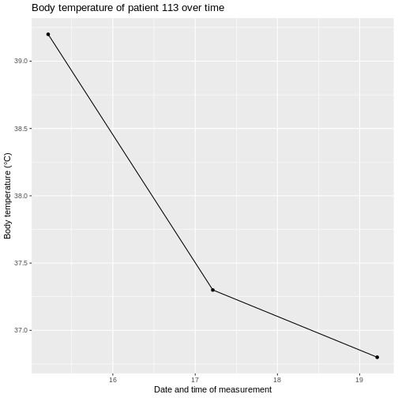

:::::::::::::::::::::::::::::::::::::: questions 

- What is the duration of an event?

- How can I view trends in measurements?:

::::::::::::::::::::::::::::::::::::::::::::::::

::::::::::::::::::::::::::::::::::::: objectives

- Know that dates and times are used in most tables in the OMOP CDM to record when events happened.

- Understand that dates and times are often used in pairs to record the start and end of an event, which allows us to calculate the duration of that event.

- Know how to convert a date or datetime string to a date or datetime object in R.

::::::::::::::::::::::::::::::::::::::::::::::::

## Introduction

This episode considers dates and times in the OMOP Common Data Model (CDM). 

:::::::::::::::::::::::::::::::::::::::::::::::: callout

For this episode we will be using a sample OMOP CDM database that is pre-loaded with data. This database is a simplified version of a real-world OMOP CDM database and is intended for educational purposes only.

(UCLH only) This will come in the same form as you would get data if you asked for a data extract via the SAFEHR platform (i.e. a set of parquet files).

As part of the setup prior to this course you were asked to download and install the sample database. If you have not done this yet, please refer to the setup instructions provided earlier in the course. For now, we will assume that you have the sample OMOP CDM database available on your local machine at the following path: `workshop/data/public/` and the functions in a folder `workshop/code`.

You will then need to load the database as shown in the previous episode.


``` r
open_omop_dataset <- function(dir) {
  open_omop_schema <- function(path) {
    # iterate table level folders
    list.dirs(path, recursive = FALSE) |>
      # exclude folder name from path
      # and use it as index for named list
      purrr::set_names(~ basename(.)) |>
      # "lazy-open" list of parquet files
      # from specified folder
      purrr::map(arrow::open_dataset)
  }
  # iterate top-level folders
  list.dirs(dir, recursive = FALSE) |>
    # exclude folder name from path
    # and use it as index for named list
    purrr::set_names(~ basename(.)) |>
    purrr::map(open_omop_schema)
}
```


``` r
omop <- open_omop_dataset("./data/")
```

and the useful functions we created in the previous episode to look up concept names/ids.


``` r
library(arrow)
library(dplyr)
get_concept_name <- function(id, omop_obj) {
  omop_obj$public$concept |>
    filter(concept_id == !!id) |>
    select(concept_name) |>
    collect()
}
```


``` r
get_concept_id <- function(name, omop_obj) {
  omop_obj$public$concept |>
    filter(concept_name == !!name) |>
    select(concept_id) |>
    collect()
}
```

::::::::::::::::::::::::::::::::::::::::::::::::

# Dates and times in OMOP

Dates and times are used in most tables to record when events happened,usually with the start and end date recorded. In many places there is also a time component, for example to record the time of day when a measurement was taken. Column names are frequently either suffixed with `_date` or `_datetime` to indicate whether they contain just a date or both date and time information.

However in our dataset dates and times are recorded as strings rather than as date or datetime objects. This is because the parquet files don't have a standard way to store date and datetime objects, so they are stored as strings in the format "YYYY-MM-DD" for dates and "YYYY-MM-DD HH:MM:SS" for datetimes. When we read the data into R, we can convert these strings to date or datetime objects using the `as.Date()` or `as.POSIXct()` functions, respectively. This will allow us to perform date and time calculations and visualizations more easily.

Usually the dates come in pairs, for example `condition_start_date` and `condition_end_date` in the `condition_occurrence` table. This allows us to determine the duration of a condition, for example, by calculating the difference between the start and end dates.

::::::::::::::::::::::::::::::::::::::::::::::::::: challenge

Using the `condition_occurrence` table, display the length of duration in days for each condition and find the average duration of conditions in this dataset.

::::::::::::::::::::::::::::::::::::::::::::::::::: solution

``` r
# First we need to read in the condition_occurrence table with only the columns we need to worry about and collect the data into memory
condition_occurrence <- omop$public$condition_occurrence |>
  select(condition_occurrence_id, condition_start_date, condition_end_date) |>
    collect()
# Then we need to exclude any rows where the end date is missing, as we can't calculate the duration for these
condition_occurrence <- condition_occurrence |>
    filter(!is.na(condition_end_date) & condition_end_date != "NULL")
# First we change the strings to actual dates and then we can calculate the length of each condition in days by taking the difference between the end date and the start date. We add 1 to include both the start and end date in the duration calculation.
condition_occurrence <- condition_occurrence |>
  mutate(
    across(c(condition_start_date, condition_end_date), ~ as.Date(.x, format = "%d/%m/%Y")),
    length_days_inclusive = as.integer(condition_end_date - condition_start_date) + 1L
  )
# Finally we can calculate the average duration of conditions in this dataset, excluding any missing values
average_duration <- mean(condition_occurrence$length_days_inclusive, na.rm = TRUE)
average_duration
```

``` output
[1] 3.178571
```

***Answer:*** The average duration of conditions in this dataset is approximately 3.2 days.

**CODING NOTE:** In the code above, we first read in the `condition_occurrence` table and selected only the relevant columns. We then filtered out any rows where the `condition_end_date` was missing, as we cannot calculate the duration for these conditions. Next, we converted the `condition_start_date` and `condition_end_date` from strings to date objects using the `as.Date()` function. We then calculated the length of each condition in days by taking the difference between the end date and the start date and adding 1 to include both the start and end date in the duration calculation. Finally, we calculated the average duration of conditions in this dataset by taking the mean of the `length_days_inclusive` column, excluding any missing values.
We use the `across()` function from the `dplyr` package to apply the `as.Date()` function to both the `condition_start_date` and `condition_end_date` columns in a single step. The `format = "%d/%m/%Y"` argument specifies the format of the date strings in our dataset, which is day/month/year. If your dataset uses a different date format, you may need to adjust this argument accordingly.
::::::::::::::::::::::::::::::::::::::::::::::::::
::::::::::::::::::::::::::::::::::::::::::::::::

It is not uncommon for the end date to be missing in the data, for example if a condition is ongoing at the time of data extraction. In this case, we can only calculate the duration for conditions that have an end date recorded.

Also consider the `measurement` table where we have both a `measurement_date` and a `measurement_datetime` column. The `measurement_date` column contains just the date of the measurement, while the `measurement_datetime` column contains both the date and time of the measurement. Depending on the analysis we want to do, we may choose to use one or the other of these columns. Note generally a measurement doesn't have a start and end date, but just a single date or datetime when the measurement was taken.

::::::::::::::::::::::::::::::::::::::::::::::::::: challenge

Using the `measurement` table, graph the `Body temperature` of patient `113`over time. You can use either the `measurement_date` or `measurement_datetime` column for the x-axis.

::::::::::::::::::::::::::::::::::::::::::::::::::: solution

``` r
library(ggplot2)
# First we need to know the concept id for body temperature
get_concept_id("Body temperature", omop)
```

``` output
# A tibble: 1 × 1
  concept_id
       <int>
1    3020891
```

``` r
# Then we need to read in the measurement table, filter for the measurements of interest and collect the data into memory
measurement <- omop$public$measurement |>
    filter(person_id == 1113 & measurement_concept_id == 3020891) |>
    collect()
# The measurement_datetime column is currently a string, so we need to convert it to a datetime object. We also need to convert the value_as_number column to a numeric type so that we can plot it. Finally we arrange the data by datetime just to make sure it's in the right order for plotting.
measurement2 <- measurement %>%
  mutate(
    measurement_datetime = as.POSIXct(measurement_datetime, tz = "Europe/London"),
    value_as_number = as.numeric(value_as_number)
  ) %>%
  arrange(measurement_datetime)

ggplot(measurement2, aes(x = measurement_datetime, y = value_as_number, group = 1)) +
  geom_point() +
  geom_line() +
  labs(
    title = "Body temperature of patient 113 over time",
    x = "Date and time of measurement",
    y = "Body temperature (°C)"
  )
```



**CODING NOTE**: In the code above, we first used the `get_concept_id()` function to find the concept ID for "Body temperature". We then read in the `measurement` table and filtered for measurements of patient `113` with the relevant concept ID. We collected this data into memory and then converted the `measurement_datetime` column from a string to a datetime object using the `as.POSIXct()` function. We also converted the `value_as_number` column to a numeric type so that we could plot it. Finally, we arranged the data by datetime and created a line plot of body temperature over time using `ggplot2`.
::::::::::::::::::::::::::::::::::::::::::::::::::
::::::::::::::::::::::::::::::::::::::::::::::::

::::::::::::::::::::::::::::::::::::: keypoints 

- Dates and times are used in most tables in the OMOP CDM to record when events happened.

- They are often used in pairs to record the start and end of an event, which allows us to calculate the duration of that event.

::::::::::::::::::::::::::::::::::::::::::::::::::
