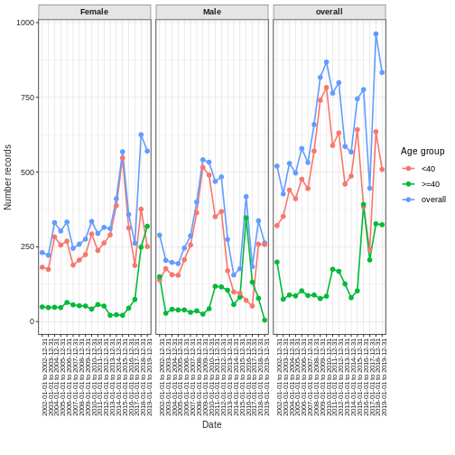

:::::::::::::::::::::::::::::::::::::: questions 

- What are some of the R tools that can work on OMOP CDM instances ?

::::::::::::::::::::::::::::::::::::::::::::::::

::::::::::::::::::::::::::::::::::::: objectives

- Brief outline of some R tools that will be useful for new OMOP users.

::::::::::::::::::::::::::::::::::::::::::::::::


## Introduction

There are a range of community provided R tools that can help you work with instances of OMOP data.

We are going to show you a brief summary of some that are likely to be of use to new users.

With each you may need to balance the need to learn some new syntax with the benefits of the extra functionality that the package provides.


TODO maybe add a table with links to packages & brief descriptions.


[OmopSketch](https://ohdsi.github.io/OmopSketch/index.html)

To summarise key information about an OMOP database.
To provide a broad characterisation of the data and to allow users to evaluate whether they are suitable for particular research.


  
First we can install the package and its dependencies and connect to some mock data.


``` r
#without dependencies=TRUE it failed needing omock & VisOmopResults
#with dependencies it installed 91 packages in 1.8 minutes
install.packages("OmopSketch", dependencies=TRUE)
```

``` output
# Downloading packages -------------------------------------------------------
- Downloading CodelistGenerator from https://packagemanager.posit.co/cran/__linux__/jammy/latest ... OK [1.9 Mb in 0.69s]
- Downloading CohortCharacteristics from https://packagemanager.posit.co/cran/__linux__/jammy/latest ... OK [3.1 Mb in 0.64s]
- Downloading DT from https://packagemanager.posit.co/cran/__linux__/jammy/latest ... OK [1.7 Mb in 0.45s]
- Downloading crosstalk from https://packagemanager.posit.co/cran/__linux__/jammy/latest ... OK [402.3 Kb in 0.39s]
- Downloading lazyeval from https://packagemanager.posit.co/cran/__linux__/jammy/latest ... OK [153.5 Kb in 0.49s]
- Downloading htmlwidgets from https://packagemanager.posit.co/cran/__linux__/jammy/latest ... OK [796.3 Kb in 0.3s]
- Downloading promises from https://packagemanager.posit.co/cran/__linux__/jammy/latest ... OK [1.6 Mb in 0.31s]
- Downloading later from https://packagemanager.posit.co/cran/__linux__/jammy/latest ... OK [149 Kb in 0.33s]
- Downloading Rcpp from https://packagemanager.posit.co/cran/__linux__/jammy/latest ... OK [2.1 Mb in 0.46s]
- Downloading flextable from https://packagemanager.posit.co/cran/__linux__/jammy/latest ... OK [2.2 Mb in 0.65s]
- Downloading data.table from https://packagemanager.posit.co/cran/__linux__/jammy/latest ... OK [2.5 Mb in 0.36s]
- Downloading gdtools from https://packagemanager.posit.co/cran/__linux__/jammy/latest ... OK [205.2 Kb in 0.4s]
- Downloading fontquiver from https://packagemanager.posit.co/cran/__linux__/jammy/latest ... OK [2.2 Mb in 0.3s]
- Downloading fontBitstreamVera from https://packagemanager.posit.co/cran/__linux__/jammy/latest ... OK [683.1 Kb in 0.33s]
- Downloading fontLiberation from https://packagemanager.posit.co/cran/__linux__/jammy/latest ... OK [4.3 Mb in 0.34s]
- Downloading systemfonts from https://packagemanager.posit.co/cran/__linux__/jammy/latest ... OK [334.9 Kb in 0.34s]
- Downloading officer from https://packagemanager.posit.co/cran/__linux__/jammy/latest ... OK [1.9 Mb in 0.47s]
- Downloading openssl from https://packagemanager.posit.co/cran/__linux__/jammy/latest ... OK [1.3 Mb in 0.3s]
- Downloading askpass from https://packagemanager.posit.co/cran/__linux__/jammy/latest ... OK [21.5 Kb in 0.3s]
- Downloading sys from https://packagemanager.posit.co/cran/__linux__/jammy/latest ... OK [39.9 Kb in 0.28s]
- Downloading ragg from https://packagemanager.posit.co/cran/__linux__/jammy/latest ... OK [702.9 Kb in 0.28s]
- Downloading textshaping from https://packagemanager.posit.co/cran/__linux__/jammy/latest ... OK [179.8 Kb in 0.23s]
- Downloading xml2 from https://packagemanager.posit.co/cran/__linux__/jammy/latest ... OK [276.2 Kb in 0.39s]
- Downloading zip from https://packagemanager.posit.co/cran/__linux__/jammy/latest ... OK [646.6 Kb in 0.34s]
- Downloading gt from https://packagemanager.posit.co/cran/__linux__/jammy/latest ... OK [5.8 Mb in 0.35s]
- Downloading bigD from https://packagemanager.posit.co/cran/__linux__/jammy/latest ... OK [1.1 Mb in 0.46s]
- Downloading bitops from https://packagemanager.posit.co/cran/__linux__/jammy/latest ... OK [25.4 Kb in 0.33s]
- Downloading commonmark from https://packagemanager.posit.co/cran/__linux__/jammy/latest ... OK [144.1 Kb in 0.44s]
- Downloading juicyjuice from https://packagemanager.posit.co/cran/__linux__/jammy/latest ... OK [1.1 Mb in 0.32s]
- Downloading V8 from https://packagemanager.posit.co/cran/__linux__/jammy/latest ... OK [11.6 Mb in 0.62s]
- Downloading curl from https://packagemanager.posit.co/cran/__linux__/jammy/latest ... OK [770.1 Kb in 0.36s]
- Downloading markdown from https://packagemanager.posit.co/cran/__linux__/jammy/latest ... OK [62.8 Kb in 0.3s]
- Downloading litedown from https://packagemanager.posit.co/cran/__linux__/jammy/latest ... OK [362.6 Kb in 0.31s]
- Downloading reactable from https://packagemanager.posit.co/cran/__linux__/jammy/latest ... OK [1 Mb in 0.34s]
- Downloading reactR from https://packagemanager.posit.co/cran/__linux__/jammy/latest ... OK [597.1 Kb in 0.27s]
- Downloading here from https://packagemanager.posit.co/cran/__linux__/jammy/latest ... OK [52.2 Kb in 0.28s]
- Downloading rprojroot from https://packagemanager.posit.co/cran/__linux__/jammy/latest ... OK [110.6 Kb in 0.25s]
- Downloading odbc from https://packagemanager.posit.co/cran/__linux__/jammy/latest ... OK [836.3 Kb in 0.3s]
- Downloading OmopViewer from https://packagemanager.posit.co/cran/__linux__/jammy/latest ... OK [518.3 Kb in 0.42s]
- Downloading shiny from https://packagemanager.posit.co/cran/__linux__/jammy/latest ... OK [4.2 Mb in 0.37s]
- Downloading httpuv from https://packagemanager.posit.co/cran/__linux__/jammy/latest ... OK [613.8 Kb in 0.42s]
- Downloading xtable from https://packagemanager.posit.co/cran/__linux__/jammy/latest ... OK [690.6 Kb in 0.3s]
- Downloading sourcetools from https://packagemanager.posit.co/cran/__linux__/jammy/latest ... OK [45.1 Kb in 0.31s]
- Downloading styler from https://packagemanager.posit.co/cran/__linux__/jammy/latest ... OK [809.2 Kb in 0.32s]
- Downloading R.cache from https://packagemanager.posit.co/cran/__linux__/jammy/latest ... OK [110.2 Kb in 0.29s]
- Downloading R.methodsS3 from https://packagemanager.posit.co/cran/__linux__/jammy/latest ... OK [80.6 Kb in 0.28s]
- Downloading R.oo from https://packagemanager.posit.co/cran/__linux__/jammy/latest ... OK [971.2 Kb in 0.45s]
- Downloading R.utils from https://packagemanager.posit.co/cran/__linux__/jammy/latest ... OK [1.4 Mb in 0.31s]
- Downloading usethis from https://packagemanager.posit.co/cran/__linux__/jammy/latest ... OK [907.8 Kb in 0.26s]
- Downloading desc from https://packagemanager.posit.co/cran/__linux__/jammy/latest ... OK [326.6 Kb in 0.3s]
- Downloading gert from https://packagemanager.posit.co/cran/__linux__/jammy/latest ... OK [2.7 Mb in 0.27s]
- Downloading credentials from https://packagemanager.posit.co/cran/__linux__/jammy/latest ... OK [216.1 Kb in 0.26s]
- Downloading rstudioapi from https://packagemanager.posit.co/cran/__linux__/jammy/latest ... OK [310.4 Kb in 0.3s]
- Downloading gh from https://packagemanager.posit.co/cran/__linux__/jammy/latest ... OK [119.6 Kb in 0.28s]
- Downloading gitcreds from https://packagemanager.posit.co/cran/__linux__/jammy/latest ... OK [95 Kb in 0.25s]
- Downloading httr2 from https://packagemanager.posit.co/cran/__linux__/jammy/latest ... OK [765.1 Kb in 0.3s]
- Downloading ini from https://packagemanager.posit.co/cran/__linux__/jammy/latest ... OK [13.1 Kb in 0.25s]
- Downloading whisker from https://packagemanager.posit.co/cran/__linux__/jammy/latest ... OK [65.6 Kb in 0.28s]
- Downloading visOmopResults from https://packagemanager.posit.co/cran/__linux__/jammy/latest ... OK [1.1 Mb in 0.5s]
- Downloading sortable from https://packagemanager.posit.co/cran/__linux__/jammy/latest ... OK [456.3 Kb in 0.44s]
- Downloading learnr from https://packagemanager.posit.co/cran/__linux__/jammy/latest ... OK [1.6 Mb in 0.3s]
- Downloading ellipsis from https://packagemanager.posit.co/cran/__linux__/jammy/latest ... OK [33.6 Kb in 0.31s]
- Downloading RPostgres from https://packagemanager.posit.co/cran/__linux__/jammy/latest ... OK [440 Kb in 0.29s]
- Downloading plogr from https://packagemanager.posit.co/cran/__linux__/jammy/latest ... OK [12.8 Kb in 0.26s]
- Downloading shinyWidgets from https://packagemanager.posit.co/cran/__linux__/jammy/latest ... OK [1.3 Mb in 0.31s]
- Downloading testthat from https://packagemanager.posit.co/cran/__linux__/jammy/latest ... OK [1.8 Mb in 0.3s]
- Downloading brio from https://packagemanager.posit.co/cran/__linux__/jammy/latest ... OK [34.4 Kb in 0.32s]
- Downloading callr from https://packagemanager.posit.co/cran/__linux__/jammy/latest ... OK [438.9 Kb in 0.51s]
- Downloading processx from https://packagemanager.posit.co/cran/__linux__/jammy/latest ... OK [329.4 Kb in 0.24s]
- Downloading ps from https://packagemanager.posit.co/cran/__linux__/jammy/latest ... OK [488.8 Kb in 0.26s]
- Downloading pkgload from https://packagemanager.posit.co/cran/__linux__/jammy/latest ... OK [212 Kb in 0.28s]
- Downloading pkgbuild from https://packagemanager.posit.co/cran/__linux__/jammy/latest ... OK [203.8 Kb in 0.27s]
- Downloading praise from https://packagemanager.posit.co/cran/__linux__/jammy/latest ... OK [16.1 Kb in 0.26s]
- Downloading waldo from https://packagemanager.posit.co/cran/__linux__/jammy/latest ... OK [132.1 Kb in 0.29s]
- Downloading diffobj from https://packagemanager.posit.co/cran/__linux__/jammy/latest ... OK [979.2 Kb in 0.29s]
- Downloading omock from https://packagemanager.posit.co/cran/__linux__/jammy/latest ... OK [930.3 Kb in 0.5s]
- Downloading covr from https://packagemanager.posit.co/cran/__linux__/jammy/latest ... OK [320.9 Kb in 0.34s]
- Downloading rex from https://packagemanager.posit.co/cran/__linux__/jammy/latest ... OK [123.8 Kb in 0.29s]
- Downloading httr from https://packagemanager.posit.co/cran/__linux__/jammy/latest ... OK [475.7 Kb in 0.29s]
- Downloading devtools from https://packagemanager.posit.co/cran/__linux__/jammy/latest ... OK [426.2 Kb in 0.25s]
- Downloading miniUI from https://packagemanager.posit.co/cran/__linux__/jammy/latest ... OK [34.4 Kb in 0.26s]
- Downloading pkgdown from https://packagemanager.posit.co/cran/__linux__/jammy/latest ... OK [891.7 Kb in 0.42s]
- Downloading downlit from https://packagemanager.posit.co/cran/__linux__/jammy/latest ... OK [110 Kb in 0.21s]
- Downloading fansi from https://packagemanager.posit.co/cran/__linux__/jammy/latest ... OK [309.9 Kb in 0.28s]
- Downloading profvis from https://packagemanager.posit.co/cran/__linux__/jammy/latest ... OK [340.4 Kb in 0.27s]
- Downloading rcmdcheck from https://packagemanager.posit.co/cran/__linux__/jammy/latest ... OK [166.7 Kb in 0.26s]
- Downloading sessioninfo from https://packagemanager.posit.co/cran/__linux__/jammy/latest ... OK [191.3 Kb in 0.36s]
- Downloading xopen from https://packagemanager.posit.co/cran/__linux__/jammy/latest ... OK [24.7 Kb in 0.2s]
- Downloading roxygen2 from https://packagemanager.posit.co/cran/__linux__/jammy/latest ... OK [712.3 Kb in 0.29s]
- Downloading brew from https://packagemanager.posit.co/cran/__linux__/jammy/latest ... OK [74.8 Kb in 0.27s]
- Downloading rversions from https://packagemanager.posit.co/cran/__linux__/jammy/latest ... OK [63.7 Kb in 0.26s]
- Downloading urlchecker from https://packagemanager.posit.co/cran/__linux__/jammy/latest ... OK [33.3 Kb in 0.26s]
Successfully downloaded 92 packages in 48 seconds.

The following package(s) will be installed:
- askpass               [1.2.1]
- bigD                  [0.3.1]
- bitops                [1.0-9]
- brew                  [1.0-10]
- brio                  [1.1.5]
- callr                 [3.7.6]
- CodelistGenerator     [3.5.0]
- CohortCharacteristics [1.0.0]
- commonmark            [2.0.0]
- covr                  [3.6.4]
- credentials           [2.0.2]
- crosstalk             [1.2.2]
- curl                  [7.0.0]
- data.table            [1.17.8]
- desc                  [1.4.3]
- devtools              [2.4.5]
- diffobj               [0.3.6]
- downlit               [0.4.4]
- DT                    [0.34.0]
- ellipsis              [0.3.2]
- fansi                 [1.0.6]
- flextable             [0.9.10]
- fontBitstreamVera     [0.1.1]
- fontLiberation        [0.1.0]
- fontquiver            [0.2.1]
- gdtools               [0.4.3]
- gert                  [2.1.5]
- gh                    [1.5.0]
- gitcreds              [0.1.2]
- gt                    [1.0.0]
- here                  [1.0.1]
- htmlwidgets           [1.6.4]
- httpuv                [1.6.16]
- httr                  [1.4.7]
- httr2                 [1.2.1]
- ini                   [0.3.1]
- juicyjuice            [0.1.0]
- later                 [1.4.4]
- lazyeval              [0.2.2]
- learnr                [0.11.5]
- litedown              [0.7]
- markdown              [2.0]
- miniUI                [0.1.2]
- odbc                  [1.6.3]
- officer               [0.7.0]
- omock                 [0.5.0]
- OmopSketch            [0.5.1]
- OmopViewer            [0.4.0]
- openssl               [2.3.3]
- pkgbuild              [1.4.8]
- pkgdown               [2.1.3]
- pkgload               [1.4.0]
- plogr                 [0.2.0]
- praise                [1.0.0]
- processx              [3.8.6]
- profvis               [0.4.0]
- promises              [1.3.3]
- ps                    [1.9.1]
- R.cache               [0.17.0]
- R.methodsS3           [1.8.2]
- R.oo                  [1.27.1]
- R.utils               [2.13.0]
- ragg                  [1.5.0]
- rcmdcheck             [1.4.0]
- Rcpp                  [1.1.0]
- reactable             [0.4.4]
- reactR                [0.6.1]
- rex                   [1.2.1]
- roxygen2              [7.3.3]
- RPostgres             [1.4.8]
- rprojroot             [2.1.1]
- rstudioapi            [0.17.1]
- rversions             [2.1.2]
- sessioninfo           [1.2.3]
- shiny                 [1.11.1]
- shinyWidgets          [0.9.0]
- sortable              [0.5.0]
- sourcetools           [0.1.7-1]
- styler                [1.10.3]
- sys                   [3.4.3]
- systemfonts           [1.2.3]
- testthat              [3.2.3]
- textshaping           [1.0.3]
- urlchecker            [1.0.1]
- usethis               [3.2.1]
- V8                    [7.0.0]
- visOmopResults        [1.2.0]
- waldo                 [0.6.2]
- whisker               [0.4.1]
- xml2                  [1.4.0]
- xopen                 [1.0.1]
- xtable                [1.8-4]
- zip                   [2.3.3]
These packages will be installed into "~/work/omop-carpentries/omop-carpentries/renv/profiles/lesson-requirements/renv/library/linux-ubuntu-jammy/R-4.5/x86_64-pc-linux-gnu".

The following required system packages are not installed:
- libgit2-dev  [required by gert]
- libnode-dev  [required by V8]
- pandoc       [required by learnr, pkgdown]
The R packages depending on these system packages may fail to install.

An administrator can install these packages with:
- sudo apt install libgit2-dev libnode-dev pandoc

# Installing packages --------------------------------------------------------
- Installing OmopSketch ...                     OK [linked from cache]
- Installing CodelistGenerator ...              OK [installed binary and cached in 0.53s]
- Installing CohortCharacteristics ...          OK [installed binary and cached in 0.56s]
- Installing lazyeval ...                       OK [installed binary and cached in 0.16s]
- Installing crosstalk ...                      OK [installed binary and cached in 0.28s]
- Installing htmlwidgets ...                    OK [installed binary and cached in 0.29s]
- Installing Rcpp ...                           OK [installed binary and cached in 0.32s]
- Installing later ...                          OK [installed binary and cached in 0.23s]
- Installing promises ...                       OK [installed binary and cached in 0.27s]
- Installing DT ...                             OK [installed binary and cached in 0.37s]
- Installing data.table ...                     OK [installed binary and cached in 0.28s]
- Installing fontBitstreamVera ...              OK [installed binary and cached in 0.17s]
- Installing fontLiberation ...                 OK [installed binary and cached in 0.24s]
- Installing fontquiver ...                     OK [installed binary and cached in 0.2s]
- Installing systemfonts ...                    OK [installed binary and cached in 0.26s]
- Installing gdtools ...                        OK [installed binary and cached in 0.34s]
- Installing sys ...                            OK [installed binary and cached in 0.16s]
- Installing askpass ...                        OK [installed binary and cached in 0.15s]
- Installing openssl ...                        OK [installed binary and cached in 0.21s]
- Installing textshaping ...                    OK [installed binary and cached in 0.27s]
- Installing ragg ...                           OK [installed binary and cached in 0.3s]
- Installing xml2 ...                           OK [installed binary and cached in 0.26s]
- Installing zip ...                            OK [installed binary and cached in 0.18s]
- Installing officer ...                        OK [installed binary and cached in 0.33s]
- Installing flextable ...                      OK [installed binary and cached in 0.55s]
- Installing bigD ...                           OK [installed binary and cached in 0.17s]
- Installing bitops ...                         OK [installed binary and cached in 0.16s]
- Installing commonmark ...                     OK [installed binary and cached in 0.16s]
- Installing curl ...                           OK [installed binary and cached in 0.19s]
- Installing V8 ...                             OK [installed binary and cached in 0.75s]
- Installing juicyjuice ...                     OK [installed binary and cached in 0.18s]
- Installing litedown ...                       OK [installed binary and cached in 0.19s]
- Installing markdown ...                       OK [installed binary and cached in 0.16s]
- Installing reactR ...                         OK [installed binary and cached in 0.29s]
- Installing reactable ...                      OK [installed binary and cached in 0.31s]
- Installing gt ...                             OK [installed binary and cached in 0.55s]
- Installing rprojroot ...                      OK [installed binary and cached in 0.16s]
- Installing here ...                           OK [installed binary and cached in 0.17s]
- Installing odbc ...                           OK [installed binary and cached in 0.62s]
- Installing httpuv ...                         OK [installed binary and cached in 0.26s]
- Installing xtable ...                         OK [installed binary and cached in 0.17s]
- Installing sourcetools ...                    OK [installed binary and cached in 0.16s]
- Installing shiny ...                          OK [installed binary and cached in 0.53s]
- Installing R.methodsS3 ...                    OK [installed binary and cached in 0.17s]
- Installing R.oo ...                           OK [installed binary and cached in 0.18s]
- Installing R.utils ...                        OK [installed binary and cached in 0.21s]
- Installing R.cache ...                        OK [installed binary and cached in 0.23s]
- Installing styler ...                         OK [installed binary and cached in 0.37s]
- Installing desc ...                           OK [installed binary and cached in 0.17s]
- Installing credentials ...                    OK [installed binary and cached in 0.19s]
- Installing rstudioapi ...                     OK [installed binary and cached in 0.17s]
- Installing gert ...                           OK [installed binary and cached in 0.3s]
- Installing gitcreds ...                       OK [installed binary and cached in 0.16s]
- Installing httr2 ...                          OK [installed binary and cached in 0.3s]
- Installing ini ...                            OK [installed binary and cached in 0.16s]
- Installing gh ...                             OK [installed binary and cached in 0.32s]
- Installing whisker ...                        OK [installed binary and cached in 0.17s]
- Installing usethis ...                        OK [installed binary and cached in 0.37s]
- Installing visOmopResults ...                 OK [installed binary and cached in 0.52s]
- Installing OmopViewer ...                     OK [installed binary and cached in 0.27s]
- Installing ellipsis ...                       OK [installed binary and cached in 0.26s]
- Installing learnr ...                         OK [installed binary and cached in 0.58s]
- Installing sortable ...                       OK [installed binary and cached in 0.56s]
- Installing plogr ...                          OK [installed binary and cached in 0.16s]
- Installing RPostgres ...                      OK [installed binary and cached in 0.46s]
- Installing shinyWidgets ...                   OK [installed binary and cached in 0.53s]
- Installing brio ...                           OK [installed binary and cached in 0.16s]
- Installing ps ...                             OK [installed binary and cached in 0.17s]
- Installing processx ...                       OK [installed binary and cached in 0.17s]
- Installing callr ...                          OK [installed binary and cached in 0.18s]
- Installing pkgbuild ...                       OK [installed binary and cached in 0.16s]
- Installing pkgload ...                        OK [installed binary and cached in 0.44s]
- Installing praise ...                         OK [installed binary and cached in 0.16s]
- Installing diffobj ...                        OK [installed binary and cached in 0.27s]
- Installing waldo ...                          OK [installed binary and cached in 0.26s]
- Installing testthat ...                       OK [installed binary and cached in 0.31s]
- Installing omock ...                          OK [installed binary and cached in 0.49s]
- Installing rex ...                            OK [installed binary and cached in 0.16s]
- Installing httr ...                           OK [installed binary and cached in 0.17s]
- Installing covr ...                           OK [installed binary and cached in 0.18s]
- Installing miniUI ...                         OK [installed binary and cached in 0.39s]
- Installing fansi ...                          OK [installed binary and cached in 0.17s]
- Installing downlit ...                        OK [installed binary and cached in 0.27s]
- Installing pkgdown ...                        OK [installed binary and cached in 0.31s]
- Installing profvis ...                        OK [installed binary and cached in 0.29s]
- Installing sessioninfo ...                    OK [installed binary and cached in 0.21s]
- Installing xopen ...                          OK [installed binary and cached in 0.16s]
- Installing rcmdcheck ...                      OK [installed binary and cached in 0.25s]
- Installing brew ...                           OK [installed binary and cached in 0.16s]
- Installing roxygen2 ...                       OK [installed binary and cached in 0.4s]
- Installing rversions ...                      OK [installed binary and cached in 0.27s]
- Installing urlchecker ...                     OK [installed binary and cached in 0.17s]
- Installing devtools ...                       OK [installed binary and cached in 0.82s]
Successfully installed 93 packages in 29 seconds.
```

``` r
library(dplyr)
library(OmopSketch)

# Connect to mock database
cdm <- mockOmopSketch()
```

#### summarise* and table* functions

The package has the following types of functions :

function start | what it does
------------ | --------------------
summarise*   | generate results objects.
table*       | convert results objects to tables for display.

### Snapshot

Snapshot creates a broad summary of the database including person count, temporal extent and other metadata.


``` r
summariseOmopSnapshot(cdm) |>
  tableOmopSnapshot(type = "gt")
```

<!--html_preserve--><div id="jmliqcnwmc" style="padding-left:0px;padding-right:0px;padding-top:10px;padding-bottom:10px;overflow-x:auto;overflow-y:auto;width:auto;height:auto;">
<style>#jmliqcnwmc table {
  font-family: system-ui, 'Segoe UI', Roboto, Helvetica, Arial, sans-serif, 'Apple Color Emoji', 'Segoe UI Emoji', 'Segoe UI Symbol', 'Noto Color Emoji';
  -webkit-font-smoothing: antialiased;
  -moz-osx-font-smoothing: grayscale;
}

#jmliqcnwmc thead, #jmliqcnwmc tbody, #jmliqcnwmc tfoot, #jmliqcnwmc tr, #jmliqcnwmc td, #jmliqcnwmc th {
  border-style: none;
}

#jmliqcnwmc p {
  margin: 0;
  padding: 0;
}

#jmliqcnwmc .gt_table {
  display: table;
  border-collapse: collapse;
  line-height: normal;
  margin-left: auto;
  margin-right: auto;
  color: #333333;
  font-size: 16px;
  font-weight: normal;
  font-style: normal;
  background-color: #FFFFFF;
  width: auto;
  border-top-style: solid;
  border-top-width: 3px;
  border-top-color: #D9D9D9;
  border-right-style: solid;
  border-right-width: 3px;
  border-right-color: #D9D9D9;
  border-bottom-style: solid;
  border-bottom-width: 3px;
  border-bottom-color: #D9D9D9;
  border-left-style: solid;
  border-left-width: 3px;
  border-left-color: #D9D9D9;
}

#jmliqcnwmc .gt_caption {
  padding-top: 4px;
  padding-bottom: 4px;
}

#jmliqcnwmc .gt_title {
  color: #333333;
  font-size: 125%;
  font-weight: initial;
  padding-top: 4px;
  padding-bottom: 4px;
  padding-left: 5px;
  padding-right: 5px;
  border-bottom-color: #FFFFFF;
  border-bottom-width: 0;
}

#jmliqcnwmc .gt_subtitle {
  color: #333333;
  font-size: 85%;
  font-weight: initial;
  padding-top: 3px;
  padding-bottom: 5px;
  padding-left: 5px;
  padding-right: 5px;
  border-top-color: #FFFFFF;
  border-top-width: 0;
}

#jmliqcnwmc .gt_heading {
  background-color: #FFFFFF;
  text-align: center;
  border-bottom-color: #FFFFFF;
  border-left-style: none;
  border-left-width: 1px;
  border-left-color: #D3D3D3;
  border-right-style: none;
  border-right-width: 1px;
  border-right-color: #D3D3D3;
}

#jmliqcnwmc .gt_bottom_border {
  border-bottom-style: solid;
  border-bottom-width: 2px;
  border-bottom-color: #D3D3D3;
}

#jmliqcnwmc .gt_col_headings {
  border-top-style: solid;
  border-top-width: 2px;
  border-top-color: #D3D3D3;
  border-bottom-style: solid;
  border-bottom-width: 2px;
  border-bottom-color: #D3D3D3;
  border-left-style: none;
  border-left-width: 1px;
  border-left-color: #D3D3D3;
  border-right-style: none;
  border-right-width: 1px;
  border-right-color: #D3D3D3;
}

#jmliqcnwmc .gt_col_heading {
  color: #333333;
  background-color: #FFFFFF;
  font-size: 100%;
  font-weight: normal;
  text-transform: inherit;
  border-left-style: none;
  border-left-width: 1px;
  border-left-color: #D3D3D3;
  border-right-style: none;
  border-right-width: 1px;
  border-right-color: #D3D3D3;
  vertical-align: bottom;
  padding-top: 5px;
  padding-bottom: 6px;
  padding-left: 5px;
  padding-right: 5px;
  overflow-x: hidden;
}

#jmliqcnwmc .gt_column_spanner_outer {
  color: #333333;
  background-color: #FFFFFF;
  font-size: 100%;
  font-weight: normal;
  text-transform: inherit;
  padding-top: 0;
  padding-bottom: 0;
  padding-left: 4px;
  padding-right: 4px;
}

#jmliqcnwmc .gt_column_spanner_outer:first-child {
  padding-left: 0;
}

#jmliqcnwmc .gt_column_spanner_outer:last-child {
  padding-right: 0;
}

#jmliqcnwmc .gt_column_spanner {
  border-bottom-style: solid;
  border-bottom-width: 2px;
  border-bottom-color: #D3D3D3;
  vertical-align: bottom;
  padding-top: 5px;
  padding-bottom: 5px;
  overflow-x: hidden;
  display: inline-block;
  width: 100%;
}

#jmliqcnwmc .gt_spanner_row {
  border-bottom-style: hidden;
}

#jmliqcnwmc .gt_group_heading {
  padding-top: 8px;
  padding-bottom: 8px;
  padding-left: 5px;
  padding-right: 5px;
  color: #333333;
  background-color: #FFFFFF;
  font-size: 100%;
  font-weight: initial;
  text-transform: inherit;
  border-top-style: solid;
  border-top-width: 2px;
  border-top-color: #D3D3D3;
  border-bottom-style: solid;
  border-bottom-width: 2px;
  border-bottom-color: #D3D3D3;
  border-left-style: none;
  border-left-width: 1px;
  border-left-color: #D3D3D3;
  border-right-style: none;
  border-right-width: 1px;
  border-right-color: #D3D3D3;
  vertical-align: middle;
  text-align: left;
}

#jmliqcnwmc .gt_empty_group_heading {
  padding: 0.5px;
  color: #333333;
  background-color: #FFFFFF;
  font-size: 100%;
  font-weight: initial;
  border-top-style: solid;
  border-top-width: 2px;
  border-top-color: #D3D3D3;
  border-bottom-style: solid;
  border-bottom-width: 2px;
  border-bottom-color: #D3D3D3;
  vertical-align: middle;
}

#jmliqcnwmc .gt_from_md > :first-child {
  margin-top: 0;
}

#jmliqcnwmc .gt_from_md > :last-child {
  margin-bottom: 0;
}

#jmliqcnwmc .gt_row {
  padding-top: 8px;
  padding-bottom: 8px;
  padding-left: 5px;
  padding-right: 5px;
  margin: 10px;
  border-top-style: solid;
  border-top-width: 1px;
  border-top-color: #D3D3D3;
  border-left-style: none;
  border-left-width: 1px;
  border-left-color: #D3D3D3;
  border-right-style: none;
  border-right-width: 1px;
  border-right-color: #D3D3D3;
  vertical-align: middle;
  overflow-x: hidden;
}

#jmliqcnwmc .gt_stub {
  color: #333333;
  background-color: #FFFFFF;
  font-size: 100%;
  font-weight: initial;
  text-transform: inherit;
  border-right-style: solid;
  border-right-width: 2px;
  border-right-color: #D3D3D3;
  padding-left: 5px;
  padding-right: 5px;
}

#jmliqcnwmc .gt_stub_row_group {
  color: #333333;
  background-color: #FFFFFF;
  font-size: 100%;
  font-weight: initial;
  text-transform: inherit;
  border-right-style: solid;
  border-right-width: 2px;
  border-right-color: #D3D3D3;
  padding-left: 5px;
  padding-right: 5px;
  vertical-align: top;
}

#jmliqcnwmc .gt_row_group_first td {
  border-top-width: 2px;
}

#jmliqcnwmc .gt_row_group_first th {
  border-top-width: 2px;
}

#jmliqcnwmc .gt_summary_row {
  color: #333333;
  background-color: #FFFFFF;
  text-transform: inherit;
  padding-top: 8px;
  padding-bottom: 8px;
  padding-left: 5px;
  padding-right: 5px;
}

#jmliqcnwmc .gt_first_summary_row {
  border-top-style: solid;
  border-top-color: #D3D3D3;
}

#jmliqcnwmc .gt_first_summary_row.thick {
  border-top-width: 2px;
}

#jmliqcnwmc .gt_last_summary_row {
  padding-top: 8px;
  padding-bottom: 8px;
  padding-left: 5px;
  padding-right: 5px;
  border-bottom-style: solid;
  border-bottom-width: 2px;
  border-bottom-color: #D3D3D3;
}

#jmliqcnwmc .gt_grand_summary_row {
  color: #333333;
  background-color: #FFFFFF;
  text-transform: inherit;
  padding-top: 8px;
  padding-bottom: 8px;
  padding-left: 5px;
  padding-right: 5px;
}

#jmliqcnwmc .gt_first_grand_summary_row {
  padding-top: 8px;
  padding-bottom: 8px;
  padding-left: 5px;
  padding-right: 5px;
  border-top-style: double;
  border-top-width: 6px;
  border-top-color: #D3D3D3;
}

#jmliqcnwmc .gt_last_grand_summary_row_top {
  padding-top: 8px;
  padding-bottom: 8px;
  padding-left: 5px;
  padding-right: 5px;
  border-bottom-style: double;
  border-bottom-width: 6px;
  border-bottom-color: #D3D3D3;
}

#jmliqcnwmc .gt_striped {
  background-color: rgba(128, 128, 128, 0.05);
}

#jmliqcnwmc .gt_table_body {
  border-top-style: solid;
  border-top-width: 3px;
  border-top-color: #D9D9D9;
  border-bottom-style: solid;
  border-bottom-width: 2px;
  border-bottom-color: #D3D3D3;
}

#jmliqcnwmc .gt_footnotes {
  color: #333333;
  background-color: #FFFFFF;
  border-bottom-style: none;
  border-bottom-width: 2px;
  border-bottom-color: #D3D3D3;
  border-left-style: none;
  border-left-width: 2px;
  border-left-color: #D3D3D3;
  border-right-style: none;
  border-right-width: 2px;
  border-right-color: #D3D3D3;
}

#jmliqcnwmc .gt_footnote {
  margin: 0px;
  font-size: 90%;
  padding-top: 4px;
  padding-bottom: 4px;
  padding-left: 5px;
  padding-right: 5px;
}

#jmliqcnwmc .gt_sourcenotes {
  color: #333333;
  background-color: #FFFFFF;
  border-bottom-style: none;
  border-bottom-width: 2px;
  border-bottom-color: #D3D3D3;
  border-left-style: none;
  border-left-width: 2px;
  border-left-color: #D3D3D3;
  border-right-style: none;
  border-right-width: 2px;
  border-right-color: #D3D3D3;
}

#jmliqcnwmc .gt_sourcenote {
  font-size: 90%;
  padding-top: 4px;
  padding-bottom: 4px;
  padding-left: 5px;
  padding-right: 5px;
}

#jmliqcnwmc .gt_left {
  text-align: left;
}

#jmliqcnwmc .gt_center {
  text-align: center;
}

#jmliqcnwmc .gt_right {
  text-align: right;
  font-variant-numeric: tabular-nums;
}

#jmliqcnwmc .gt_font_normal {
  font-weight: normal;
}

#jmliqcnwmc .gt_font_bold {
  font-weight: bold;
}

#jmliqcnwmc .gt_font_italic {
  font-style: italic;
}

#jmliqcnwmc .gt_super {
  font-size: 65%;
}

#jmliqcnwmc .gt_footnote_marks {
  font-size: 75%;
  vertical-align: 0.4em;
  position: initial;
}

#jmliqcnwmc .gt_asterisk {
  font-size: 100%;
  vertical-align: 0;
}

#jmliqcnwmc .gt_indent_1 {
  text-indent: 5px;
}

#jmliqcnwmc .gt_indent_2 {
  text-indent: 10px;
}

#jmliqcnwmc .gt_indent_3 {
  text-indent: 15px;
}

#jmliqcnwmc .gt_indent_4 {
  text-indent: 20px;
}

#jmliqcnwmc .gt_indent_5 {
  text-indent: 25px;
}

#jmliqcnwmc .katex-display {
  display: inline-flex !important;
  margin-bottom: 0.75em !important;
}

#jmliqcnwmc div.Reactable > div.rt-table > div.rt-thead > div.rt-tr.rt-tr-group-header > div.rt-th-group:after {
  height: 0px !important;
}
</style>
<table class="gt_table" data-quarto-disable-processing="false" data-quarto-bootstrap="false">
  <thead>
    <tr class="gt_col_headings gt_spanner_row">
      <th class="gt_col_heading gt_columns_bottom_border gt_left" rowspan="2" colspan="1" style="text-align: center; font-weight: bold;" scope="col" id="Estimate">Estimate</th>
      <th class="gt_center gt_columns_top_border gt_column_spanner_outer" rowspan="1" colspan="1" style="background-color: #D9D9D9; text-align: center; font-weight: bold;" scope="col" id="spanner-[header_name]Database name&#10;[header_level]mockOmopSketch">
        <div class="gt_column_spanner">Database name</div>
      </th>
    </tr>
    <tr class="gt_col_headings">
      <th class="gt_col_heading gt_columns_bottom_border gt_left" rowspan="1" colspan="1" style="background-color: #E1E1E1; text-align: center; font-weight: bold;" scope="col" id="[header_name]Database-name-[header_level]mockOmopSketch">mockOmopSketch</th>
    </tr>
  </thead>
  <tbody class="gt_table_body">
    <tr class="gt_group_heading_row">
      <th colspan="2" class="gt_group_heading" style="background-color: #E9E9E9; font-weight: bold;" scope="colgroup" id="General">General</th>
    </tr>
    <tr class="gt_row_group_first"><td headers="General  Estimate" class="gt_row gt_left" style="text-align: left; border-left-width: 1px; border-left-style: solid; border-left-color: #D3D3D3; border-right-width: 1px; border-right-style: solid; border-right-color: #D3D3D3; border-top-width: 1px; border-top-style: solid; border-top-color: #D3D3D3; border-bottom-width: 1px; border-bottom-style: solid; border-bottom-color: #D3D3D3;">Snapshot date</td>
<td headers="General  [header_name]Database name
[header_level]mockOmopSketch" class="gt_row gt_left" style="text-align: right;">2025-09-12</td></tr>
    <tr><td headers="General  Estimate" class="gt_row gt_left" style="text-align: left; border-left-width: 1px; border-left-style: solid; border-left-color: #D3D3D3; border-right-width: 1px; border-right-style: solid; border-right-color: #D3D3D3; border-top-width: 1px; border-top-style: solid; border-top-color: #D3D3D3; border-bottom-width: 1px; border-bottom-style: solid; border-bottom-color: #D3D3D3;">Person count</td>
<td headers="General  [header_name]Database name
[header_level]mockOmopSketch" class="gt_row gt_left" style="text-align: right;">100</td></tr>
    <tr><td headers="General  Estimate" class="gt_row gt_left" style="text-align: left; border-left-width: 1px; border-left-style: solid; border-left-color: #D3D3D3; border-right-width: 1px; border-right-style: solid; border-right-color: #D3D3D3; border-top-width: 1px; border-top-style: solid; border-top-color: #D3D3D3; border-bottom-width: 1px; border-bottom-style: solid; border-bottom-color: #D3D3D3;">Vocabulary version</td>
<td headers="General  [header_name]Database name
[header_level]mockOmopSketch" class="gt_row gt_left" style="text-align: right;">v5.0 18-JAN-19</td></tr>
    <tr class="gt_group_heading_row">
      <th colspan="2" class="gt_group_heading" style="background-color: #E9E9E9; font-weight: bold;" scope="colgroup" id="Observation period">Observation period</th>
    </tr>
    <tr class="gt_row_group_first"><td headers="Observation period  Estimate" class="gt_row gt_left" style="text-align: left; border-left-width: 1px; border-left-style: solid; border-left-color: #D3D3D3; border-right-width: 1px; border-right-style: solid; border-right-color: #D3D3D3; border-top-width: 1px; border-top-style: solid; border-top-color: #D3D3D3; border-bottom-width: 1px; border-bottom-style: solid; border-bottom-color: #D3D3D3;">N</td>
<td headers="Observation period  [header_name]Database name
[header_level]mockOmopSketch" class="gt_row gt_left" style="text-align: right;">100</td></tr>
    <tr><td headers="Observation period  Estimate" class="gt_row gt_left" style="text-align: left; border-left-width: 1px; border-left-style: solid; border-left-color: #D3D3D3; border-right-width: 1px; border-right-style: solid; border-right-color: #D3D3D3; border-top-width: 1px; border-top-style: solid; border-top-color: #D3D3D3; border-bottom-width: 1px; border-bottom-style: solid; border-bottom-color: #D3D3D3;">Start date</td>
<td headers="Observation period  [header_name]Database name
[header_level]mockOmopSketch" class="gt_row gt_left" style="text-align: right;">1957-06-06</td></tr>
    <tr><td headers="Observation period  Estimate" class="gt_row gt_left" style="text-align: left; border-left-width: 1px; border-left-style: solid; border-left-color: #D3D3D3; border-right-width: 1px; border-right-style: solid; border-right-color: #D3D3D3; border-top-width: 1px; border-top-style: solid; border-top-color: #D3D3D3; border-bottom-width: 1px; border-bottom-style: solid; border-bottom-color: #D3D3D3;">End date</td>
<td headers="Observation period  [header_name]Database name
[header_level]mockOmopSketch" class="gt_row gt_left" style="text-align: right;">2019-12-17</td></tr>
    <tr class="gt_group_heading_row">
      <th colspan="2" class="gt_group_heading" style="background-color: #E9E9E9; font-weight: bold;" scope="colgroup" id="Cdm">Cdm</th>
    </tr>
    <tr class="gt_row_group_first"><td headers="Cdm  Estimate" class="gt_row gt_left" style="text-align: left; border-left-width: 1px; border-left-style: solid; border-left-color: #D3D3D3; border-right-width: 1px; border-right-style: solid; border-right-color: #D3D3D3; border-top-width: 1px; border-top-style: solid; border-top-color: #D3D3D3; border-bottom-width: 1px; border-bottom-style: solid; border-bottom-color: #D3D3D3;">Source name</td>
<td headers="Cdm  [header_name]Database name
[header_level]mockOmopSketch" class="gt_row gt_left" style="text-align: right;">eunomia</td></tr>
    <tr><td headers="Cdm  Estimate" class="gt_row gt_left" style="text-align: left; border-left-width: 1px; border-left-style: solid; border-left-color: #D3D3D3; border-right-width: 1px; border-right-style: solid; border-right-color: #D3D3D3; border-top-width: 1px; border-top-style: solid; border-top-color: #D3D3D3; border-bottom-width: 1px; border-bottom-style: solid; border-bottom-color: #D3D3D3;">Version</td>
<td headers="Cdm  [header_name]Database name
[header_level]mockOmopSketch" class="gt_row gt_left" style="text-align: right;">5.3</td></tr>
    <tr><td headers="Cdm  Estimate" class="gt_row gt_left" style="text-align: left; border-left-width: 1px; border-left-style: solid; border-left-color: #D3D3D3; border-right-width: 1px; border-right-style: solid; border-right-color: #D3D3D3; border-top-width: 1px; border-top-style: solid; border-top-color: #D3D3D3; border-bottom-width: 1px; border-bottom-style: solid; border-bottom-color: #D3D3D3;">Holder name</td>
<td headers="Cdm  [header_name]Database name
[header_level]mockOmopSketch" class="gt_row gt_left" style="text-align: right;">-</td></tr>
    <tr><td headers="Cdm  Estimate" class="gt_row gt_left" style="text-align: left; border-left-width: 1px; border-left-style: solid; border-left-color: #D3D3D3; border-right-width: 1px; border-right-style: solid; border-right-color: #D3D3D3; border-top-width: 1px; border-top-style: solid; border-top-color: #D3D3D3; border-bottom-width: 1px; border-bottom-style: solid; border-bottom-color: #D3D3D3;">Release date</td>
<td headers="Cdm  [header_name]Database name
[header_level]mockOmopSketch" class="gt_row gt_left" style="text-align: right;">-</td></tr>
    <tr><td headers="Cdm  Estimate" class="gt_row gt_left" style="text-align: left; border-left-width: 1px; border-left-style: solid; border-left-color: #D3D3D3; border-right-width: 1px; border-right-style: solid; border-right-color: #D3D3D3; border-top-width: 1px; border-top-style: solid; border-top-color: #D3D3D3; border-bottom-width: 1px; border-bottom-style: solid; border-bottom-color: #D3D3D3;">Description</td>
<td headers="Cdm  [header_name]Database name
[header_level]mockOmopSketch" class="gt_row gt_left" style="text-align: right;">-</td></tr>
    <tr><td headers="Cdm  Estimate" class="gt_row gt_left" style="text-align: left; border-left-width: 1px; border-left-style: solid; border-left-color: #D3D3D3; border-right-width: 1px; border-right-style: solid; border-right-color: #D3D3D3; border-top-width: 1px; border-top-style: solid; border-top-color: #D3D3D3; border-bottom-width: 1px; border-bottom-style: solid; border-bottom-color: #D3D3D3;">Documentation reference</td>
<td headers="Cdm  [header_name]Database name
[header_level]mockOmopSketch" class="gt_row gt_left" style="text-align: right;">-</td></tr>
    <tr><td headers="Cdm  Estimate" class="gt_row gt_left" style="text-align: left; border-left-width: 1px; border-left-style: solid; border-left-color: #D3D3D3; border-right-width: 1px; border-right-style: solid; border-right-color: #D3D3D3; border-top-width: 1px; border-top-style: solid; border-top-color: #D3D3D3; border-bottom-width: 1px; border-bottom-style: solid; border-bottom-color: #D3D3D3;">Source type</td>
<td headers="Cdm  [header_name]Database name
[header_level]mockOmopSketch" class="gt_row gt_left" style="text-align: right;">duckdb</td></tr>
  </tbody>
  
  
</table>
</div><!--/html_preserve-->

### Missing data

Summarise missing data in each column of one or many cdm tables.


``` r
missingData <- summariseMissingData(cdm, c("drug_exposure"))
tableMissingData(missingData)
```

<!--html_preserve--><div id="dtpaxjmayt" style="padding-left:0px;padding-right:0px;padding-top:10px;padding-bottom:10px;overflow-x:auto;overflow-y:auto;width:auto;height:auto;">
<style>#dtpaxjmayt table {
  font-family: system-ui, 'Segoe UI', Roboto, Helvetica, Arial, sans-serif, 'Apple Color Emoji', 'Segoe UI Emoji', 'Segoe UI Symbol', 'Noto Color Emoji';
  -webkit-font-smoothing: antialiased;
  -moz-osx-font-smoothing: grayscale;
}

#dtpaxjmayt thead, #dtpaxjmayt tbody, #dtpaxjmayt tfoot, #dtpaxjmayt tr, #dtpaxjmayt td, #dtpaxjmayt th {
  border-style: none;
}

#dtpaxjmayt p {
  margin: 0;
  padding: 0;
}

#dtpaxjmayt .gt_table {
  display: table;
  border-collapse: collapse;
  line-height: normal;
  margin-left: auto;
  margin-right: auto;
  color: #333333;
  font-size: 16px;
  font-weight: normal;
  font-style: normal;
  background-color: #FFFFFF;
  width: auto;
  border-top-style: solid;
  border-top-width: 3px;
  border-top-color: #D9D9D9;
  border-right-style: solid;
  border-right-width: 3px;
  border-right-color: #D9D9D9;
  border-bottom-style: solid;
  border-bottom-width: 3px;
  border-bottom-color: #D9D9D9;
  border-left-style: solid;
  border-left-width: 3px;
  border-left-color: #D9D9D9;
}

#dtpaxjmayt .gt_caption {
  padding-top: 4px;
  padding-bottom: 4px;
}

#dtpaxjmayt .gt_title {
  color: #333333;
  font-size: 125%;
  font-weight: initial;
  padding-top: 4px;
  padding-bottom: 4px;
  padding-left: 5px;
  padding-right: 5px;
  border-bottom-color: #FFFFFF;
  border-bottom-width: 0;
}

#dtpaxjmayt .gt_subtitle {
  color: #333333;
  font-size: 85%;
  font-weight: initial;
  padding-top: 3px;
  padding-bottom: 5px;
  padding-left: 5px;
  padding-right: 5px;
  border-top-color: #FFFFFF;
  border-top-width: 0;
}

#dtpaxjmayt .gt_heading {
  background-color: #FFFFFF;
  text-align: center;
  border-bottom-color: #FFFFFF;
  border-left-style: none;
  border-left-width: 1px;
  border-left-color: #D3D3D3;
  border-right-style: none;
  border-right-width: 1px;
  border-right-color: #D3D3D3;
}

#dtpaxjmayt .gt_bottom_border {
  border-bottom-style: solid;
  border-bottom-width: 2px;
  border-bottom-color: #D3D3D3;
}

#dtpaxjmayt .gt_col_headings {
  border-top-style: solid;
  border-top-width: 2px;
  border-top-color: #D3D3D3;
  border-bottom-style: solid;
  border-bottom-width: 2px;
  border-bottom-color: #D3D3D3;
  border-left-style: none;
  border-left-width: 1px;
  border-left-color: #D3D3D3;
  border-right-style: none;
  border-right-width: 1px;
  border-right-color: #D3D3D3;
}

#dtpaxjmayt .gt_col_heading {
  color: #333333;
  background-color: #FFFFFF;
  font-size: 100%;
  font-weight: normal;
  text-transform: inherit;
  border-left-style: none;
  border-left-width: 1px;
  border-left-color: #D3D3D3;
  border-right-style: none;
  border-right-width: 1px;
  border-right-color: #D3D3D3;
  vertical-align: bottom;
  padding-top: 5px;
  padding-bottom: 6px;
  padding-left: 5px;
  padding-right: 5px;
  overflow-x: hidden;
}

#dtpaxjmayt .gt_column_spanner_outer {
  color: #333333;
  background-color: #FFFFFF;
  font-size: 100%;
  font-weight: normal;
  text-transform: inherit;
  padding-top: 0;
  padding-bottom: 0;
  padding-left: 4px;
  padding-right: 4px;
}

#dtpaxjmayt .gt_column_spanner_outer:first-child {
  padding-left: 0;
}

#dtpaxjmayt .gt_column_spanner_outer:last-child {
  padding-right: 0;
}

#dtpaxjmayt .gt_column_spanner {
  border-bottom-style: solid;
  border-bottom-width: 2px;
  border-bottom-color: #D3D3D3;
  vertical-align: bottom;
  padding-top: 5px;
  padding-bottom: 5px;
  overflow-x: hidden;
  display: inline-block;
  width: 100%;
}

#dtpaxjmayt .gt_spanner_row {
  border-bottom-style: hidden;
}

#dtpaxjmayt .gt_group_heading {
  padding-top: 8px;
  padding-bottom: 8px;
  padding-left: 5px;
  padding-right: 5px;
  color: #333333;
  background-color: #FFFFFF;
  font-size: 100%;
  font-weight: initial;
  text-transform: inherit;
  border-top-style: solid;
  border-top-width: 2px;
  border-top-color: #D3D3D3;
  border-bottom-style: solid;
  border-bottom-width: 2px;
  border-bottom-color: #D3D3D3;
  border-left-style: none;
  border-left-width: 1px;
  border-left-color: #D3D3D3;
  border-right-style: none;
  border-right-width: 1px;
  border-right-color: #D3D3D3;
  vertical-align: middle;
  text-align: left;
}

#dtpaxjmayt .gt_empty_group_heading {
  padding: 0.5px;
  color: #333333;
  background-color: #FFFFFF;
  font-size: 100%;
  font-weight: initial;
  border-top-style: solid;
  border-top-width: 2px;
  border-top-color: #D3D3D3;
  border-bottom-style: solid;
  border-bottom-width: 2px;
  border-bottom-color: #D3D3D3;
  vertical-align: middle;
}

#dtpaxjmayt .gt_from_md > :first-child {
  margin-top: 0;
}

#dtpaxjmayt .gt_from_md > :last-child {
  margin-bottom: 0;
}

#dtpaxjmayt .gt_row {
  padding-top: 8px;
  padding-bottom: 8px;
  padding-left: 5px;
  padding-right: 5px;
  margin: 10px;
  border-top-style: solid;
  border-top-width: 1px;
  border-top-color: #D3D3D3;
  border-left-style: none;
  border-left-width: 1px;
  border-left-color: #D3D3D3;
  border-right-style: none;
  border-right-width: 1px;
  border-right-color: #D3D3D3;
  vertical-align: middle;
  overflow-x: hidden;
}

#dtpaxjmayt .gt_stub {
  color: #333333;
  background-color: #FFFFFF;
  font-size: 100%;
  font-weight: initial;
  text-transform: inherit;
  border-right-style: solid;
  border-right-width: 2px;
  border-right-color: #D3D3D3;
  padding-left: 5px;
  padding-right: 5px;
}

#dtpaxjmayt .gt_stub_row_group {
  color: #333333;
  background-color: #FFFFFF;
  font-size: 100%;
  font-weight: initial;
  text-transform: inherit;
  border-right-style: solid;
  border-right-width: 2px;
  border-right-color: #D3D3D3;
  padding-left: 5px;
  padding-right: 5px;
  vertical-align: top;
}

#dtpaxjmayt .gt_row_group_first td {
  border-top-width: 2px;
}

#dtpaxjmayt .gt_row_group_first th {
  border-top-width: 2px;
}

#dtpaxjmayt .gt_summary_row {
  color: #333333;
  background-color: #FFFFFF;
  text-transform: inherit;
  padding-top: 8px;
  padding-bottom: 8px;
  padding-left: 5px;
  padding-right: 5px;
}

#dtpaxjmayt .gt_first_summary_row {
  border-top-style: solid;
  border-top-color: #D3D3D3;
}

#dtpaxjmayt .gt_first_summary_row.thick {
  border-top-width: 2px;
}

#dtpaxjmayt .gt_last_summary_row {
  padding-top: 8px;
  padding-bottom: 8px;
  padding-left: 5px;
  padding-right: 5px;
  border-bottom-style: solid;
  border-bottom-width: 2px;
  border-bottom-color: #D3D3D3;
}

#dtpaxjmayt .gt_grand_summary_row {
  color: #333333;
  background-color: #FFFFFF;
  text-transform: inherit;
  padding-top: 8px;
  padding-bottom: 8px;
  padding-left: 5px;
  padding-right: 5px;
}

#dtpaxjmayt .gt_first_grand_summary_row {
  padding-top: 8px;
  padding-bottom: 8px;
  padding-left: 5px;
  padding-right: 5px;
  border-top-style: double;
  border-top-width: 6px;
  border-top-color: #D3D3D3;
}

#dtpaxjmayt .gt_last_grand_summary_row_top {
  padding-top: 8px;
  padding-bottom: 8px;
  padding-left: 5px;
  padding-right: 5px;
  border-bottom-style: double;
  border-bottom-width: 6px;
  border-bottom-color: #D3D3D3;
}

#dtpaxjmayt .gt_striped {
  background-color: rgba(128, 128, 128, 0.05);
}

#dtpaxjmayt .gt_table_body {
  border-top-style: solid;
  border-top-width: 3px;
  border-top-color: #D9D9D9;
  border-bottom-style: solid;
  border-bottom-width: 2px;
  border-bottom-color: #D3D3D3;
}

#dtpaxjmayt .gt_footnotes {
  color: #333333;
  background-color: #FFFFFF;
  border-bottom-style: none;
  border-bottom-width: 2px;
  border-bottom-color: #D3D3D3;
  border-left-style: none;
  border-left-width: 2px;
  border-left-color: #D3D3D3;
  border-right-style: none;
  border-right-width: 2px;
  border-right-color: #D3D3D3;
}

#dtpaxjmayt .gt_footnote {
  margin: 0px;
  font-size: 90%;
  padding-top: 4px;
  padding-bottom: 4px;
  padding-left: 5px;
  padding-right: 5px;
}

#dtpaxjmayt .gt_sourcenotes {
  color: #333333;
  background-color: #FFFFFF;
  border-bottom-style: none;
  border-bottom-width: 2px;
  border-bottom-color: #D3D3D3;
  border-left-style: none;
  border-left-width: 2px;
  border-left-color: #D3D3D3;
  border-right-style: none;
  border-right-width: 2px;
  border-right-color: #D3D3D3;
}

#dtpaxjmayt .gt_sourcenote {
  font-size: 90%;
  padding-top: 4px;
  padding-bottom: 4px;
  padding-left: 5px;
  padding-right: 5px;
}

#dtpaxjmayt .gt_left {
  text-align: left;
}

#dtpaxjmayt .gt_center {
  text-align: center;
}

#dtpaxjmayt .gt_right {
  text-align: right;
  font-variant-numeric: tabular-nums;
}

#dtpaxjmayt .gt_font_normal {
  font-weight: normal;
}

#dtpaxjmayt .gt_font_bold {
  font-weight: bold;
}

#dtpaxjmayt .gt_font_italic {
  font-style: italic;
}

#dtpaxjmayt .gt_super {
  font-size: 65%;
}

#dtpaxjmayt .gt_footnote_marks {
  font-size: 75%;
  vertical-align: 0.4em;
  position: initial;
}

#dtpaxjmayt .gt_asterisk {
  font-size: 100%;
  vertical-align: 0;
}

#dtpaxjmayt .gt_indent_1 {
  text-indent: 5px;
}

#dtpaxjmayt .gt_indent_2 {
  text-indent: 10px;
}

#dtpaxjmayt .gt_indent_3 {
  text-indent: 15px;
}

#dtpaxjmayt .gt_indent_4 {
  text-indent: 20px;
}

#dtpaxjmayt .gt_indent_5 {
  text-indent: 25px;
}

#dtpaxjmayt .katex-display {
  display: inline-flex !important;
  margin-bottom: 0.75em !important;
}

#dtpaxjmayt div.Reactable > div.rt-table > div.rt-thead > div.rt-tr.rt-tr-group-header > div.rt-th-group:after {
  height: 0px !important;
}
</style>
<table class="gt_table" data-quarto-disable-processing="false" data-quarto-bootstrap="false">
  <thead>
    <tr class="gt_col_headings gt_spanner_row">
      <th class="gt_col_heading gt_columns_bottom_border gt_left" rowspan="2" colspan="1" style="text-align: center; font-weight: bold;" scope="col" id="Column-name">Column name</th>
      <th class="gt_col_heading gt_columns_bottom_border gt_left" rowspan="2" colspan="1" style="text-align: center; font-weight: bold;" scope="col" id="Estimate-name">Estimate name</th>
      <th class="gt_center gt_columns_top_border gt_column_spanner_outer" rowspan="1" colspan="1" style="background-color: #D9D9D9; text-align: center; font-weight: bold;" scope="col" id="spanner-[header_name]Database name&#10;[header_level]mockOmopSketch">
        <div class="gt_column_spanner">Database name</div>
      </th>
    </tr>
    <tr class="gt_col_headings">
      <th class="gt_col_heading gt_columns_bottom_border gt_right" rowspan="1" colspan="1" style="background-color: #E1E1E1; text-align: center; font-weight: bold;" scope="col" id="[header_name]Database-name-[header_level]mockOmopSketch">mockOmopSketch</th>
    </tr>
  </thead>
  <tbody class="gt_table_body">
    <tr class="gt_group_heading_row">
      <th colspan="3" class="gt_group_heading" style="background-color: #E9E9E9; font-weight: bold;" scope="colgroup" id="drug_exposure">drug_exposure</th>
    </tr>
    <tr class="gt_row_group_first"><td headers="drug_exposure  Column name" class="gt_row gt_left" style="text-align: left; border-left-width: 1px; border-left-style: solid; border-left-color: #D3D3D3; border-right-width: 1px; border-right-style: solid; border-right-color: #D3D3D3; border-top-width: 1px; border-top-style: solid; border-top-color: #D3D3D3; border-bottom-width: 1px; border-bottom-style: solid; border-bottom-color: #D3D3D3;">drug_exposure_id</td>
<td headers="drug_exposure  Estimate name" class="gt_row gt_left" style="text-align: left; border-left-width: 1px; border-left-style: solid; border-left-color: #D3D3D3; border-right-width: 1px; border-right-style: solid; border-right-color: #D3D3D3; border-top-width: 1px; border-top-style: solid; border-top-color: #D3D3D3; border-bottom-width: 1px; border-bottom-style: solid; border-bottom-color: #D3D3D3;">N missing data (%)</td>
<td headers="drug_exposure  [header_name]Database name
[header_level]mockOmopSketch" class="gt_row gt_right" style="text-align: right;">0 (0.00%)</td></tr>
    <tr><td headers="drug_exposure  Column name" class="gt_row gt_left" style="text-align: left; border-left-width: 1px; border-left-style: solid; border-left-color: #D3D3D3; border-right-width: 1px; border-right-style: solid; border-right-color: #D3D3D3; border-top-width: 1px; border-top-style: hidden; border-top-color: #000000; border-bottom-width: 1px; border-bottom-style: solid; border-bottom-color: #D3D3D3;"></td>
<td headers="drug_exposure  Estimate name" class="gt_row gt_left" style="text-align: left; border-left-width: 1px; border-left-style: solid; border-left-color: #D3D3D3; border-right-width: 1px; border-right-style: solid; border-right-color: #D3D3D3; border-top-width: 1px; border-top-style: solid; border-top-color: #D3D3D3; border-bottom-width: 1px; border-bottom-style: solid; border-bottom-color: #D3D3D3;">N zeros (%)</td>
<td headers="drug_exposure  [header_name]Database name
[header_level]mockOmopSketch" class="gt_row gt_right" style="text-align: right;">0 (0.00%)</td></tr>
    <tr><td headers="drug_exposure  Column name" class="gt_row gt_left" style="text-align: left; border-left-width: 1px; border-left-style: solid; border-left-color: #D3D3D3; border-right-width: 1px; border-right-style: solid; border-right-color: #D3D3D3; border-top-width: 1px; border-top-style: solid; border-top-color: #D3D3D3; border-bottom-width: 1px; border-bottom-style: solid; border-bottom-color: #D3D3D3;">person_id</td>
<td headers="drug_exposure  Estimate name" class="gt_row gt_left" style="text-align: left; border-left-width: 1px; border-left-style: solid; border-left-color: #D3D3D3; border-right-width: 1px; border-right-style: solid; border-right-color: #D3D3D3; border-top-width: 1px; border-top-style: solid; border-top-color: #D3D3D3; border-bottom-width: 1px; border-bottom-style: solid; border-bottom-color: #D3D3D3;">N missing data (%)</td>
<td headers="drug_exposure  [header_name]Database name
[header_level]mockOmopSketch" class="gt_row gt_right" style="text-align: right;">0 (0.00%)</td></tr>
    <tr><td headers="drug_exposure  Column name" class="gt_row gt_left" style="text-align: left; border-left-width: 1px; border-left-style: solid; border-left-color: #D3D3D3; border-right-width: 1px; border-right-style: solid; border-right-color: #D3D3D3; border-top-width: 1px; border-top-style: hidden; border-top-color: #000000; border-bottom-width: 1px; border-bottom-style: solid; border-bottom-color: #D3D3D3;"></td>
<td headers="drug_exposure  Estimate name" class="gt_row gt_left" style="text-align: left; border-left-width: 1px; border-left-style: solid; border-left-color: #D3D3D3; border-right-width: 1px; border-right-style: solid; border-right-color: #D3D3D3; border-top-width: 1px; border-top-style: solid; border-top-color: #D3D3D3; border-bottom-width: 1px; border-bottom-style: solid; border-bottom-color: #D3D3D3;">N zeros (%)</td>
<td headers="drug_exposure  [header_name]Database name
[header_level]mockOmopSketch" class="gt_row gt_right" style="text-align: right;">0 (0.00%)</td></tr>
    <tr><td headers="drug_exposure  Column name" class="gt_row gt_left" style="text-align: left; border-left-width: 1px; border-left-style: solid; border-left-color: #D3D3D3; border-right-width: 1px; border-right-style: solid; border-right-color: #D3D3D3; border-top-width: 1px; border-top-style: solid; border-top-color: #D3D3D3; border-bottom-width: 1px; border-bottom-style: solid; border-bottom-color: #D3D3D3;">drug_concept_id</td>
<td headers="drug_exposure  Estimate name" class="gt_row gt_left" style="text-align: left; border-left-width: 1px; border-left-style: solid; border-left-color: #D3D3D3; border-right-width: 1px; border-right-style: solid; border-right-color: #D3D3D3; border-top-width: 1px; border-top-style: solid; border-top-color: #D3D3D3; border-bottom-width: 1px; border-bottom-style: solid; border-bottom-color: #D3D3D3;">N missing data (%)</td>
<td headers="drug_exposure  [header_name]Database name
[header_level]mockOmopSketch" class="gt_row gt_right" style="text-align: right;">0 (0.00%)</td></tr>
    <tr><td headers="drug_exposure  Column name" class="gt_row gt_left" style="text-align: left; border-left-width: 1px; border-left-style: solid; border-left-color: #D3D3D3; border-right-width: 1px; border-right-style: solid; border-right-color: #D3D3D3; border-top-width: 1px; border-top-style: hidden; border-top-color: #000000; border-bottom-width: 1px; border-bottom-style: solid; border-bottom-color: #D3D3D3;"></td>
<td headers="drug_exposure  Estimate name" class="gt_row gt_left" style="text-align: left; border-left-width: 1px; border-left-style: solid; border-left-color: #D3D3D3; border-right-width: 1px; border-right-style: solid; border-right-color: #D3D3D3; border-top-width: 1px; border-top-style: solid; border-top-color: #D3D3D3; border-bottom-width: 1px; border-bottom-style: solid; border-bottom-color: #D3D3D3;">N zeros (%)</td>
<td headers="drug_exposure  [header_name]Database name
[header_level]mockOmopSketch" class="gt_row gt_right" style="text-align: right;">0 (0.00%)</td></tr>
    <tr><td headers="drug_exposure  Column name" class="gt_row gt_left" style="text-align: left; border-left-width: 1px; border-left-style: solid; border-left-color: #D3D3D3; border-right-width: 1px; border-right-style: solid; border-right-color: #D3D3D3; border-top-width: 1px; border-top-style: solid; border-top-color: #D3D3D3; border-bottom-width: 1px; border-bottom-style: solid; border-bottom-color: #D3D3D3;">drug_exposure_start_date</td>
<td headers="drug_exposure  Estimate name" class="gt_row gt_left" style="text-align: left; border-left-width: 1px; border-left-style: solid; border-left-color: #D3D3D3; border-right-width: 1px; border-right-style: solid; border-right-color: #D3D3D3; border-top-width: 1px; border-top-style: solid; border-top-color: #D3D3D3; border-bottom-width: 1px; border-bottom-style: solid; border-bottom-color: #D3D3D3;">N missing data (%)</td>
<td headers="drug_exposure  [header_name]Database name
[header_level]mockOmopSketch" class="gt_row gt_right" style="text-align: right;">0 (0.00%)</td></tr>
    <tr><td headers="drug_exposure  Column name" class="gt_row gt_left" style="text-align: left; border-left-width: 1px; border-left-style: solid; border-left-color: #D3D3D3; border-right-width: 1px; border-right-style: solid; border-right-color: #D3D3D3; border-top-width: 1px; border-top-style: solid; border-top-color: #D3D3D3; border-bottom-width: 1px; border-bottom-style: solid; border-bottom-color: #D3D3D3;">drug_exposure_start_datetime</td>
<td headers="drug_exposure  Estimate name" class="gt_row gt_left" style="text-align: left; border-left-width: 1px; border-left-style: solid; border-left-color: #D3D3D3; border-right-width: 1px; border-right-style: solid; border-right-color: #D3D3D3; border-top-width: 1px; border-top-style: solid; border-top-color: #D3D3D3; border-bottom-width: 1px; border-bottom-style: solid; border-bottom-color: #D3D3D3;">N missing data (%)</td>
<td headers="drug_exposure  [header_name]Database name
[header_level]mockOmopSketch" class="gt_row gt_right" style="text-align: right;">21,600 (100.00%)</td></tr>
    <tr><td headers="drug_exposure  Column name" class="gt_row gt_left" style="text-align: left; border-left-width: 1px; border-left-style: solid; border-left-color: #D3D3D3; border-right-width: 1px; border-right-style: solid; border-right-color: #D3D3D3; border-top-width: 1px; border-top-style: solid; border-top-color: #D3D3D3; border-bottom-width: 1px; border-bottom-style: solid; border-bottom-color: #D3D3D3;">drug_exposure_end_date</td>
<td headers="drug_exposure  Estimate name" class="gt_row gt_left" style="text-align: left; border-left-width: 1px; border-left-style: solid; border-left-color: #D3D3D3; border-right-width: 1px; border-right-style: solid; border-right-color: #D3D3D3; border-top-width: 1px; border-top-style: solid; border-top-color: #D3D3D3; border-bottom-width: 1px; border-bottom-style: solid; border-bottom-color: #D3D3D3;">N missing data (%)</td>
<td headers="drug_exposure  [header_name]Database name
[header_level]mockOmopSketch" class="gt_row gt_right" style="text-align: right;">0 (0.00%)</td></tr>
    <tr><td headers="drug_exposure  Column name" class="gt_row gt_left" style="text-align: left; border-left-width: 1px; border-left-style: solid; border-left-color: #D3D3D3; border-right-width: 1px; border-right-style: solid; border-right-color: #D3D3D3; border-top-width: 1px; border-top-style: solid; border-top-color: #D3D3D3; border-bottom-width: 1px; border-bottom-style: solid; border-bottom-color: #D3D3D3;">drug_exposure_end_datetime</td>
<td headers="drug_exposure  Estimate name" class="gt_row gt_left" style="text-align: left; border-left-width: 1px; border-left-style: solid; border-left-color: #D3D3D3; border-right-width: 1px; border-right-style: solid; border-right-color: #D3D3D3; border-top-width: 1px; border-top-style: solid; border-top-color: #D3D3D3; border-bottom-width: 1px; border-bottom-style: solid; border-bottom-color: #D3D3D3;">N missing data (%)</td>
<td headers="drug_exposure  [header_name]Database name
[header_level]mockOmopSketch" class="gt_row gt_right" style="text-align: right;">21,600 (100.00%)</td></tr>
    <tr><td headers="drug_exposure  Column name" class="gt_row gt_left" style="text-align: left; border-left-width: 1px; border-left-style: solid; border-left-color: #D3D3D3; border-right-width: 1px; border-right-style: solid; border-right-color: #D3D3D3; border-top-width: 1px; border-top-style: solid; border-top-color: #D3D3D3; border-bottom-width: 1px; border-bottom-style: solid; border-bottom-color: #D3D3D3;">verbatim_end_date</td>
<td headers="drug_exposure  Estimate name" class="gt_row gt_left" style="text-align: left; border-left-width: 1px; border-left-style: solid; border-left-color: #D3D3D3; border-right-width: 1px; border-right-style: solid; border-right-color: #D3D3D3; border-top-width: 1px; border-top-style: solid; border-top-color: #D3D3D3; border-bottom-width: 1px; border-bottom-style: solid; border-bottom-color: #D3D3D3;">N missing data (%)</td>
<td headers="drug_exposure  [header_name]Database name
[header_level]mockOmopSketch" class="gt_row gt_right" style="text-align: right;">21,600 (100.00%)</td></tr>
    <tr><td headers="drug_exposure  Column name" class="gt_row gt_left" style="text-align: left; border-left-width: 1px; border-left-style: solid; border-left-color: #D3D3D3; border-right-width: 1px; border-right-style: solid; border-right-color: #D3D3D3; border-top-width: 1px; border-top-style: solid; border-top-color: #D3D3D3; border-bottom-width: 1px; border-bottom-style: solid; border-bottom-color: #D3D3D3;">drug_type_concept_id</td>
<td headers="drug_exposure  Estimate name" class="gt_row gt_left" style="text-align: left; border-left-width: 1px; border-left-style: solid; border-left-color: #D3D3D3; border-right-width: 1px; border-right-style: solid; border-right-color: #D3D3D3; border-top-width: 1px; border-top-style: solid; border-top-color: #D3D3D3; border-bottom-width: 1px; border-bottom-style: solid; border-bottom-color: #D3D3D3;">N missing data (%)</td>
<td headers="drug_exposure  [header_name]Database name
[header_level]mockOmopSketch" class="gt_row gt_right" style="text-align: right;">0 (0.00%)</td></tr>
    <tr><td headers="drug_exposure  Column name" class="gt_row gt_left" style="text-align: left; border-left-width: 1px; border-left-style: solid; border-left-color: #D3D3D3; border-right-width: 1px; border-right-style: solid; border-right-color: #D3D3D3; border-top-width: 1px; border-top-style: hidden; border-top-color: #000000; border-bottom-width: 1px; border-bottom-style: solid; border-bottom-color: #D3D3D3;"></td>
<td headers="drug_exposure  Estimate name" class="gt_row gt_left" style="text-align: left; border-left-width: 1px; border-left-style: solid; border-left-color: #D3D3D3; border-right-width: 1px; border-right-style: solid; border-right-color: #D3D3D3; border-top-width: 1px; border-top-style: solid; border-top-color: #D3D3D3; border-bottom-width: 1px; border-bottom-style: solid; border-bottom-color: #D3D3D3;">N zeros (%)</td>
<td headers="drug_exposure  [header_name]Database name
[header_level]mockOmopSketch" class="gt_row gt_right" style="text-align: right;">0 (0.00%)</td></tr>
    <tr><td headers="drug_exposure  Column name" class="gt_row gt_left" style="text-align: left; border-left-width: 1px; border-left-style: solid; border-left-color: #D3D3D3; border-right-width: 1px; border-right-style: solid; border-right-color: #D3D3D3; border-top-width: 1px; border-top-style: solid; border-top-color: #D3D3D3; border-bottom-width: 1px; border-bottom-style: solid; border-bottom-color: #D3D3D3;">stop_reason</td>
<td headers="drug_exposure  Estimate name" class="gt_row gt_left" style="text-align: left; border-left-width: 1px; border-left-style: solid; border-left-color: #D3D3D3; border-right-width: 1px; border-right-style: solid; border-right-color: #D3D3D3; border-top-width: 1px; border-top-style: solid; border-top-color: #D3D3D3; border-bottom-width: 1px; border-bottom-style: solid; border-bottom-color: #D3D3D3;">N missing data (%)</td>
<td headers="drug_exposure  [header_name]Database name
[header_level]mockOmopSketch" class="gt_row gt_right" style="text-align: right;">21,600 (100.00%)</td></tr>
    <tr><td headers="drug_exposure  Column name" class="gt_row gt_left" style="text-align: left; border-left-width: 1px; border-left-style: solid; border-left-color: #D3D3D3; border-right-width: 1px; border-right-style: solid; border-right-color: #D3D3D3; border-top-width: 1px; border-top-style: solid; border-top-color: #D3D3D3; border-bottom-width: 1px; border-bottom-style: solid; border-bottom-color: #D3D3D3;">refills</td>
<td headers="drug_exposure  Estimate name" class="gt_row gt_left" style="text-align: left; border-left-width: 1px; border-left-style: solid; border-left-color: #D3D3D3; border-right-width: 1px; border-right-style: solid; border-right-color: #D3D3D3; border-top-width: 1px; border-top-style: solid; border-top-color: #D3D3D3; border-bottom-width: 1px; border-bottom-style: solid; border-bottom-color: #D3D3D3;">N missing data (%)</td>
<td headers="drug_exposure  [header_name]Database name
[header_level]mockOmopSketch" class="gt_row gt_right" style="text-align: right;">21,600 (100.00%)</td></tr>
    <tr><td headers="drug_exposure  Column name" class="gt_row gt_left" style="text-align: left; border-left-width: 1px; border-left-style: solid; border-left-color: #D3D3D3; border-right-width: 1px; border-right-style: solid; border-right-color: #D3D3D3; border-top-width: 1px; border-top-style: solid; border-top-color: #D3D3D3; border-bottom-width: 1px; border-bottom-style: solid; border-bottom-color: #D3D3D3;">quantity</td>
<td headers="drug_exposure  Estimate name" class="gt_row gt_left" style="text-align: left; border-left-width: 1px; border-left-style: solid; border-left-color: #D3D3D3; border-right-width: 1px; border-right-style: solid; border-right-color: #D3D3D3; border-top-width: 1px; border-top-style: solid; border-top-color: #D3D3D3; border-bottom-width: 1px; border-bottom-style: solid; border-bottom-color: #D3D3D3;">N missing data (%)</td>
<td headers="drug_exposure  [header_name]Database name
[header_level]mockOmopSketch" class="gt_row gt_right" style="text-align: right;">21,600 (100.00%)</td></tr>
    <tr><td headers="drug_exposure  Column name" class="gt_row gt_left" style="text-align: left; border-left-width: 1px; border-left-style: solid; border-left-color: #D3D3D3; border-right-width: 1px; border-right-style: solid; border-right-color: #D3D3D3; border-top-width: 1px; border-top-style: solid; border-top-color: #D3D3D3; border-bottom-width: 1px; border-bottom-style: solid; border-bottom-color: #D3D3D3;">days_supply</td>
<td headers="drug_exposure  Estimate name" class="gt_row gt_left" style="text-align: left; border-left-width: 1px; border-left-style: solid; border-left-color: #D3D3D3; border-right-width: 1px; border-right-style: solid; border-right-color: #D3D3D3; border-top-width: 1px; border-top-style: solid; border-top-color: #D3D3D3; border-bottom-width: 1px; border-bottom-style: solid; border-bottom-color: #D3D3D3;">N missing data (%)</td>
<td headers="drug_exposure  [header_name]Database name
[header_level]mockOmopSketch" class="gt_row gt_right" style="text-align: right;">21,600 (100.00%)</td></tr>
    <tr><td headers="drug_exposure  Column name" class="gt_row gt_left" style="text-align: left; border-left-width: 1px; border-left-style: solid; border-left-color: #D3D3D3; border-right-width: 1px; border-right-style: solid; border-right-color: #D3D3D3; border-top-width: 1px; border-top-style: solid; border-top-color: #D3D3D3; border-bottom-width: 1px; border-bottom-style: solid; border-bottom-color: #D3D3D3;">sig</td>
<td headers="drug_exposure  Estimate name" class="gt_row gt_left" style="text-align: left; border-left-width: 1px; border-left-style: solid; border-left-color: #D3D3D3; border-right-width: 1px; border-right-style: solid; border-right-color: #D3D3D3; border-top-width: 1px; border-top-style: solid; border-top-color: #D3D3D3; border-bottom-width: 1px; border-bottom-style: solid; border-bottom-color: #D3D3D3;">N missing data (%)</td>
<td headers="drug_exposure  [header_name]Database name
[header_level]mockOmopSketch" class="gt_row gt_right" style="text-align: right;">21,600 (100.00%)</td></tr>
    <tr><td headers="drug_exposure  Column name" class="gt_row gt_left" style="text-align: left; border-left-width: 1px; border-left-style: solid; border-left-color: #D3D3D3; border-right-width: 1px; border-right-style: solid; border-right-color: #D3D3D3; border-top-width: 1px; border-top-style: solid; border-top-color: #D3D3D3; border-bottom-width: 1px; border-bottom-style: solid; border-bottom-color: #D3D3D3;">route_concept_id</td>
<td headers="drug_exposure  Estimate name" class="gt_row gt_left" style="text-align: left; border-left-width: 1px; border-left-style: solid; border-left-color: #D3D3D3; border-right-width: 1px; border-right-style: solid; border-right-color: #D3D3D3; border-top-width: 1px; border-top-style: solid; border-top-color: #D3D3D3; border-bottom-width: 1px; border-bottom-style: solid; border-bottom-color: #D3D3D3;">N missing data (%)</td>
<td headers="drug_exposure  [header_name]Database name
[header_level]mockOmopSketch" class="gt_row gt_right" style="text-align: right;">21,600 (100.00%)</td></tr>
    <tr><td headers="drug_exposure  Column name" class="gt_row gt_left" style="text-align: left; border-left-width: 1px; border-left-style: solid; border-left-color: #D3D3D3; border-right-width: 1px; border-right-style: solid; border-right-color: #D3D3D3; border-top-width: 1px; border-top-style: hidden; border-top-color: #000000; border-bottom-width: 1px; border-bottom-style: solid; border-bottom-color: #D3D3D3;"></td>
<td headers="drug_exposure  Estimate name" class="gt_row gt_left" style="text-align: left; border-left-width: 1px; border-left-style: solid; border-left-color: #D3D3D3; border-right-width: 1px; border-right-style: solid; border-right-color: #D3D3D3; border-top-width: 1px; border-top-style: solid; border-top-color: #D3D3D3; border-bottom-width: 1px; border-bottom-style: solid; border-bottom-color: #D3D3D3;">N zeros (%)</td>
<td headers="drug_exposure  [header_name]Database name
[header_level]mockOmopSketch" class="gt_row gt_right" style="text-align: right;">0 (0.00%)</td></tr>
    <tr><td headers="drug_exposure  Column name" class="gt_row gt_left" style="text-align: left; border-left-width: 1px; border-left-style: solid; border-left-color: #D3D3D3; border-right-width: 1px; border-right-style: solid; border-right-color: #D3D3D3; border-top-width: 1px; border-top-style: solid; border-top-color: #D3D3D3; border-bottom-width: 1px; border-bottom-style: solid; border-bottom-color: #D3D3D3;">lot_number</td>
<td headers="drug_exposure  Estimate name" class="gt_row gt_left" style="text-align: left; border-left-width: 1px; border-left-style: solid; border-left-color: #D3D3D3; border-right-width: 1px; border-right-style: solid; border-right-color: #D3D3D3; border-top-width: 1px; border-top-style: solid; border-top-color: #D3D3D3; border-bottom-width: 1px; border-bottom-style: solid; border-bottom-color: #D3D3D3;">N missing data (%)</td>
<td headers="drug_exposure  [header_name]Database name
[header_level]mockOmopSketch" class="gt_row gt_right" style="text-align: right;">21,600 (100.00%)</td></tr>
    <tr><td headers="drug_exposure  Column name" class="gt_row gt_left" style="text-align: left; border-left-width: 1px; border-left-style: solid; border-left-color: #D3D3D3; border-right-width: 1px; border-right-style: solid; border-right-color: #D3D3D3; border-top-width: 1px; border-top-style: solid; border-top-color: #D3D3D3; border-bottom-width: 1px; border-bottom-style: solid; border-bottom-color: #D3D3D3;">provider_id</td>
<td headers="drug_exposure  Estimate name" class="gt_row gt_left" style="text-align: left; border-left-width: 1px; border-left-style: solid; border-left-color: #D3D3D3; border-right-width: 1px; border-right-style: solid; border-right-color: #D3D3D3; border-top-width: 1px; border-top-style: solid; border-top-color: #D3D3D3; border-bottom-width: 1px; border-bottom-style: solid; border-bottom-color: #D3D3D3;">N missing data (%)</td>
<td headers="drug_exposure  [header_name]Database name
[header_level]mockOmopSketch" class="gt_row gt_right" style="text-align: right;">21,600 (100.00%)</td></tr>
    <tr><td headers="drug_exposure  Column name" class="gt_row gt_left" style="text-align: left; border-left-width: 1px; border-left-style: solid; border-left-color: #D3D3D3; border-right-width: 1px; border-right-style: solid; border-right-color: #D3D3D3; border-top-width: 1px; border-top-style: hidden; border-top-color: #000000; border-bottom-width: 1px; border-bottom-style: solid; border-bottom-color: #D3D3D3;"></td>
<td headers="drug_exposure  Estimate name" class="gt_row gt_left" style="text-align: left; border-left-width: 1px; border-left-style: solid; border-left-color: #D3D3D3; border-right-width: 1px; border-right-style: solid; border-right-color: #D3D3D3; border-top-width: 1px; border-top-style: solid; border-top-color: #D3D3D3; border-bottom-width: 1px; border-bottom-style: solid; border-bottom-color: #D3D3D3;">N zeros (%)</td>
<td headers="drug_exposure  [header_name]Database name
[header_level]mockOmopSketch" class="gt_row gt_right" style="text-align: right;">0 (0.00%)</td></tr>
    <tr><td headers="drug_exposure  Column name" class="gt_row gt_left" style="text-align: left; border-left-width: 1px; border-left-style: solid; border-left-color: #D3D3D3; border-right-width: 1px; border-right-style: solid; border-right-color: #D3D3D3; border-top-width: 1px; border-top-style: solid; border-top-color: #D3D3D3; border-bottom-width: 1px; border-bottom-style: solid; border-bottom-color: #D3D3D3;">visit_occurrence_id</td>
<td headers="drug_exposure  Estimate name" class="gt_row gt_left" style="text-align: left; border-left-width: 1px; border-left-style: solid; border-left-color: #D3D3D3; border-right-width: 1px; border-right-style: solid; border-right-color: #D3D3D3; border-top-width: 1px; border-top-style: solid; border-top-color: #D3D3D3; border-bottom-width: 1px; border-bottom-style: solid; border-bottom-color: #D3D3D3;">N missing data (%)</td>
<td headers="drug_exposure  [header_name]Database name
[header_level]mockOmopSketch" class="gt_row gt_right" style="text-align: right;">0 (0.00%)</td></tr>
    <tr><td headers="drug_exposure  Column name" class="gt_row gt_left" style="text-align: left; border-left-width: 1px; border-left-style: solid; border-left-color: #D3D3D3; border-right-width: 1px; border-right-style: solid; border-right-color: #D3D3D3; border-top-width: 1px; border-top-style: hidden; border-top-color: #000000; border-bottom-width: 1px; border-bottom-style: solid; border-bottom-color: #D3D3D3;"></td>
<td headers="drug_exposure  Estimate name" class="gt_row gt_left" style="text-align: left; border-left-width: 1px; border-left-style: solid; border-left-color: #D3D3D3; border-right-width: 1px; border-right-style: solid; border-right-color: #D3D3D3; border-top-width: 1px; border-top-style: solid; border-top-color: #D3D3D3; border-bottom-width: 1px; border-bottom-style: solid; border-bottom-color: #D3D3D3;">N zeros (%)</td>
<td headers="drug_exposure  [header_name]Database name
[header_level]mockOmopSketch" class="gt_row gt_right" style="text-align: right;">0 (0.00%)</td></tr>
    <tr><td headers="drug_exposure  Column name" class="gt_row gt_left" style="text-align: left; border-left-width: 1px; border-left-style: solid; border-left-color: #D3D3D3; border-right-width: 1px; border-right-style: solid; border-right-color: #D3D3D3; border-top-width: 1px; border-top-style: solid; border-top-color: #D3D3D3; border-bottom-width: 1px; border-bottom-style: solid; border-bottom-color: #D3D3D3;">visit_detail_id</td>
<td headers="drug_exposure  Estimate name" class="gt_row gt_left" style="text-align: left; border-left-width: 1px; border-left-style: solid; border-left-color: #D3D3D3; border-right-width: 1px; border-right-style: solid; border-right-color: #D3D3D3; border-top-width: 1px; border-top-style: solid; border-top-color: #D3D3D3; border-bottom-width: 1px; border-bottom-style: solid; border-bottom-color: #D3D3D3;">N missing data (%)</td>
<td headers="drug_exposure  [header_name]Database name
[header_level]mockOmopSketch" class="gt_row gt_right" style="text-align: right;">21,600 (100.00%)</td></tr>
    <tr><td headers="drug_exposure  Column name" class="gt_row gt_left" style="text-align: left; border-left-width: 1px; border-left-style: solid; border-left-color: #D3D3D3; border-right-width: 1px; border-right-style: solid; border-right-color: #D3D3D3; border-top-width: 1px; border-top-style: hidden; border-top-color: #000000; border-bottom-width: 1px; border-bottom-style: solid; border-bottom-color: #D3D3D3;"></td>
<td headers="drug_exposure  Estimate name" class="gt_row gt_left" style="text-align: left; border-left-width: 1px; border-left-style: solid; border-left-color: #D3D3D3; border-right-width: 1px; border-right-style: solid; border-right-color: #D3D3D3; border-top-width: 1px; border-top-style: solid; border-top-color: #D3D3D3; border-bottom-width: 1px; border-bottom-style: solid; border-bottom-color: #D3D3D3;">N zeros (%)</td>
<td headers="drug_exposure  [header_name]Database name
[header_level]mockOmopSketch" class="gt_row gt_right" style="text-align: right;">0 (0.00%)</td></tr>
    <tr><td headers="drug_exposure  Column name" class="gt_row gt_left" style="text-align: left; border-left-width: 1px; border-left-style: solid; border-left-color: #D3D3D3; border-right-width: 1px; border-right-style: solid; border-right-color: #D3D3D3; border-top-width: 1px; border-top-style: solid; border-top-color: #D3D3D3; border-bottom-width: 1px; border-bottom-style: solid; border-bottom-color: #D3D3D3;">drug_source_value</td>
<td headers="drug_exposure  Estimate name" class="gt_row gt_left" style="text-align: left; border-left-width: 1px; border-left-style: solid; border-left-color: #D3D3D3; border-right-width: 1px; border-right-style: solid; border-right-color: #D3D3D3; border-top-width: 1px; border-top-style: solid; border-top-color: #D3D3D3; border-bottom-width: 1px; border-bottom-style: solid; border-bottom-color: #D3D3D3;">N missing data (%)</td>
<td headers="drug_exposure  [header_name]Database name
[header_level]mockOmopSketch" class="gt_row gt_right" style="text-align: right;">21,600 (100.00%)</td></tr>
    <tr><td headers="drug_exposure  Column name" class="gt_row gt_left" style="text-align: left; border-left-width: 1px; border-left-style: solid; border-left-color: #D3D3D3; border-right-width: 1px; border-right-style: solid; border-right-color: #D3D3D3; border-top-width: 1px; border-top-style: solid; border-top-color: #D3D3D3; border-bottom-width: 1px; border-bottom-style: solid; border-bottom-color: #D3D3D3;">drug_source_concept_id</td>
<td headers="drug_exposure  Estimate name" class="gt_row gt_left" style="text-align: left; border-left-width: 1px; border-left-style: solid; border-left-color: #D3D3D3; border-right-width: 1px; border-right-style: solid; border-right-color: #D3D3D3; border-top-width: 1px; border-top-style: solid; border-top-color: #D3D3D3; border-bottom-width: 1px; border-bottom-style: solid; border-bottom-color: #D3D3D3;">N missing data (%)</td>
<td headers="drug_exposure  [header_name]Database name
[header_level]mockOmopSketch" class="gt_row gt_right" style="text-align: right;">21,600 (100.00%)</td></tr>
    <tr><td headers="drug_exposure  Column name" class="gt_row gt_left" style="text-align: left; border-left-width: 1px; border-left-style: solid; border-left-color: #D3D3D3; border-right-width: 1px; border-right-style: solid; border-right-color: #D3D3D3; border-top-width: 1px; border-top-style: hidden; border-top-color: #000000; border-bottom-width: 1px; border-bottom-style: solid; border-bottom-color: #D3D3D3;"></td>
<td headers="drug_exposure  Estimate name" class="gt_row gt_left" style="text-align: left; border-left-width: 1px; border-left-style: solid; border-left-color: #D3D3D3; border-right-width: 1px; border-right-style: solid; border-right-color: #D3D3D3; border-top-width: 1px; border-top-style: solid; border-top-color: #D3D3D3; border-bottom-width: 1px; border-bottom-style: solid; border-bottom-color: #D3D3D3;">N zeros (%)</td>
<td headers="drug_exposure  [header_name]Database name
[header_level]mockOmopSketch" class="gt_row gt_right" style="text-align: right;">0 (0.00%)</td></tr>
    <tr><td headers="drug_exposure  Column name" class="gt_row gt_left" style="text-align: left; border-left-width: 1px; border-left-style: solid; border-left-color: #D3D3D3; border-right-width: 1px; border-right-style: solid; border-right-color: #D3D3D3; border-top-width: 1px; border-top-style: solid; border-top-color: #D3D3D3; border-bottom-width: 1px; border-bottom-style: solid; border-bottom-color: #D3D3D3;">route_source_value</td>
<td headers="drug_exposure  Estimate name" class="gt_row gt_left" style="text-align: left; border-left-width: 1px; border-left-style: solid; border-left-color: #D3D3D3; border-right-width: 1px; border-right-style: solid; border-right-color: #D3D3D3; border-top-width: 1px; border-top-style: solid; border-top-color: #D3D3D3; border-bottom-width: 1px; border-bottom-style: solid; border-bottom-color: #D3D3D3;">N missing data (%)</td>
<td headers="drug_exposure  [header_name]Database name
[header_level]mockOmopSketch" class="gt_row gt_right" style="text-align: right;">21,600 (100.00%)</td></tr>
    <tr><td headers="drug_exposure  Column name" class="gt_row gt_left" style="text-align: left; border-left-width: 1px; border-left-style: solid; border-left-color: #D3D3D3; border-right-width: 1px; border-right-style: solid; border-right-color: #D3D3D3; border-top-width: 1px; border-top-style: solid; border-top-color: #D3D3D3; border-bottom-width: 1px; border-bottom-style: solid; border-bottom-color: #D3D3D3;">dose_unit_source_value</td>
<td headers="drug_exposure  Estimate name" class="gt_row gt_left" style="text-align: left; border-left-width: 1px; border-left-style: solid; border-left-color: #D3D3D3; border-right-width: 1px; border-right-style: solid; border-right-color: #D3D3D3; border-top-width: 1px; border-top-style: solid; border-top-color: #D3D3D3; border-bottom-width: 1px; border-bottom-style: solid; border-bottom-color: #D3D3D3;">N missing data (%)</td>
<td headers="drug_exposure  [header_name]Database name
[header_level]mockOmopSketch" class="gt_row gt_right" style="text-align: right;">21,600 (100.00%)</td></tr>
  </tbody>
  
  
</table>
</div><!--/html_preserve-->

### Clinical Records

Allows you to summarise omop tables from a cdm. By default it gives measures including records per person, how many concepts are standard and source vocabularies.


``` r
summariseClinicalRecords(cdm, "condition_occurrence") |>
  tableClinicalRecords(type = "gt")
```

<!--html_preserve--><div id="omyewvdldm" style="padding-left:0px;padding-right:0px;padding-top:10px;padding-bottom:10px;overflow-x:auto;overflow-y:auto;width:auto;height:auto;">
<style>#omyewvdldm table {
  font-family: system-ui, 'Segoe UI', Roboto, Helvetica, Arial, sans-serif, 'Apple Color Emoji', 'Segoe UI Emoji', 'Segoe UI Symbol', 'Noto Color Emoji';
  -webkit-font-smoothing: antialiased;
  -moz-osx-font-smoothing: grayscale;
}

#omyewvdldm thead, #omyewvdldm tbody, #omyewvdldm tfoot, #omyewvdldm tr, #omyewvdldm td, #omyewvdldm th {
  border-style: none;
}

#omyewvdldm p {
  margin: 0;
  padding: 0;
}

#omyewvdldm .gt_table {
  display: table;
  border-collapse: collapse;
  line-height: normal;
  margin-left: auto;
  margin-right: auto;
  color: #333333;
  font-size: 16px;
  font-weight: normal;
  font-style: normal;
  background-color: #FFFFFF;
  width: auto;
  border-top-style: solid;
  border-top-width: 3px;
  border-top-color: #D9D9D9;
  border-right-style: solid;
  border-right-width: 3px;
  border-right-color: #D9D9D9;
  border-bottom-style: solid;
  border-bottom-width: 3px;
  border-bottom-color: #D9D9D9;
  border-left-style: solid;
  border-left-width: 3px;
  border-left-color: #D9D9D9;
}

#omyewvdldm .gt_caption {
  padding-top: 4px;
  padding-bottom: 4px;
}

#omyewvdldm .gt_title {
  color: #333333;
  font-size: 125%;
  font-weight: initial;
  padding-top: 4px;
  padding-bottom: 4px;
  padding-left: 5px;
  padding-right: 5px;
  border-bottom-color: #FFFFFF;
  border-bottom-width: 0;
}

#omyewvdldm .gt_subtitle {
  color: #333333;
  font-size: 85%;
  font-weight: initial;
  padding-top: 3px;
  padding-bottom: 5px;
  padding-left: 5px;
  padding-right: 5px;
  border-top-color: #FFFFFF;
  border-top-width: 0;
}

#omyewvdldm .gt_heading {
  background-color: #FFFFFF;
  text-align: center;
  border-bottom-color: #FFFFFF;
  border-left-style: none;
  border-left-width: 1px;
  border-left-color: #D3D3D3;
  border-right-style: none;
  border-right-width: 1px;
  border-right-color: #D3D3D3;
}

#omyewvdldm .gt_bottom_border {
  border-bottom-style: solid;
  border-bottom-width: 2px;
  border-bottom-color: #D3D3D3;
}

#omyewvdldm .gt_col_headings {
  border-top-style: solid;
  border-top-width: 2px;
  border-top-color: #D3D3D3;
  border-bottom-style: solid;
  border-bottom-width: 2px;
  border-bottom-color: #D3D3D3;
  border-left-style: none;
  border-left-width: 1px;
  border-left-color: #D3D3D3;
  border-right-style: none;
  border-right-width: 1px;
  border-right-color: #D3D3D3;
}

#omyewvdldm .gt_col_heading {
  color: #333333;
  background-color: #FFFFFF;
  font-size: 100%;
  font-weight: normal;
  text-transform: inherit;
  border-left-style: none;
  border-left-width: 1px;
  border-left-color: #D3D3D3;
  border-right-style: none;
  border-right-width: 1px;
  border-right-color: #D3D3D3;
  vertical-align: bottom;
  padding-top: 5px;
  padding-bottom: 6px;
  padding-left: 5px;
  padding-right: 5px;
  overflow-x: hidden;
}

#omyewvdldm .gt_column_spanner_outer {
  color: #333333;
  background-color: #FFFFFF;
  font-size: 100%;
  font-weight: normal;
  text-transform: inherit;
  padding-top: 0;
  padding-bottom: 0;
  padding-left: 4px;
  padding-right: 4px;
}

#omyewvdldm .gt_column_spanner_outer:first-child {
  padding-left: 0;
}

#omyewvdldm .gt_column_spanner_outer:last-child {
  padding-right: 0;
}

#omyewvdldm .gt_column_spanner {
  border-bottom-style: solid;
  border-bottom-width: 2px;
  border-bottom-color: #D3D3D3;
  vertical-align: bottom;
  padding-top: 5px;
  padding-bottom: 5px;
  overflow-x: hidden;
  display: inline-block;
  width: 100%;
}

#omyewvdldm .gt_spanner_row {
  border-bottom-style: hidden;
}

#omyewvdldm .gt_group_heading {
  padding-top: 8px;
  padding-bottom: 8px;
  padding-left: 5px;
  padding-right: 5px;
  color: #333333;
  background-color: #FFFFFF;
  font-size: 100%;
  font-weight: initial;
  text-transform: inherit;
  border-top-style: solid;
  border-top-width: 2px;
  border-top-color: #D3D3D3;
  border-bottom-style: solid;
  border-bottom-width: 2px;
  border-bottom-color: #D3D3D3;
  border-left-style: none;
  border-left-width: 1px;
  border-left-color: #D3D3D3;
  border-right-style: none;
  border-right-width: 1px;
  border-right-color: #D3D3D3;
  vertical-align: middle;
  text-align: left;
}

#omyewvdldm .gt_empty_group_heading {
  padding: 0.5px;
  color: #333333;
  background-color: #FFFFFF;
  font-size: 100%;
  font-weight: initial;
  border-top-style: solid;
  border-top-width: 2px;
  border-top-color: #D3D3D3;
  border-bottom-style: solid;
  border-bottom-width: 2px;
  border-bottom-color: #D3D3D3;
  vertical-align: middle;
}

#omyewvdldm .gt_from_md > :first-child {
  margin-top: 0;
}

#omyewvdldm .gt_from_md > :last-child {
  margin-bottom: 0;
}

#omyewvdldm .gt_row {
  padding-top: 8px;
  padding-bottom: 8px;
  padding-left: 5px;
  padding-right: 5px;
  margin: 10px;
  border-top-style: solid;
  border-top-width: 1px;
  border-top-color: #D3D3D3;
  border-left-style: none;
  border-left-width: 1px;
  border-left-color: #D3D3D3;
  border-right-style: none;
  border-right-width: 1px;
  border-right-color: #D3D3D3;
  vertical-align: middle;
  overflow-x: hidden;
}

#omyewvdldm .gt_stub {
  color: #333333;
  background-color: #FFFFFF;
  font-size: 100%;
  font-weight: initial;
  text-transform: inherit;
  border-right-style: solid;
  border-right-width: 2px;
  border-right-color: #D3D3D3;
  padding-left: 5px;
  padding-right: 5px;
}

#omyewvdldm .gt_stub_row_group {
  color: #333333;
  background-color: #FFFFFF;
  font-size: 100%;
  font-weight: initial;
  text-transform: inherit;
  border-right-style: solid;
  border-right-width: 2px;
  border-right-color: #D3D3D3;
  padding-left: 5px;
  padding-right: 5px;
  vertical-align: top;
}

#omyewvdldm .gt_row_group_first td {
  border-top-width: 2px;
}

#omyewvdldm .gt_row_group_first th {
  border-top-width: 2px;
}

#omyewvdldm .gt_summary_row {
  color: #333333;
  background-color: #FFFFFF;
  text-transform: inherit;
  padding-top: 8px;
  padding-bottom: 8px;
  padding-left: 5px;
  padding-right: 5px;
}

#omyewvdldm .gt_first_summary_row {
  border-top-style: solid;
  border-top-color: #D3D3D3;
}

#omyewvdldm .gt_first_summary_row.thick {
  border-top-width: 2px;
}

#omyewvdldm .gt_last_summary_row {
  padding-top: 8px;
  padding-bottom: 8px;
  padding-left: 5px;
  padding-right: 5px;
  border-bottom-style: solid;
  border-bottom-width: 2px;
  border-bottom-color: #D3D3D3;
}

#omyewvdldm .gt_grand_summary_row {
  color: #333333;
  background-color: #FFFFFF;
  text-transform: inherit;
  padding-top: 8px;
  padding-bottom: 8px;
  padding-left: 5px;
  padding-right: 5px;
}

#omyewvdldm .gt_first_grand_summary_row {
  padding-top: 8px;
  padding-bottom: 8px;
  padding-left: 5px;
  padding-right: 5px;
  border-top-style: double;
  border-top-width: 6px;
  border-top-color: #D3D3D3;
}

#omyewvdldm .gt_last_grand_summary_row_top {
  padding-top: 8px;
  padding-bottom: 8px;
  padding-left: 5px;
  padding-right: 5px;
  border-bottom-style: double;
  border-bottom-width: 6px;
  border-bottom-color: #D3D3D3;
}

#omyewvdldm .gt_striped {
  background-color: rgba(128, 128, 128, 0.05);
}

#omyewvdldm .gt_table_body {
  border-top-style: solid;
  border-top-width: 3px;
  border-top-color: #D9D9D9;
  border-bottom-style: solid;
  border-bottom-width: 2px;
  border-bottom-color: #D3D3D3;
}

#omyewvdldm .gt_footnotes {
  color: #333333;
  background-color: #FFFFFF;
  border-bottom-style: none;
  border-bottom-width: 2px;
  border-bottom-color: #D3D3D3;
  border-left-style: none;
  border-left-width: 2px;
  border-left-color: #D3D3D3;
  border-right-style: none;
  border-right-width: 2px;
  border-right-color: #D3D3D3;
}

#omyewvdldm .gt_footnote {
  margin: 0px;
  font-size: 90%;
  padding-top: 4px;
  padding-bottom: 4px;
  padding-left: 5px;
  padding-right: 5px;
}

#omyewvdldm .gt_sourcenotes {
  color: #333333;
  background-color: #FFFFFF;
  border-bottom-style: none;
  border-bottom-width: 2px;
  border-bottom-color: #D3D3D3;
  border-left-style: none;
  border-left-width: 2px;
  border-left-color: #D3D3D3;
  border-right-style: none;
  border-right-width: 2px;
  border-right-color: #D3D3D3;
}

#omyewvdldm .gt_sourcenote {
  font-size: 90%;
  padding-top: 4px;
  padding-bottom: 4px;
  padding-left: 5px;
  padding-right: 5px;
}

#omyewvdldm .gt_left {
  text-align: left;
}

#omyewvdldm .gt_center {
  text-align: center;
}

#omyewvdldm .gt_right {
  text-align: right;
  font-variant-numeric: tabular-nums;
}

#omyewvdldm .gt_font_normal {
  font-weight: normal;
}

#omyewvdldm .gt_font_bold {
  font-weight: bold;
}

#omyewvdldm .gt_font_italic {
  font-style: italic;
}

#omyewvdldm .gt_super {
  font-size: 65%;
}

#omyewvdldm .gt_footnote_marks {
  font-size: 75%;
  vertical-align: 0.4em;
  position: initial;
}

#omyewvdldm .gt_asterisk {
  font-size: 100%;
  vertical-align: 0;
}

#omyewvdldm .gt_indent_1 {
  text-indent: 5px;
}

#omyewvdldm .gt_indent_2 {
  text-indent: 10px;
}

#omyewvdldm .gt_indent_3 {
  text-indent: 15px;
}

#omyewvdldm .gt_indent_4 {
  text-indent: 20px;
}

#omyewvdldm .gt_indent_5 {
  text-indent: 25px;
}

#omyewvdldm .katex-display {
  display: inline-flex !important;
  margin-bottom: 0.75em !important;
}

#omyewvdldm div.Reactable > div.rt-table > div.rt-thead > div.rt-tr.rt-tr-group-header > div.rt-th-group:after {
  height: 0px !important;
}
</style>
<table class="gt_table" data-quarto-disable-processing="false" data-quarto-bootstrap="false">
  <thead>
    <tr class="gt_col_headings gt_spanner_row">
      <th class="gt_col_heading gt_columns_bottom_border gt_left" rowspan="2" colspan="1" style="text-align: center; font-weight: bold;" scope="col" id="Variable-name">Variable name</th>
      <th class="gt_col_heading gt_columns_bottom_border gt_left" rowspan="2" colspan="1" style="text-align: center; font-weight: bold;" scope="col" id="Variable-level">Variable level</th>
      <th class="gt_col_heading gt_columns_bottom_border gt_left" rowspan="2" colspan="1" style="text-align: center; font-weight: bold;" scope="col" id="Estimate-name">Estimate name</th>
      <th class="gt_center gt_columns_top_border gt_column_spanner_outer" rowspan="1" colspan="1" style="background-color: #D9D9D9; text-align: center; font-weight: bold;" scope="col" id="spanner-[header_name]Database name&#10;[header_level]mockOmopSketch">
        <div class="gt_column_spanner">Database name</div>
      </th>
    </tr>
    <tr class="gt_col_headings">
      <th class="gt_col_heading gt_columns_bottom_border gt_left" rowspan="1" colspan="1" style="background-color: #E1E1E1; text-align: center; font-weight: bold;" scope="col" id="[header_name]Database-name-[header_level]mockOmopSketch">mockOmopSketch</th>
    </tr>
  </thead>
  <tbody class="gt_table_body">
    <tr class="gt_group_heading_row">
      <th colspan="4" class="gt_group_heading" style="background-color: #E9E9E9; font-weight: bold;" scope="colgroup" id="condition_occurrence">condition_occurrence</th>
    </tr>
    <tr class="gt_row_group_first"><td headers="condition_occurrence  Variable name" class="gt_row gt_left" style="text-align: left; border-left-width: 1px; border-left-style: solid; border-left-color: #D3D3D3; border-right-width: 1px; border-right-style: solid; border-right-color: #D3D3D3; border-top-width: 1px; border-top-style: solid; border-top-color: #D3D3D3; border-bottom-width: 1px; border-bottom-style: solid; border-bottom-color: #D3D3D3;">Number records</td>
<td headers="condition_occurrence  Variable level" class="gt_row gt_left" style="text-align: left; border-left-width: 1px; border-left-style: solid; border-left-color: #D3D3D3; border-right-width: 1px; border-right-style: solid; border-right-color: #D3D3D3; border-top-width: 1px; border-top-style: solid; border-top-color: #D3D3D3; border-bottom-width: 1px; border-bottom-style: solid; border-bottom-color: #D3D3D3;">-</td>
<td headers="condition_occurrence  Estimate name" class="gt_row gt_left" style="text-align: left; border-left-width: 1px; border-left-style: solid; border-left-color: #D3D3D3; border-right-width: 1px; border-right-style: solid; border-right-color: #D3D3D3; border-top-width: 1px; border-top-style: solid; border-top-color: #D3D3D3; border-bottom-width: 1px; border-bottom-style: solid; border-bottom-color: #D3D3D3;">N</td>
<td headers="condition_occurrence  [header_name]Database name
[header_level]mockOmopSketch" class="gt_row gt_left" style="text-align: right;">8,400</td></tr>
    <tr><td headers="condition_occurrence  Variable name" class="gt_row gt_left" style="text-align: left; border-left-width: 1px; border-left-style: solid; border-left-color: #D3D3D3; border-right-width: 1px; border-right-style: solid; border-right-color: #D3D3D3; border-top-width: 1px; border-top-style: solid; border-top-color: #D3D3D3; border-bottom-width: 1px; border-bottom-style: solid; border-bottom-color: #D3D3D3;">Number subjects</td>
<td headers="condition_occurrence  Variable level" class="gt_row gt_left" style="text-align: left; border-left-width: 1px; border-left-style: solid; border-left-color: #D3D3D3; border-right-width: 1px; border-right-style: solid; border-right-color: #D3D3D3; border-top-width: 1px; border-top-style: solid; border-top-color: #D3D3D3; border-bottom-width: 1px; border-bottom-style: solid; border-bottom-color: #D3D3D3;">-</td>
<td headers="condition_occurrence  Estimate name" class="gt_row gt_left" style="text-align: left; border-left-width: 1px; border-left-style: solid; border-left-color: #D3D3D3; border-right-width: 1px; border-right-style: solid; border-right-color: #D3D3D3; border-top-width: 1px; border-top-style: solid; border-top-color: #D3D3D3; border-bottom-width: 1px; border-bottom-style: solid; border-bottom-color: #D3D3D3;">N (%)</td>
<td headers="condition_occurrence  [header_name]Database name
[header_level]mockOmopSketch" class="gt_row gt_left" style="text-align: right;">100 (100.00%)</td></tr>
    <tr><td headers="condition_occurrence  Variable name" class="gt_row gt_left" style="text-align: left; border-left-width: 1px; border-left-style: solid; border-left-color: #D3D3D3; border-right-width: 1px; border-right-style: solid; border-right-color: #D3D3D3; border-top-width: 1px; border-top-style: solid; border-top-color: #D3D3D3; border-bottom-width: 1px; border-bottom-style: solid; border-bottom-color: #D3D3D3;">Records per person</td>
<td headers="condition_occurrence  Variable level" class="gt_row gt_left" style="text-align: left; border-left-width: 1px; border-left-style: solid; border-left-color: #D3D3D3; border-right-width: 1px; border-right-style: solid; border-right-color: #D3D3D3; border-top-width: 1px; border-top-style: solid; border-top-color: #D3D3D3; border-bottom-width: 1px; border-bottom-style: solid; border-bottom-color: #D3D3D3;">-</td>
<td headers="condition_occurrence  Estimate name" class="gt_row gt_left" style="text-align: left; border-left-width: 1px; border-left-style: solid; border-left-color: #D3D3D3; border-right-width: 1px; border-right-style: solid; border-right-color: #D3D3D3; border-top-width: 1px; border-top-style: solid; border-top-color: #D3D3D3; border-bottom-width: 1px; border-bottom-style: solid; border-bottom-color: #D3D3D3;">Mean (SD)</td>
<td headers="condition_occurrence  [header_name]Database name
[header_level]mockOmopSketch" class="gt_row gt_left" style="text-align: right;">84.00 (9.63)</td></tr>
    <tr><td headers="condition_occurrence  Variable name" class="gt_row gt_left" style="text-align: left; border-left-width: 1px; border-left-style: solid; border-left-color: #D3D3D3; border-right-width: 1px; border-right-style: solid; border-right-color: #D3D3D3; border-top-width: 1px; border-top-style: hidden; border-top-color: #000000; border-bottom-width: 1px; border-bottom-style: solid; border-bottom-color: #D3D3D3;"></td>
<td headers="condition_occurrence  Variable level" class="gt_row gt_left" style="text-align: left; border-left-width: 1px; border-left-style: solid; border-left-color: #D3D3D3; border-right-width: 1px; border-right-style: solid; border-right-color: #D3D3D3; border-top-width: 1px; border-top-style: hidden; border-top-color: #000000; border-bottom-width: 1px; border-bottom-style: solid; border-bottom-color: #D3D3D3;"></td>
<td headers="condition_occurrence  Estimate name" class="gt_row gt_left" style="text-align: left; border-left-width: 1px; border-left-style: solid; border-left-color: #D3D3D3; border-right-width: 1px; border-right-style: solid; border-right-color: #D3D3D3; border-top-width: 1px; border-top-style: solid; border-top-color: #D3D3D3; border-bottom-width: 1px; border-bottom-style: solid; border-bottom-color: #D3D3D3;">Median [Q25 - Q75]</td>
<td headers="condition_occurrence  [header_name]Database name
[header_level]mockOmopSketch" class="gt_row gt_left" style="text-align: right;">85 [77 - 91]</td></tr>
    <tr><td headers="condition_occurrence  Variable name" class="gt_row gt_left" style="text-align: left; border-left-width: 1px; border-left-style: solid; border-left-color: #D3D3D3; border-right-width: 1px; border-right-style: solid; border-right-color: #D3D3D3; border-top-width: 1px; border-top-style: hidden; border-top-color: #000000; border-bottom-width: 1px; border-bottom-style: solid; border-bottom-color: #D3D3D3;"></td>
<td headers="condition_occurrence  Variable level" class="gt_row gt_left" style="text-align: left; border-left-width: 1px; border-left-style: solid; border-left-color: #D3D3D3; border-right-width: 1px; border-right-style: solid; border-right-color: #D3D3D3; border-top-width: 1px; border-top-style: hidden; border-top-color: #000000; border-bottom-width: 1px; border-bottom-style: solid; border-bottom-color: #D3D3D3;"></td>
<td headers="condition_occurrence  Estimate name" class="gt_row gt_left" style="text-align: left; border-left-width: 1px; border-left-style: solid; border-left-color: #D3D3D3; border-right-width: 1px; border-right-style: solid; border-right-color: #D3D3D3; border-top-width: 1px; border-top-style: solid; border-top-color: #D3D3D3; border-bottom-width: 1px; border-bottom-style: solid; border-bottom-color: #D3D3D3;">Range [min to max]</td>
<td headers="condition_occurrence  [header_name]Database name
[header_level]mockOmopSketch" class="gt_row gt_left" style="text-align: right;">[53 to 108]</td></tr>
    <tr><td headers="condition_occurrence  Variable name" class="gt_row gt_left" style="text-align: left; border-left-width: 1px; border-left-style: solid; border-left-color: #D3D3D3; border-right-width: 1px; border-right-style: solid; border-right-color: #D3D3D3; border-top-width: 1px; border-top-style: solid; border-top-color: #D3D3D3; border-bottom-width: 1px; border-bottom-style: solid; border-bottom-color: #D3D3D3;">In observation</td>
<td headers="condition_occurrence  Variable level" class="gt_row gt_left" style="text-align: left; border-left-width: 1px; border-left-style: solid; border-left-color: #D3D3D3; border-right-width: 1px; border-right-style: solid; border-right-color: #D3D3D3; border-top-width: 1px; border-top-style: solid; border-top-color: #D3D3D3; border-bottom-width: 1px; border-bottom-style: solid; border-bottom-color: #D3D3D3;">Yes</td>
<td headers="condition_occurrence  Estimate name" class="gt_row gt_left" style="text-align: left; border-left-width: 1px; border-left-style: solid; border-left-color: #D3D3D3; border-right-width: 1px; border-right-style: solid; border-right-color: #D3D3D3; border-top-width: 1px; border-top-style: solid; border-top-color: #D3D3D3; border-bottom-width: 1px; border-bottom-style: solid; border-bottom-color: #D3D3D3;">N (%)</td>
<td headers="condition_occurrence  [header_name]Database name
[header_level]mockOmopSketch" class="gt_row gt_left" style="text-align: right;">8,400 (100.00%)</td></tr>
    <tr><td headers="condition_occurrence  Variable name" class="gt_row gt_left" style="text-align: left; border-left-width: 1px; border-left-style: solid; border-left-color: #D3D3D3; border-right-width: 1px; border-right-style: solid; border-right-color: #D3D3D3; border-top-width: 1px; border-top-style: solid; border-top-color: #D3D3D3; border-bottom-width: 1px; border-bottom-style: solid; border-bottom-color: #D3D3D3;">Domain</td>
<td headers="condition_occurrence  Variable level" class="gt_row gt_left" style="text-align: left; border-left-width: 1px; border-left-style: solid; border-left-color: #D3D3D3; border-right-width: 1px; border-right-style: solid; border-right-color: #D3D3D3; border-top-width: 1px; border-top-style: solid; border-top-color: #D3D3D3; border-bottom-width: 1px; border-bottom-style: solid; border-bottom-color: #D3D3D3;">Condition</td>
<td headers="condition_occurrence  Estimate name" class="gt_row gt_left" style="text-align: left; border-left-width: 1px; border-left-style: solid; border-left-color: #D3D3D3; border-right-width: 1px; border-right-style: solid; border-right-color: #D3D3D3; border-top-width: 1px; border-top-style: solid; border-top-color: #D3D3D3; border-bottom-width: 1px; border-bottom-style: solid; border-bottom-color: #D3D3D3;">N (%)</td>
<td headers="condition_occurrence  [header_name]Database name
[header_level]mockOmopSketch" class="gt_row gt_left" style="text-align: right;">8,400 (100.00%)</td></tr>
    <tr><td headers="condition_occurrence  Variable name" class="gt_row gt_left" style="text-align: left; border-left-width: 1px; border-left-style: solid; border-left-color: #D3D3D3; border-right-width: 1px; border-right-style: solid; border-right-color: #D3D3D3; border-top-width: 1px; border-top-style: solid; border-top-color: #D3D3D3; border-bottom-width: 1px; border-bottom-style: solid; border-bottom-color: #D3D3D3;">Source vocabulary</td>
<td headers="condition_occurrence  Variable level" class="gt_row gt_left" style="text-align: left; border-left-width: 1px; border-left-style: solid; border-left-color: #D3D3D3; border-right-width: 1px; border-right-style: solid; border-right-color: #D3D3D3; border-top-width: 1px; border-top-style: solid; border-top-color: #D3D3D3; border-bottom-width: 1px; border-bottom-style: solid; border-bottom-color: #D3D3D3;">No matching concept</td>
<td headers="condition_occurrence  Estimate name" class="gt_row gt_left" style="text-align: left; border-left-width: 1px; border-left-style: solid; border-left-color: #D3D3D3; border-right-width: 1px; border-right-style: solid; border-right-color: #D3D3D3; border-top-width: 1px; border-top-style: solid; border-top-color: #D3D3D3; border-bottom-width: 1px; border-bottom-style: solid; border-bottom-color: #D3D3D3;">N (%)</td>
<td headers="condition_occurrence  [header_name]Database name
[header_level]mockOmopSketch" class="gt_row gt_left" style="text-align: right;">8,400 (100.00%)</td></tr>
    <tr><td headers="condition_occurrence  Variable name" class="gt_row gt_left" style="text-align: left; border-left-width: 1px; border-left-style: solid; border-left-color: #D3D3D3; border-right-width: 1px; border-right-style: solid; border-right-color: #D3D3D3; border-top-width: 1px; border-top-style: solid; border-top-color: #D3D3D3; border-bottom-width: 1px; border-bottom-style: solid; border-bottom-color: #D3D3D3;">Standard concept</td>
<td headers="condition_occurrence  Variable level" class="gt_row gt_left" style="text-align: left; border-left-width: 1px; border-left-style: solid; border-left-color: #D3D3D3; border-right-width: 1px; border-right-style: solid; border-right-color: #D3D3D3; border-top-width: 1px; border-top-style: solid; border-top-color: #D3D3D3; border-bottom-width: 1px; border-bottom-style: solid; border-bottom-color: #D3D3D3;">S</td>
<td headers="condition_occurrence  Estimate name" class="gt_row gt_left" style="text-align: left; border-left-width: 1px; border-left-style: solid; border-left-color: #D3D3D3; border-right-width: 1px; border-right-style: solid; border-right-color: #D3D3D3; border-top-width: 1px; border-top-style: solid; border-top-color: #D3D3D3; border-bottom-width: 1px; border-bottom-style: solid; border-bottom-color: #D3D3D3;">N (%)</td>
<td headers="condition_occurrence  [header_name]Database name
[header_level]mockOmopSketch" class="gt_row gt_left" style="text-align: right;">8,400 (100.00%)</td></tr>
    <tr><td headers="condition_occurrence  Variable name" class="gt_row gt_left" style="text-align: left; border-left-width: 1px; border-left-style: solid; border-left-color: #D3D3D3; border-right-width: 1px; border-right-style: solid; border-right-color: #D3D3D3; border-top-width: 1px; border-top-style: solid; border-top-color: #D3D3D3; border-bottom-width: 1px; border-bottom-style: solid; border-bottom-color: #D3D3D3;">Type concept id</td>
<td headers="condition_occurrence  Variable level" class="gt_row gt_left" style="text-align: left; border-left-width: 1px; border-left-style: solid; border-left-color: #D3D3D3; border-right-width: 1px; border-right-style: solid; border-right-color: #D3D3D3; border-top-width: 1px; border-top-style: solid; border-top-color: #D3D3D3; border-bottom-width: 1px; border-bottom-style: solid; border-bottom-color: #D3D3D3;">Unknown type concept: 1</td>
<td headers="condition_occurrence  Estimate name" class="gt_row gt_left" style="text-align: left; border-left-width: 1px; border-left-style: solid; border-left-color: #D3D3D3; border-right-width: 1px; border-right-style: solid; border-right-color: #D3D3D3; border-top-width: 1px; border-top-style: solid; border-top-color: #D3D3D3; border-bottom-width: 1px; border-bottom-style: solid; border-bottom-color: #D3D3D3;">N (%)</td>
<td headers="condition_occurrence  [header_name]Database name
[header_level]mockOmopSketch" class="gt_row gt_left" style="text-align: right;">8,400 (100.00%)</td></tr>
  </tbody>
  
  
</table>
</div><!--/html_preserve-->


You can also 

* apply to more than one table at a time
* reduce the measures of records per person
* reduce the number of rows by setting options to FALSE
* stratify by sex and/or age
* set a date range


``` r
summariseClinicalRecords(cdm, c("drug_exposure","measurement"),
                         recordsPerPerson = c("mean", "sd"),
                         inObservation = FALSE,
                         standardConcept = FALSE,
                         sourceVocabulary = FALSE,
                         domainId = FALSE,
                         typeConcept = FALSE,
                         sex = TRUE) |> 
                     tableClinicalRecords(type = "gt")
```

<!--html_preserve--><div id="gpaxdozwma" style="padding-left:0px;padding-right:0px;padding-top:10px;padding-bottom:10px;overflow-x:auto;overflow-y:auto;width:auto;height:auto;">
<style>#gpaxdozwma table {
  font-family: system-ui, 'Segoe UI', Roboto, Helvetica, Arial, sans-serif, 'Apple Color Emoji', 'Segoe UI Emoji', 'Segoe UI Symbol', 'Noto Color Emoji';
  -webkit-font-smoothing: antialiased;
  -moz-osx-font-smoothing: grayscale;
}

#gpaxdozwma thead, #gpaxdozwma tbody, #gpaxdozwma tfoot, #gpaxdozwma tr, #gpaxdozwma td, #gpaxdozwma th {
  border-style: none;
}

#gpaxdozwma p {
  margin: 0;
  padding: 0;
}

#gpaxdozwma .gt_table {
  display: table;
  border-collapse: collapse;
  line-height: normal;
  margin-left: auto;
  margin-right: auto;
  color: #333333;
  font-size: 16px;
  font-weight: normal;
  font-style: normal;
  background-color: #FFFFFF;
  width: auto;
  border-top-style: solid;
  border-top-width: 3px;
  border-top-color: #D9D9D9;
  border-right-style: solid;
  border-right-width: 3px;
  border-right-color: #D9D9D9;
  border-bottom-style: solid;
  border-bottom-width: 3px;
  border-bottom-color: #D9D9D9;
  border-left-style: solid;
  border-left-width: 3px;
  border-left-color: #D9D9D9;
}

#gpaxdozwma .gt_caption {
  padding-top: 4px;
  padding-bottom: 4px;
}

#gpaxdozwma .gt_title {
  color: #333333;
  font-size: 125%;
  font-weight: initial;
  padding-top: 4px;
  padding-bottom: 4px;
  padding-left: 5px;
  padding-right: 5px;
  border-bottom-color: #FFFFFF;
  border-bottom-width: 0;
}

#gpaxdozwma .gt_subtitle {
  color: #333333;
  font-size: 85%;
  font-weight: initial;
  padding-top: 3px;
  padding-bottom: 5px;
  padding-left: 5px;
  padding-right: 5px;
  border-top-color: #FFFFFF;
  border-top-width: 0;
}

#gpaxdozwma .gt_heading {
  background-color: #FFFFFF;
  text-align: center;
  border-bottom-color: #FFFFFF;
  border-left-style: none;
  border-left-width: 1px;
  border-left-color: #D3D3D3;
  border-right-style: none;
  border-right-width: 1px;
  border-right-color: #D3D3D3;
}

#gpaxdozwma .gt_bottom_border {
  border-bottom-style: solid;
  border-bottom-width: 2px;
  border-bottom-color: #D3D3D3;
}

#gpaxdozwma .gt_col_headings {
  border-top-style: solid;
  border-top-width: 2px;
  border-top-color: #D3D3D3;
  border-bottom-style: solid;
  border-bottom-width: 2px;
  border-bottom-color: #D3D3D3;
  border-left-style: none;
  border-left-width: 1px;
  border-left-color: #D3D3D3;
  border-right-style: none;
  border-right-width: 1px;
  border-right-color: #D3D3D3;
}

#gpaxdozwma .gt_col_heading {
  color: #333333;
  background-color: #FFFFFF;
  font-size: 100%;
  font-weight: normal;
  text-transform: inherit;
  border-left-style: none;
  border-left-width: 1px;
  border-left-color: #D3D3D3;
  border-right-style: none;
  border-right-width: 1px;
  border-right-color: #D3D3D3;
  vertical-align: bottom;
  padding-top: 5px;
  padding-bottom: 6px;
  padding-left: 5px;
  padding-right: 5px;
  overflow-x: hidden;
}

#gpaxdozwma .gt_column_spanner_outer {
  color: #333333;
  background-color: #FFFFFF;
  font-size: 100%;
  font-weight: normal;
  text-transform: inherit;
  padding-top: 0;
  padding-bottom: 0;
  padding-left: 4px;
  padding-right: 4px;
}

#gpaxdozwma .gt_column_spanner_outer:first-child {
  padding-left: 0;
}

#gpaxdozwma .gt_column_spanner_outer:last-child {
  padding-right: 0;
}

#gpaxdozwma .gt_column_spanner {
  border-bottom-style: solid;
  border-bottom-width: 2px;
  border-bottom-color: #D3D3D3;
  vertical-align: bottom;
  padding-top: 5px;
  padding-bottom: 5px;
  overflow-x: hidden;
  display: inline-block;
  width: 100%;
}

#gpaxdozwma .gt_spanner_row {
  border-bottom-style: hidden;
}

#gpaxdozwma .gt_group_heading {
  padding-top: 8px;
  padding-bottom: 8px;
  padding-left: 5px;
  padding-right: 5px;
  color: #333333;
  background-color: #FFFFFF;
  font-size: 100%;
  font-weight: initial;
  text-transform: inherit;
  border-top-style: solid;
  border-top-width: 2px;
  border-top-color: #D3D3D3;
  border-bottom-style: solid;
  border-bottom-width: 2px;
  border-bottom-color: #D3D3D3;
  border-left-style: none;
  border-left-width: 1px;
  border-left-color: #D3D3D3;
  border-right-style: none;
  border-right-width: 1px;
  border-right-color: #D3D3D3;
  vertical-align: middle;
  text-align: left;
}

#gpaxdozwma .gt_empty_group_heading {
  padding: 0.5px;
  color: #333333;
  background-color: #FFFFFF;
  font-size: 100%;
  font-weight: initial;
  border-top-style: solid;
  border-top-width: 2px;
  border-top-color: #D3D3D3;
  border-bottom-style: solid;
  border-bottom-width: 2px;
  border-bottom-color: #D3D3D3;
  vertical-align: middle;
}

#gpaxdozwma .gt_from_md > :first-child {
  margin-top: 0;
}

#gpaxdozwma .gt_from_md > :last-child {
  margin-bottom: 0;
}

#gpaxdozwma .gt_row {
  padding-top: 8px;
  padding-bottom: 8px;
  padding-left: 5px;
  padding-right: 5px;
  margin: 10px;
  border-top-style: solid;
  border-top-width: 1px;
  border-top-color: #D3D3D3;
  border-left-style: none;
  border-left-width: 1px;
  border-left-color: #D3D3D3;
  border-right-style: none;
  border-right-width: 1px;
  border-right-color: #D3D3D3;
  vertical-align: middle;
  overflow-x: hidden;
}

#gpaxdozwma .gt_stub {
  color: #333333;
  background-color: #FFFFFF;
  font-size: 100%;
  font-weight: initial;
  text-transform: inherit;
  border-right-style: solid;
  border-right-width: 2px;
  border-right-color: #D3D3D3;
  padding-left: 5px;
  padding-right: 5px;
}

#gpaxdozwma .gt_stub_row_group {
  color: #333333;
  background-color: #FFFFFF;
  font-size: 100%;
  font-weight: initial;
  text-transform: inherit;
  border-right-style: solid;
  border-right-width: 2px;
  border-right-color: #D3D3D3;
  padding-left: 5px;
  padding-right: 5px;
  vertical-align: top;
}

#gpaxdozwma .gt_row_group_first td {
  border-top-width: 2px;
}

#gpaxdozwma .gt_row_group_first th {
  border-top-width: 2px;
}

#gpaxdozwma .gt_summary_row {
  color: #333333;
  background-color: #FFFFFF;
  text-transform: inherit;
  padding-top: 8px;
  padding-bottom: 8px;
  padding-left: 5px;
  padding-right: 5px;
}

#gpaxdozwma .gt_first_summary_row {
  border-top-style: solid;
  border-top-color: #D3D3D3;
}

#gpaxdozwma .gt_first_summary_row.thick {
  border-top-width: 2px;
}

#gpaxdozwma .gt_last_summary_row {
  padding-top: 8px;
  padding-bottom: 8px;
  padding-left: 5px;
  padding-right: 5px;
  border-bottom-style: solid;
  border-bottom-width: 2px;
  border-bottom-color: #D3D3D3;
}

#gpaxdozwma .gt_grand_summary_row {
  color: #333333;
  background-color: #FFFFFF;
  text-transform: inherit;
  padding-top: 8px;
  padding-bottom: 8px;
  padding-left: 5px;
  padding-right: 5px;
}

#gpaxdozwma .gt_first_grand_summary_row {
  padding-top: 8px;
  padding-bottom: 8px;
  padding-left: 5px;
  padding-right: 5px;
  border-top-style: double;
  border-top-width: 6px;
  border-top-color: #D3D3D3;
}

#gpaxdozwma .gt_last_grand_summary_row_top {
  padding-top: 8px;
  padding-bottom: 8px;
  padding-left: 5px;
  padding-right: 5px;
  border-bottom-style: double;
  border-bottom-width: 6px;
  border-bottom-color: #D3D3D3;
}

#gpaxdozwma .gt_striped {
  background-color: rgba(128, 128, 128, 0.05);
}

#gpaxdozwma .gt_table_body {
  border-top-style: solid;
  border-top-width: 3px;
  border-top-color: #D9D9D9;
  border-bottom-style: solid;
  border-bottom-width: 2px;
  border-bottom-color: #D3D3D3;
}

#gpaxdozwma .gt_footnotes {
  color: #333333;
  background-color: #FFFFFF;
  border-bottom-style: none;
  border-bottom-width: 2px;
  border-bottom-color: #D3D3D3;
  border-left-style: none;
  border-left-width: 2px;
  border-left-color: #D3D3D3;
  border-right-style: none;
  border-right-width: 2px;
  border-right-color: #D3D3D3;
}

#gpaxdozwma .gt_footnote {
  margin: 0px;
  font-size: 90%;
  padding-top: 4px;
  padding-bottom: 4px;
  padding-left: 5px;
  padding-right: 5px;
}

#gpaxdozwma .gt_sourcenotes {
  color: #333333;
  background-color: #FFFFFF;
  border-bottom-style: none;
  border-bottom-width: 2px;
  border-bottom-color: #D3D3D3;
  border-left-style: none;
  border-left-width: 2px;
  border-left-color: #D3D3D3;
  border-right-style: none;
  border-right-width: 2px;
  border-right-color: #D3D3D3;
}

#gpaxdozwma .gt_sourcenote {
  font-size: 90%;
  padding-top: 4px;
  padding-bottom: 4px;
  padding-left: 5px;
  padding-right: 5px;
}

#gpaxdozwma .gt_left {
  text-align: left;
}

#gpaxdozwma .gt_center {
  text-align: center;
}

#gpaxdozwma .gt_right {
  text-align: right;
  font-variant-numeric: tabular-nums;
}

#gpaxdozwma .gt_font_normal {
  font-weight: normal;
}

#gpaxdozwma .gt_font_bold {
  font-weight: bold;
}

#gpaxdozwma .gt_font_italic {
  font-style: italic;
}

#gpaxdozwma .gt_super {
  font-size: 65%;
}

#gpaxdozwma .gt_footnote_marks {
  font-size: 75%;
  vertical-align: 0.4em;
  position: initial;
}

#gpaxdozwma .gt_asterisk {
  font-size: 100%;
  vertical-align: 0;
}

#gpaxdozwma .gt_indent_1 {
  text-indent: 5px;
}

#gpaxdozwma .gt_indent_2 {
  text-indent: 10px;
}

#gpaxdozwma .gt_indent_3 {
  text-indent: 15px;
}

#gpaxdozwma .gt_indent_4 {
  text-indent: 20px;
}

#gpaxdozwma .gt_indent_5 {
  text-indent: 25px;
}

#gpaxdozwma .katex-display {
  display: inline-flex !important;
  margin-bottom: 0.75em !important;
}

#gpaxdozwma div.Reactable > div.rt-table > div.rt-thead > div.rt-tr.rt-tr-group-header > div.rt-th-group:after {
  height: 0px !important;
}
</style>
<table class="gt_table" data-quarto-disable-processing="false" data-quarto-bootstrap="false">
  <thead>
    <tr class="gt_col_headings gt_spanner_row">
      <th class="gt_col_heading gt_columns_bottom_border gt_left" rowspan="2" colspan="1" style="text-align: center; font-weight: bold;" scope="col" id="Variable-name">Variable name</th>
      <th class="gt_col_heading gt_columns_bottom_border gt_right" rowspan="2" colspan="1" style="text-align: center; font-weight: bold;" scope="col" id="Variable-level">Variable level</th>
      <th class="gt_col_heading gt_columns_bottom_border gt_left" rowspan="2" colspan="1" style="text-align: center; font-weight: bold;" scope="col" id="Estimate-name">Estimate name</th>
      <th class="gt_center gt_columns_top_border gt_column_spanner_outer" rowspan="1" colspan="1" style="background-color: #D9D9D9; text-align: center; font-weight: bold;" scope="col" id="spanner-[header_name]Database name&#10;[header_level]mockOmopSketch">
        <div class="gt_column_spanner">Database name</div>
      </th>
    </tr>
    <tr class="gt_col_headings">
      <th class="gt_col_heading gt_columns_bottom_border gt_right" rowspan="1" colspan="1" style="background-color: #E1E1E1; text-align: center; font-weight: bold;" scope="col" id="[header_name]Database-name-[header_level]mockOmopSketch">mockOmopSketch</th>
    </tr>
  </thead>
  <tbody class="gt_table_body">
    <tr class="gt_group_heading_row">
      <th colspan="4" class="gt_group_heading" style="background-color: #E9E9E9; font-weight: bold;" scope="colgroup" id="drug_exposure; overall">drug_exposure; overall</th>
    </tr>
    <tr class="gt_row_group_first"><td headers="drug_exposure; overall  Variable name" class="gt_row gt_left" style="text-align: left; border-left-width: 1px; border-left-style: solid; border-left-color: #D3D3D3; border-right-width: 1px; border-right-style: solid; border-right-color: #D3D3D3; border-top-width: 1px; border-top-style: solid; border-top-color: #D3D3D3; border-bottom-width: 1px; border-bottom-style: solid; border-bottom-color: #D3D3D3;">Number records</td>
<td headers="drug_exposure; overall  Variable level" class="gt_row gt_right" style="text-align: left; border-left-width: 1px; border-left-style: solid; border-left-color: #D3D3D3; border-right-width: 1px; border-right-style: solid; border-right-color: #D3D3D3; border-top-width: 1px; border-top-style: solid; border-top-color: #D3D3D3; border-bottom-width: 1px; border-bottom-style: solid; border-bottom-color: #D3D3D3;">-</td>
<td headers="drug_exposure; overall  Estimate name" class="gt_row gt_left" style="text-align: left; border-left-width: 1px; border-left-style: solid; border-left-color: #D3D3D3; border-right-width: 1px; border-right-style: solid; border-right-color: #D3D3D3; border-top-width: 1px; border-top-style: solid; border-top-color: #D3D3D3; border-bottom-width: 1px; border-bottom-style: solid; border-bottom-color: #D3D3D3;">N</td>
<td headers="drug_exposure; overall  [header_name]Database name
[header_level]mockOmopSketch" class="gt_row gt_right" style="text-align: right;">21,600.00</td></tr>
    <tr><td headers="drug_exposure; overall  Variable name" class="gt_row gt_left" style="text-align: left; border-left-width: 1px; border-left-style: solid; border-left-color: #D3D3D3; border-right-width: 1px; border-right-style: solid; border-right-color: #D3D3D3; border-top-width: 1px; border-top-style: solid; border-top-color: #D3D3D3; border-bottom-width: 1px; border-bottom-style: solid; border-bottom-color: #D3D3D3;">Number subjects</td>
<td headers="drug_exposure; overall  Variable level" class="gt_row gt_right" style="text-align: left; border-left-width: 1px; border-left-style: solid; border-left-color: #D3D3D3; border-right-width: 1px; border-right-style: solid; border-right-color: #D3D3D3; border-top-width: 1px; border-top-style: solid; border-top-color: #D3D3D3; border-bottom-width: 1px; border-bottom-style: solid; border-bottom-color: #D3D3D3;">-</td>
<td headers="drug_exposure; overall  Estimate name" class="gt_row gt_left" style="text-align: left; border-left-width: 1px; border-left-style: solid; border-left-color: #D3D3D3; border-right-width: 1px; border-right-style: solid; border-right-color: #D3D3D3; border-top-width: 1px; border-top-style: solid; border-top-color: #D3D3D3; border-bottom-width: 1px; border-bottom-style: solid; border-bottom-color: #D3D3D3;">N (%)</td>
<td headers="drug_exposure; overall  [header_name]Database name
[header_level]mockOmopSketch" class="gt_row gt_right" style="text-align: right;">100 (100.00%)</td></tr>
    <tr><td headers="drug_exposure; overall  Variable name" class="gt_row gt_left" style="text-align: left; border-left-width: 1px; border-left-style: solid; border-left-color: #D3D3D3; border-right-width: 1px; border-right-style: solid; border-right-color: #D3D3D3; border-top-width: 1px; border-top-style: solid; border-top-color: #D3D3D3; border-bottom-width: 1px; border-bottom-style: solid; border-bottom-color: #D3D3D3;">Records per person</td>
<td headers="drug_exposure; overall  Variable level" class="gt_row gt_right" style="text-align: left; border-left-width: 1px; border-left-style: solid; border-left-color: #D3D3D3; border-right-width: 1px; border-right-style: solid; border-right-color: #D3D3D3; border-top-width: 1px; border-top-style: solid; border-top-color: #D3D3D3; border-bottom-width: 1px; border-bottom-style: solid; border-bottom-color: #D3D3D3;">-</td>
<td headers="drug_exposure; overall  Estimate name" class="gt_row gt_left" style="text-align: left; border-left-width: 1px; border-left-style: solid; border-left-color: #D3D3D3; border-right-width: 1px; border-right-style: solid; border-right-color: #D3D3D3; border-top-width: 1px; border-top-style: solid; border-top-color: #D3D3D3; border-bottom-width: 1px; border-bottom-style: solid; border-bottom-color: #D3D3D3;">Mean (SD)</td>
<td headers="drug_exposure; overall  [header_name]Database name
[header_level]mockOmopSketch" class="gt_row gt_right" style="text-align: right;">216.00 (16.51)</td></tr>
    <tr class="gt_group_heading_row">
      <th colspan="4" class="gt_group_heading" style="background-color: #E9E9E9; font-weight: bold;" scope="colgroup" id="drug_exposure; Female">drug_exposure; Female</th>
    </tr>
    <tr class="gt_row_group_first"><td headers="drug_exposure; Female  Variable name" class="gt_row gt_left" style="text-align: left; border-left-width: 1px; border-left-style: solid; border-left-color: #D3D3D3; border-right-width: 1px; border-right-style: solid; border-right-color: #D3D3D3; border-top-width: 1px; border-top-style: solid; border-top-color: #D3D3D3; border-bottom-width: 1px; border-bottom-style: solid; border-bottom-color: #D3D3D3;">Number records</td>
<td headers="drug_exposure; Female  Variable level" class="gt_row gt_right" style="text-align: left; border-left-width: 1px; border-left-style: solid; border-left-color: #D3D3D3; border-right-width: 1px; border-right-style: solid; border-right-color: #D3D3D3; border-top-width: 1px; border-top-style: solid; border-top-color: #D3D3D3; border-bottom-width: 1px; border-bottom-style: solid; border-bottom-color: #D3D3D3;">-</td>
<td headers="drug_exposure; Female  Estimate name" class="gt_row gt_left" style="text-align: left; border-left-width: 1px; border-left-style: solid; border-left-color: #D3D3D3; border-right-width: 1px; border-right-style: solid; border-right-color: #D3D3D3; border-top-width: 1px; border-top-style: solid; border-top-color: #D3D3D3; border-bottom-width: 1px; border-bottom-style: solid; border-bottom-color: #D3D3D3;">N</td>
<td headers="drug_exposure; Female  [header_name]Database name
[header_level]mockOmopSketch" class="gt_row gt_right" style="text-align: right;">12,007.00</td></tr>
    <tr><td headers="drug_exposure; Female  Variable name" class="gt_row gt_left" style="text-align: left; border-left-width: 1px; border-left-style: solid; border-left-color: #D3D3D3; border-right-width: 1px; border-right-style: solid; border-right-color: #D3D3D3; border-top-width: 1px; border-top-style: solid; border-top-color: #D3D3D3; border-bottom-width: 1px; border-bottom-style: solid; border-bottom-color: #D3D3D3;">Number subjects</td>
<td headers="drug_exposure; Female  Variable level" class="gt_row gt_right" style="text-align: left; border-left-width: 1px; border-left-style: solid; border-left-color: #D3D3D3; border-right-width: 1px; border-right-style: solid; border-right-color: #D3D3D3; border-top-width: 1px; border-top-style: solid; border-top-color: #D3D3D3; border-bottom-width: 1px; border-bottom-style: solid; border-bottom-color: #D3D3D3;">-</td>
<td headers="drug_exposure; Female  Estimate name" class="gt_row gt_left" style="text-align: left; border-left-width: 1px; border-left-style: solid; border-left-color: #D3D3D3; border-right-width: 1px; border-right-style: solid; border-right-color: #D3D3D3; border-top-width: 1px; border-top-style: solid; border-top-color: #D3D3D3; border-bottom-width: 1px; border-bottom-style: solid; border-bottom-color: #D3D3D3;">N (%)</td>
<td headers="drug_exposure; Female  [header_name]Database name
[header_level]mockOmopSketch" class="gt_row gt_right" style="text-align: right;">55 (100.00%)</td></tr>
    <tr><td headers="drug_exposure; Female  Variable name" class="gt_row gt_left" style="text-align: left; border-left-width: 1px; border-left-style: solid; border-left-color: #D3D3D3; border-right-width: 1px; border-right-style: solid; border-right-color: #D3D3D3; border-top-width: 1px; border-top-style: solid; border-top-color: #D3D3D3; border-bottom-width: 1px; border-bottom-style: solid; border-bottom-color: #D3D3D3;">Records per person</td>
<td headers="drug_exposure; Female  Variable level" class="gt_row gt_right" style="text-align: left; border-left-width: 1px; border-left-style: solid; border-left-color: #D3D3D3; border-right-width: 1px; border-right-style: solid; border-right-color: #D3D3D3; border-top-width: 1px; border-top-style: solid; border-top-color: #D3D3D3; border-bottom-width: 1px; border-bottom-style: solid; border-bottom-color: #D3D3D3;">-</td>
<td headers="drug_exposure; Female  Estimate name" class="gt_row gt_left" style="text-align: left; border-left-width: 1px; border-left-style: solid; border-left-color: #D3D3D3; border-right-width: 1px; border-right-style: solid; border-right-color: #D3D3D3; border-top-width: 1px; border-top-style: solid; border-top-color: #D3D3D3; border-bottom-width: 1px; border-bottom-style: solid; border-bottom-color: #D3D3D3;">Mean (SD)</td>
<td headers="drug_exposure; Female  [header_name]Database name
[header_level]mockOmopSketch" class="gt_row gt_right" style="text-align: right;">218.31 (16.54)</td></tr>
    <tr class="gt_group_heading_row">
      <th colspan="4" class="gt_group_heading" style="background-color: #E9E9E9; font-weight: bold;" scope="colgroup" id="drug_exposure; Male">drug_exposure; Male</th>
    </tr>
    <tr class="gt_row_group_first"><td headers="drug_exposure; Male  Variable name" class="gt_row gt_left" style="text-align: left; border-left-width: 1px; border-left-style: solid; border-left-color: #D3D3D3; border-right-width: 1px; border-right-style: solid; border-right-color: #D3D3D3; border-top-width: 1px; border-top-style: solid; border-top-color: #D3D3D3; border-bottom-width: 1px; border-bottom-style: solid; border-bottom-color: #D3D3D3;">Number records</td>
<td headers="drug_exposure; Male  Variable level" class="gt_row gt_right" style="text-align: left; border-left-width: 1px; border-left-style: solid; border-left-color: #D3D3D3; border-right-width: 1px; border-right-style: solid; border-right-color: #D3D3D3; border-top-width: 1px; border-top-style: solid; border-top-color: #D3D3D3; border-bottom-width: 1px; border-bottom-style: solid; border-bottom-color: #D3D3D3;">-</td>
<td headers="drug_exposure; Male  Estimate name" class="gt_row gt_left" style="text-align: left; border-left-width: 1px; border-left-style: solid; border-left-color: #D3D3D3; border-right-width: 1px; border-right-style: solid; border-right-color: #D3D3D3; border-top-width: 1px; border-top-style: solid; border-top-color: #D3D3D3; border-bottom-width: 1px; border-bottom-style: solid; border-bottom-color: #D3D3D3;">N</td>
<td headers="drug_exposure; Male  [header_name]Database name
[header_level]mockOmopSketch" class="gt_row gt_right" style="text-align: right;">9,593.00</td></tr>
    <tr><td headers="drug_exposure; Male  Variable name" class="gt_row gt_left" style="text-align: left; border-left-width: 1px; border-left-style: solid; border-left-color: #D3D3D3; border-right-width: 1px; border-right-style: solid; border-right-color: #D3D3D3; border-top-width: 1px; border-top-style: solid; border-top-color: #D3D3D3; border-bottom-width: 1px; border-bottom-style: solid; border-bottom-color: #D3D3D3;">Number subjects</td>
<td headers="drug_exposure; Male  Variable level" class="gt_row gt_right" style="text-align: left; border-left-width: 1px; border-left-style: solid; border-left-color: #D3D3D3; border-right-width: 1px; border-right-style: solid; border-right-color: #D3D3D3; border-top-width: 1px; border-top-style: solid; border-top-color: #D3D3D3; border-bottom-width: 1px; border-bottom-style: solid; border-bottom-color: #D3D3D3;">-</td>
<td headers="drug_exposure; Male  Estimate name" class="gt_row gt_left" style="text-align: left; border-left-width: 1px; border-left-style: solid; border-left-color: #D3D3D3; border-right-width: 1px; border-right-style: solid; border-right-color: #D3D3D3; border-top-width: 1px; border-top-style: solid; border-top-color: #D3D3D3; border-bottom-width: 1px; border-bottom-style: solid; border-bottom-color: #D3D3D3;">N (%)</td>
<td headers="drug_exposure; Male  [header_name]Database name
[header_level]mockOmopSketch" class="gt_row gt_right" style="text-align: right;">45 (100.00%)</td></tr>
    <tr><td headers="drug_exposure; Male  Variable name" class="gt_row gt_left" style="text-align: left; border-left-width: 1px; border-left-style: solid; border-left-color: #D3D3D3; border-right-width: 1px; border-right-style: solid; border-right-color: #D3D3D3; border-top-width: 1px; border-top-style: solid; border-top-color: #D3D3D3; border-bottom-width: 1px; border-bottom-style: solid; border-bottom-color: #D3D3D3;">Records per person</td>
<td headers="drug_exposure; Male  Variable level" class="gt_row gt_right" style="text-align: left; border-left-width: 1px; border-left-style: solid; border-left-color: #D3D3D3; border-right-width: 1px; border-right-style: solid; border-right-color: #D3D3D3; border-top-width: 1px; border-top-style: solid; border-top-color: #D3D3D3; border-bottom-width: 1px; border-bottom-style: solid; border-bottom-color: #D3D3D3;">-</td>
<td headers="drug_exposure; Male  Estimate name" class="gt_row gt_left" style="text-align: left; border-left-width: 1px; border-left-style: solid; border-left-color: #D3D3D3; border-right-width: 1px; border-right-style: solid; border-right-color: #D3D3D3; border-top-width: 1px; border-top-style: solid; border-top-color: #D3D3D3; border-bottom-width: 1px; border-bottom-style: solid; border-bottom-color: #D3D3D3;">Mean (SD)</td>
<td headers="drug_exposure; Male  [header_name]Database name
[header_level]mockOmopSketch" class="gt_row gt_right" style="text-align: right;">213.18 (16.21)</td></tr>
    <tr class="gt_group_heading_row">
      <th colspan="4" class="gt_group_heading" style="background-color: #E9E9E9; font-weight: bold;" scope="colgroup" id="measurement; overall">measurement; overall</th>
    </tr>
    <tr class="gt_row_group_first"><td headers="measurement; overall  Variable name" class="gt_row gt_left" style="text-align: left; border-left-width: 1px; border-left-style: solid; border-left-color: #D3D3D3; border-right-width: 1px; border-right-style: solid; border-right-color: #D3D3D3; border-top-width: 1px; border-top-style: solid; border-top-color: #D3D3D3; border-bottom-width: 1px; border-bottom-style: solid; border-bottom-color: #D3D3D3;">Number records</td>
<td headers="measurement; overall  Variable level" class="gt_row gt_right" style="text-align: left; border-left-width: 1px; border-left-style: solid; border-left-color: #D3D3D3; border-right-width: 1px; border-right-style: solid; border-right-color: #D3D3D3; border-top-width: 1px; border-top-style: solid; border-top-color: #D3D3D3; border-bottom-width: 1px; border-bottom-style: solid; border-bottom-color: #D3D3D3;">-</td>
<td headers="measurement; overall  Estimate name" class="gt_row gt_left" style="text-align: left; border-left-width: 1px; border-left-style: solid; border-left-color: #D3D3D3; border-right-width: 1px; border-right-style: solid; border-right-color: #D3D3D3; border-top-width: 1px; border-top-style: solid; border-top-color: #D3D3D3; border-bottom-width: 1px; border-bottom-style: solid; border-bottom-color: #D3D3D3;">N</td>
<td headers="measurement; overall  [header_name]Database name
[header_level]mockOmopSketch" class="gt_row gt_right" style="text-align: right;">5,900.00</td></tr>
    <tr><td headers="measurement; overall  Variable name" class="gt_row gt_left" style="text-align: left; border-left-width: 1px; border-left-style: solid; border-left-color: #D3D3D3; border-right-width: 1px; border-right-style: solid; border-right-color: #D3D3D3; border-top-width: 1px; border-top-style: solid; border-top-color: #D3D3D3; border-bottom-width: 1px; border-bottom-style: solid; border-bottom-color: #D3D3D3;">Number subjects</td>
<td headers="measurement; overall  Variable level" class="gt_row gt_right" style="text-align: left; border-left-width: 1px; border-left-style: solid; border-left-color: #D3D3D3; border-right-width: 1px; border-right-style: solid; border-right-color: #D3D3D3; border-top-width: 1px; border-top-style: solid; border-top-color: #D3D3D3; border-bottom-width: 1px; border-bottom-style: solid; border-bottom-color: #D3D3D3;">-</td>
<td headers="measurement; overall  Estimate name" class="gt_row gt_left" style="text-align: left; border-left-width: 1px; border-left-style: solid; border-left-color: #D3D3D3; border-right-width: 1px; border-right-style: solid; border-right-color: #D3D3D3; border-top-width: 1px; border-top-style: solid; border-top-color: #D3D3D3; border-bottom-width: 1px; border-bottom-style: solid; border-bottom-color: #D3D3D3;">N (%)</td>
<td headers="measurement; overall  [header_name]Database name
[header_level]mockOmopSketch" class="gt_row gt_right" style="text-align: right;">100 (100.00%)</td></tr>
    <tr><td headers="measurement; overall  Variable name" class="gt_row gt_left" style="text-align: left; border-left-width: 1px; border-left-style: solid; border-left-color: #D3D3D3; border-right-width: 1px; border-right-style: solid; border-right-color: #D3D3D3; border-top-width: 1px; border-top-style: solid; border-top-color: #D3D3D3; border-bottom-width: 1px; border-bottom-style: solid; border-bottom-color: #D3D3D3;">Records per person</td>
<td headers="measurement; overall  Variable level" class="gt_row gt_right" style="text-align: left; border-left-width: 1px; border-left-style: solid; border-left-color: #D3D3D3; border-right-width: 1px; border-right-style: solid; border-right-color: #D3D3D3; border-top-width: 1px; border-top-style: solid; border-top-color: #D3D3D3; border-bottom-width: 1px; border-bottom-style: solid; border-bottom-color: #D3D3D3;">-</td>
<td headers="measurement; overall  Estimate name" class="gt_row gt_left" style="text-align: left; border-left-width: 1px; border-left-style: solid; border-left-color: #D3D3D3; border-right-width: 1px; border-right-style: solid; border-right-color: #D3D3D3; border-top-width: 1px; border-top-style: solid; border-top-color: #D3D3D3; border-bottom-width: 1px; border-bottom-style: solid; border-bottom-color: #D3D3D3;">Mean (SD)</td>
<td headers="measurement; overall  [header_name]Database name
[header_level]mockOmopSketch" class="gt_row gt_right" style="text-align: right;">59.00 (7.45)</td></tr>
    <tr class="gt_group_heading_row">
      <th colspan="4" class="gt_group_heading" style="background-color: #E9E9E9; font-weight: bold;" scope="colgroup" id="measurement; Female">measurement; Female</th>
    </tr>
    <tr class="gt_row_group_first"><td headers="measurement; Female  Variable name" class="gt_row gt_left" style="text-align: left; border-left-width: 1px; border-left-style: solid; border-left-color: #D3D3D3; border-right-width: 1px; border-right-style: solid; border-right-color: #D3D3D3; border-top-width: 1px; border-top-style: solid; border-top-color: #D3D3D3; border-bottom-width: 1px; border-bottom-style: solid; border-bottom-color: #D3D3D3;">Number records</td>
<td headers="measurement; Female  Variable level" class="gt_row gt_right" style="text-align: left; border-left-width: 1px; border-left-style: solid; border-left-color: #D3D3D3; border-right-width: 1px; border-right-style: solid; border-right-color: #D3D3D3; border-top-width: 1px; border-top-style: solid; border-top-color: #D3D3D3; border-bottom-width: 1px; border-bottom-style: solid; border-bottom-color: #D3D3D3;">-</td>
<td headers="measurement; Female  Estimate name" class="gt_row gt_left" style="text-align: left; border-left-width: 1px; border-left-style: solid; border-left-color: #D3D3D3; border-right-width: 1px; border-right-style: solid; border-right-color: #D3D3D3; border-top-width: 1px; border-top-style: solid; border-top-color: #D3D3D3; border-bottom-width: 1px; border-bottom-style: solid; border-bottom-color: #D3D3D3;">N</td>
<td headers="measurement; Female  [header_name]Database name
[header_level]mockOmopSketch" class="gt_row gt_right" style="text-align: right;">3,226.00</td></tr>
    <tr><td headers="measurement; Female  Variable name" class="gt_row gt_left" style="text-align: left; border-left-width: 1px; border-left-style: solid; border-left-color: #D3D3D3; border-right-width: 1px; border-right-style: solid; border-right-color: #D3D3D3; border-top-width: 1px; border-top-style: solid; border-top-color: #D3D3D3; border-bottom-width: 1px; border-bottom-style: solid; border-bottom-color: #D3D3D3;">Number subjects</td>
<td headers="measurement; Female  Variable level" class="gt_row gt_right" style="text-align: left; border-left-width: 1px; border-left-style: solid; border-left-color: #D3D3D3; border-right-width: 1px; border-right-style: solid; border-right-color: #D3D3D3; border-top-width: 1px; border-top-style: solid; border-top-color: #D3D3D3; border-bottom-width: 1px; border-bottom-style: solid; border-bottom-color: #D3D3D3;">-</td>
<td headers="measurement; Female  Estimate name" class="gt_row gt_left" style="text-align: left; border-left-width: 1px; border-left-style: solid; border-left-color: #D3D3D3; border-right-width: 1px; border-right-style: solid; border-right-color: #D3D3D3; border-top-width: 1px; border-top-style: solid; border-top-color: #D3D3D3; border-bottom-width: 1px; border-bottom-style: solid; border-bottom-color: #D3D3D3;">N (%)</td>
<td headers="measurement; Female  [header_name]Database name
[header_level]mockOmopSketch" class="gt_row gt_right" style="text-align: right;">55 (100.00%)</td></tr>
    <tr><td headers="measurement; Female  Variable name" class="gt_row gt_left" style="text-align: left; border-left-width: 1px; border-left-style: solid; border-left-color: #D3D3D3; border-right-width: 1px; border-right-style: solid; border-right-color: #D3D3D3; border-top-width: 1px; border-top-style: solid; border-top-color: #D3D3D3; border-bottom-width: 1px; border-bottom-style: solid; border-bottom-color: #D3D3D3;">Records per person</td>
<td headers="measurement; Female  Variable level" class="gt_row gt_right" style="text-align: left; border-left-width: 1px; border-left-style: solid; border-left-color: #D3D3D3; border-right-width: 1px; border-right-style: solid; border-right-color: #D3D3D3; border-top-width: 1px; border-top-style: solid; border-top-color: #D3D3D3; border-bottom-width: 1px; border-bottom-style: solid; border-bottom-color: #D3D3D3;">-</td>
<td headers="measurement; Female  Estimate name" class="gt_row gt_left" style="text-align: left; border-left-width: 1px; border-left-style: solid; border-left-color: #D3D3D3; border-right-width: 1px; border-right-style: solid; border-right-color: #D3D3D3; border-top-width: 1px; border-top-style: solid; border-top-color: #D3D3D3; border-bottom-width: 1px; border-bottom-style: solid; border-bottom-color: #D3D3D3;">Mean (SD)</td>
<td headers="measurement; Female  [header_name]Database name
[header_level]mockOmopSketch" class="gt_row gt_right" style="text-align: right;">58.65 (7.20)</td></tr>
    <tr class="gt_group_heading_row">
      <th colspan="4" class="gt_group_heading" style="background-color: #E9E9E9; font-weight: bold;" scope="colgroup" id="measurement; Male">measurement; Male</th>
    </tr>
    <tr class="gt_row_group_first"><td headers="measurement; Male  Variable name" class="gt_row gt_left" style="text-align: left; border-left-width: 1px; border-left-style: solid; border-left-color: #D3D3D3; border-right-width: 1px; border-right-style: solid; border-right-color: #D3D3D3; border-top-width: 1px; border-top-style: solid; border-top-color: #D3D3D3; border-bottom-width: 1px; border-bottom-style: solid; border-bottom-color: #D3D3D3;">Number records</td>
<td headers="measurement; Male  Variable level" class="gt_row gt_right" style="text-align: left; border-left-width: 1px; border-left-style: solid; border-left-color: #D3D3D3; border-right-width: 1px; border-right-style: solid; border-right-color: #D3D3D3; border-top-width: 1px; border-top-style: solid; border-top-color: #D3D3D3; border-bottom-width: 1px; border-bottom-style: solid; border-bottom-color: #D3D3D3;">-</td>
<td headers="measurement; Male  Estimate name" class="gt_row gt_left" style="text-align: left; border-left-width: 1px; border-left-style: solid; border-left-color: #D3D3D3; border-right-width: 1px; border-right-style: solid; border-right-color: #D3D3D3; border-top-width: 1px; border-top-style: solid; border-top-color: #D3D3D3; border-bottom-width: 1px; border-bottom-style: solid; border-bottom-color: #D3D3D3;">N</td>
<td headers="measurement; Male  [header_name]Database name
[header_level]mockOmopSketch" class="gt_row gt_right" style="text-align: right;">2,674.00</td></tr>
    <tr><td headers="measurement; Male  Variable name" class="gt_row gt_left" style="text-align: left; border-left-width: 1px; border-left-style: solid; border-left-color: #D3D3D3; border-right-width: 1px; border-right-style: solid; border-right-color: #D3D3D3; border-top-width: 1px; border-top-style: solid; border-top-color: #D3D3D3; border-bottom-width: 1px; border-bottom-style: solid; border-bottom-color: #D3D3D3;">Number subjects</td>
<td headers="measurement; Male  Variable level" class="gt_row gt_right" style="text-align: left; border-left-width: 1px; border-left-style: solid; border-left-color: #D3D3D3; border-right-width: 1px; border-right-style: solid; border-right-color: #D3D3D3; border-top-width: 1px; border-top-style: solid; border-top-color: #D3D3D3; border-bottom-width: 1px; border-bottom-style: solid; border-bottom-color: #D3D3D3;">-</td>
<td headers="measurement; Male  Estimate name" class="gt_row gt_left" style="text-align: left; border-left-width: 1px; border-left-style: solid; border-left-color: #D3D3D3; border-right-width: 1px; border-right-style: solid; border-right-color: #D3D3D3; border-top-width: 1px; border-top-style: solid; border-top-color: #D3D3D3; border-bottom-width: 1px; border-bottom-style: solid; border-bottom-color: #D3D3D3;">N (%)</td>
<td headers="measurement; Male  [header_name]Database name
[header_level]mockOmopSketch" class="gt_row gt_right" style="text-align: right;">45 (100.00%)</td></tr>
    <tr><td headers="measurement; Male  Variable name" class="gt_row gt_left" style="text-align: left; border-left-width: 1px; border-left-style: solid; border-left-color: #D3D3D3; border-right-width: 1px; border-right-style: solid; border-right-color: #D3D3D3; border-top-width: 1px; border-top-style: solid; border-top-color: #D3D3D3; border-bottom-width: 1px; border-bottom-style: solid; border-bottom-color: #D3D3D3;">Records per person</td>
<td headers="measurement; Male  Variable level" class="gt_row gt_right" style="text-align: left; border-left-width: 1px; border-left-style: solid; border-left-color: #D3D3D3; border-right-width: 1px; border-right-style: solid; border-right-color: #D3D3D3; border-top-width: 1px; border-top-style: solid; border-top-color: #D3D3D3; border-bottom-width: 1px; border-bottom-style: solid; border-bottom-color: #D3D3D3;">-</td>
<td headers="measurement; Male  Estimate name" class="gt_row gt_left" style="text-align: left; border-left-width: 1px; border-left-style: solid; border-left-color: #D3D3D3; border-right-width: 1px; border-right-style: solid; border-right-color: #D3D3D3; border-top-width: 1px; border-top-style: solid; border-top-color: #D3D3D3; border-bottom-width: 1px; border-bottom-style: solid; border-bottom-color: #D3D3D3;">Mean (SD)</td>
<td headers="measurement; Male  [header_name]Database name
[header_level]mockOmopSketch" class="gt_row gt_right" style="text-align: right;">59.42 (7.80)</td></tr>
  </tbody>
  
  
</table>
</div><!--/html_preserve-->

### Record counts over time

You can plot the number of records over time for any cdm table also stratified by age and sex (so behind the scenes this will be joining clinical tables to the person table).


``` r
recordCount <- summariseRecordCount(cdm, 
                                    omopTableName =  "drug_exposure",
                                    interval = "years",
                                    sex = TRUE,
                                    ageGroup =  list("<40" = c(0,39), ">=40" = c(40, Inf)),
                                    dateRange = as.Date(c("2002-01-01", NA))) 

plotRecordCount(recordCount, facet = "sex", colour = "age_group")
```



### Concept Id counts

You can get a summary of the numbers of concept ids in a cdm table. Unfortuntaely the summary doesn't display here but you can copy and paste the code into your console to see it.


``` r
result <- summariseConceptIdCounts(cdm = cdm, omopTableName = "condition_occurrence")
tableConceptIdCounts(head(result,5), display = "standard", type = "datatable")
```

<!--html_preserve--><div class="datatables html-widget html-fill-item" id="htmlwidget-1c5fe9a9bbd2c208426d" style="width:100%;height:auto;"></div>
<script type="application/json" data-for="htmlwidget-1c5fe9a9bbd2c208426d">{"x":{"filter":"bottom","vertical":false,"filterHTML":"<tr>\n  <td data-type=\"character\" style=\"vertical-align: top;\">\n    <div class=\"form-group has-feedback\" style=\"margin-bottom: auto;\">\n      <input type=\"search\" placeholder=\"All\" class=\"form-control\" style=\"width: 100%;\" disabled=\"\"/>\n      <span class=\"glyphicon glyphicon-remove-circle form-control-feedback\"><\/span>\n    <\/div>\n  <\/td>\n  <td data-type=\"character\" style=\"vertical-align: top;\">\n    <div class=\"form-group has-feedback\" style=\"margin-bottom: auto;\">\n      <input type=\"search\" placeholder=\"All\" class=\"form-control\" style=\"width: 100%;\"/>\n      <span class=\"glyphicon glyphicon-remove-circle form-control-feedback\"><\/span>\n    <\/div>\n  <\/td>\n  <td data-type=\"character\" style=\"vertical-align: top;\">\n    <div class=\"form-group has-feedback\" style=\"margin-bottom: auto;\">\n      <input type=\"search\" placeholder=\"All\" class=\"form-control\" style=\"width: 100%;\"/>\n      <span class=\"glyphicon glyphicon-remove-circle form-control-feedback\"><\/span>\n    <\/div>\n  <\/td>\n  <td data-type=\"number\" style=\"vertical-align: top;\">\n    <div class=\"form-group has-feedback\" style=\"margin-bottom: auto;\">\n      <input type=\"search\" placeholder=\"All\" class=\"form-control\" style=\"width: 100%;\" disabled=\"\"/>\n      <span class=\"glyphicon glyphicon-remove-circle form-control-feedback\"><\/span>\n    <\/div>\n    <div style=\"display: none;position: absolute;width: 200px;opacity: 1\">\n      <div data-min=\"0\" data-max=\"1\"><\/div>\n      <span style=\"float: left;\"><\/span>\n      <span style=\"float: right;\"><\/span>\n    <\/div>\n  <\/td>\n<\/tr>","class":"display","extensions":["FixedColumns","FixedHeader","Responsive","RowGroup","Scroller"],"data":[["condition_occurrence","condition_occurrence","condition_occurrence","condition_occurrence","condition_occurrence"],["Acute bacterial sinusitis","Angiodysplasia of stomach","Childhood asthma","Escherichia coli urinary tract infection","Sinusitis"],["4294548","4310024","4051466","4116491","4283893"],[100,100,100,100,100]],"container":"<table class='display'>\n<thead>\n<tr><th rowspan='2' style='text-align:center;'> <\/th><th rowspan='2' style='text-align:center;'>Standard concept name<\/th><th rowspan='2' style='text-align:center;'>Standard concept id<\/th><th style='text-align:center;'>mockOmopSketch<\/th><\/tr>\n<tr><th style='text-align:center;'>N records<\/th><\/tr>\n<\/thead>\n<\/table>","options":{"scrollX":true,"scrollY":400,"scrollCollapse":true,"pageLength":10,"lengthMenu":[5,10,20,50,100],"searchHighlight":true,"scroller":true,"deferRender":true,"fixedColumns":{"leftColumns":0,"rightColumns":0},"fixedHeader":true,"rowGroup":{"dataSrc":0},"columnDefs":[{"className":"dt-right","targets":3},{"orderable":false,"targets":0},{"name":" ","targets":0},{"name":"Standard concept name","targets":1},{"name":"Standard concept id","targets":2},{"name":"mockOmopSketch\nN records","targets":3}],"order":[],"autoWidth":false,"orderClasses":false,"responsive":true}},"evals":[],"jsHooks":[]}</script><!--/html_preserve-->


::::::::::::::::::::::::::::::::::::: keypoints 


::::::::::::::::::::::::::::::::::::::::::::::::

[r-markdown]: https://rmarkdown.rstudio.com/
