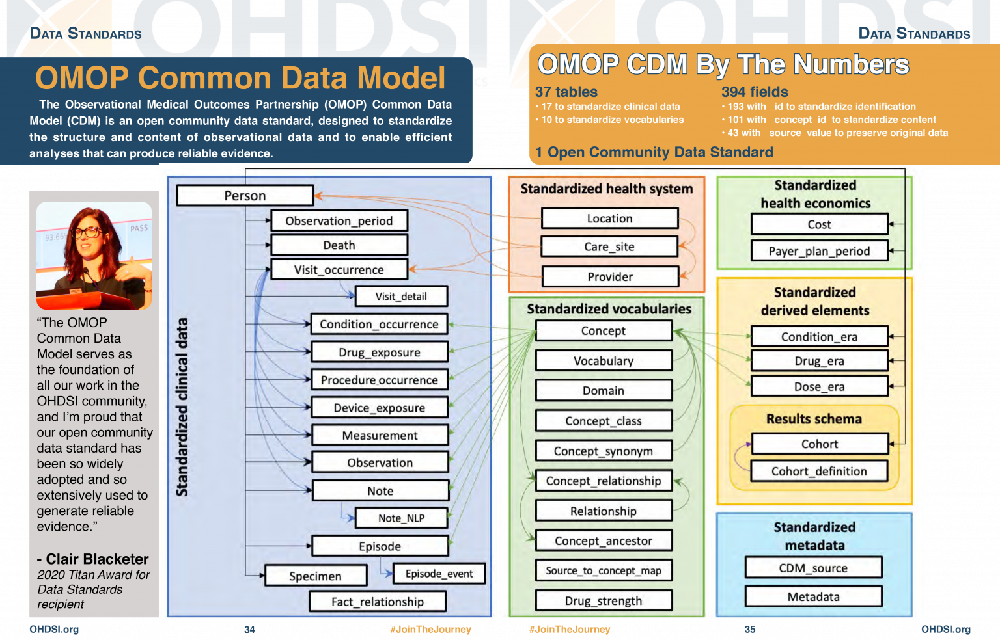

:::::::::::::::::::::::::::::::::::::: questions 

- What is OMOP?
- What information would you expect to find in the person table?

::::::::::::::::::::::::::::::::::::::::::::::::

::::::::::::::::::::::::::::::::::::: objectives

- Examine the diagram of the OMOP tables and the data specification
- Interrogate the data in the person table

::::::::::::::::::::::::::::::::::::::::::::::::

## Introduction

OMOP is a format for recording Electronic Healthcare Records. It allows you to follow a patient journey through a hospital by linking every aspect to a standard vocabulary thus enabling easy sharing of data between hospitals, trusts and even countries.

### OMOP CDM Diagram

:::::::::::::::::::::::::::::::::::::::::::::::::::::::::::::::::::: instructor

Make sure everyone has R open

::::::::::::::::::::::::::::::::::::::::::::::::::::::::::::::::::::::::::::::::

::::::::::::::::::::::::::::::::::::: challenge 

## Looking at the diagram answer the following:

Which table is the key to all the other tables in the standardized clinical data?

:::::::::::::::::::::::: solution 
The **Person** table
:::::::::::::::::::::::::::::::::

2. Which table it allows you to distinguish between different stays in hospital?

:::::::::::::::::::::::: solution 
The **Visit_occurrence** table
:::::::::::::::::::::::::::::::::
:::::::::::::::::::::::::::::::::::::::::::::::

::::::::::::::::::::::::::::::::::::: challenge 
:::::::::::::::::::::::::::::::::::::::::::::::

::::::::::::::::::::::::::::::::::::: keypoints 

- Use `.md` files for episodes when you want static content
- Use `.Rmd` files for episodes when you need to generate output
- Run `sandpaper::check_lesson()` to identify any issues with your lesson
- Run `sandpaper::build_lesson()` to preview your lesson locally

::::::::::::::::::::::::::::::::::::::::::::::::

[r-markdown]: https://rmarkdown.rstudio.com/
