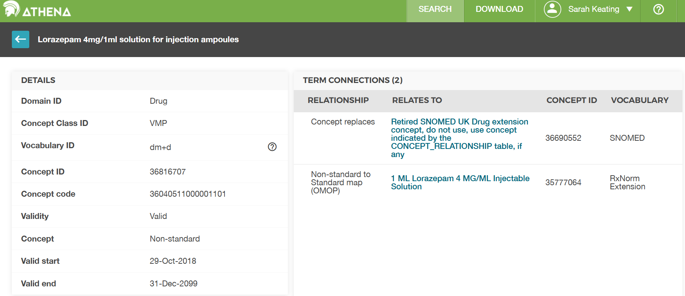

    
:::::::::::::::::::::::::::::::::::::: questions 

- Where are medications stored ?

::::::::::::::::::::::::::::::::::::::::::::::::

::::::::::::::::::::::::::::::::::::: objectives

- Know that exposure of a patient to medications is mainly stored in the drug_exposure table

- Understand that drug concepts can be at different levels of granularity

- Understand that source values are mapped to a standard vocabulary

::::::::::::::::::::::::::::::::::::::::::::::::

## Introduction

This lesson considers medications (the drug exposure table) in the OMOP Common Data Model (CDM).

:::::::::::::::::::::::::::::::::::::::::::::::: callout

For this episode we will be using a sample OMOP CDM database that is pre-loaded with data. This database is a simplified version of a real-world OMOP CDM database and is intended for educational purposes only.

(UCLH only) This will come in the same form as you would get data if you asked for a data extract via the SAFEHR platform (i.e. a set of parquet files).

As part of the setup prior to this course you were asked to download and install the sample database. If you have not done this yet, please refer to the setup instructions provided earlier in the course. For now, we will assume that you have the sample OMOP CDM database available on your local machine at the following path: `workshop/data/public/` and the functions in a folder `workshop/code`.

You will then need to load the database as shown in the previous episode.

```{r, warning = FALSE, message = FALSE}
open_omop_dataset <- function(dir) {
  open_omop_schema <- function(path) {
    # iterate table level folders
    list.dirs(path, recursive = FALSE) |>
      # exclude folder name from path
      # and use it as index for named list
      purrr::set_names(~ basename(.)) |>
      # "lazy-open" list of parquet files
      # from specified folder
      purrr::map(arrow::open_dataset)
  }
  # iterate top-level folders
  list.dirs(dir, recursive = FALSE) |>
    # exclude folder name from path
    # and use it as index for named list
    purrr::set_names(~ basename(.)) |>
    purrr::map(open_omop_schema)
}
```

```{r, warning = FALSE, message = FALSE}
omop <- open_omop_dataset("./data/")
```

and the useful functions we created in the previous episode to look up concept names/ids.

```{r, warning = FALSE, message = FALSE}
library(arrow)
library(dplyr)
get_concept_name <- function(id) {
  omop$public$concept |>
    filter(concept_id == !!id) |>
    select(concept_name) |>
    collect()
}
```

```{r, warning = FALSE, message = FALSE}
get_concept_id <- function(name) {
  omop$public$concept |>
    filter(concept_name == !!name) |>
    select(concept_id) |>
    collect()
}
``` 

::::::::::::::::::::::::::::::::::::::::::::::::


The OMOP [drug_exposure](https://ohdsi.github.io/CommonDataModel/cdm54.html#drug_exposure) table stores exposure of a patient to medications.

The main columns are :

column name           | content
----------------      | ------------
**drug_exposure_id**   | unique identifier given that person can get multiple exposures per visit
**person_id**   |    the patient
**drug_concept_id** |   standard drug identifier, can be at different levels of granularity
**drug_exposure_start_date** |  may also be an optional start_datetime
**drug_exposure_end_date** | may also be an optional end_datetime
**drug_type_concept_id**  | where the record came from e.g. EHR administration record
**drug_source_value**  | in UCLH the NHS dm+d Dictionary of Medicines and Devices ID
**drug_source_concept_id**  | OMOP concept ID for the source value

Drug data can be very complicated, as can the process of converting from the source data to OMOP. You may not find what you expect depending on this and the quality of the source data. 

## Drug concepts

The standard OHDSI drug vocabularies are called `RxNorm` and `RxNormExtension`. `RxNorm` contains all drugs currently on the US market. `RxNormExtension` is maintained by the OHDSI community and contains all other drugs.

A particular concept_id can be at one of a number of different levels in a drug hierarchy. 

::::::::::::::::::::::::::::::::: challenge

List the main levels of drug concepts in RxNorm.

::::::::::::::::::::::::::::::::: solution

```{r, warning = FALSE, message = FALSE}
omop$public$concept |>
  filter(vocabulary_id == "RxNorm") |>
  select(concept_class_id) |>
  collect() |>
  distinct() |>
  arrange(concept_class_id)
```

**CODING_NOTE**: There are more levels than shown here, but that is a disadvantage of using a small sample database. In a full OMOP CDM database you would see more levels.
::::::::::::::::::::::::::::::::::::::::::::::::::
::::::::::::::::::::::::::::::::::::::::::::::::::


| RxNorm concept_class_id                | Description |
|--------------------------------|-------------|
| **Ingredient**                 | A base active drug ingredient, without strength or dose form (e.g., *Ibuprofen*). |
| **Clinical Drug Component**    | A drug component with strength but no form (e.g., *Ibuprofen 200 mg*). |
| **Clinical Drug**              | A combination of an ingredient, strength, and dose form (e.g., *Ibuprofen 200 mg Oral Tablet*). |

## Drug mapping in the NHS

Drugs in the NHS are standardised to the NHS Dictionary of Medicines and Devices (dm+d). dm+d is included in OMOP so there are values of OMOP concept_id for each dm+d. However because dm+d is not a standard vocabulary in OMOP it is translate once more to get to a standard OMOP concept id in `RxNorm` or `RxNormExtension` that can be used in collaborative studies. If there is a drug_concept_id value of 0 and there are source codes this can be because that drug doesn't map to a standard ID. Reminder that the source values are stored in these columns.


column name           | content
----------------      | ------------
**drug_source_value**  | in UCLH the NHS dm+d Dictionary of Medicines and Devices ID
**drug_source_concept_id**  | OMOP concept ID for the source value

::::::::::::::::::::::::::::::::: challenge

Look up the concept for code `36816707` and find the corresponding RxNorm concept id.

::::::::::::::::::::::::::::::::: solution
```{r, warning = FALSE, message = FALSE}
library(dplyr)
# make a copy of the concept table
concepts <- omop$public$concept |> collect()
# look up the concept entry
dmd_concept_1 <- concepts |>
  filter(concept_id == 36816707) |>
  select(concept_id, concept_name, domain_id, vocabulary_id, concept_class_id) |>
  collect()
dmd_concept_1
# this is the dose of lorazepam
# now look up any concepts that have a similar name
similar <- filter(concepts, grepl('Lorazepam', concept_name, TRUE))
similar

```

Answer: We can see from the resulting table that there are entries for each lorazepam dose from both the dm+d and RxNorm vocabularies
::::::::::::::::::::::::::::::::::::::::::::::::::
::::::::::::::::::::::::::::::::::::::::::::::::::

{alt='A snapshot of the Athena table for code 36816707.'}

::::::::::::::::::::::::::::::::::::: keypoints 

- Know that exposure of a patient to medications is mainly stored in the drug_exposure table
- Understand that drug concepts can be at different levels of granularity
- Understand that source values are mapped to a standard vocabulary

::::::::::::::::::::::::::::::::::::::::::::::::


