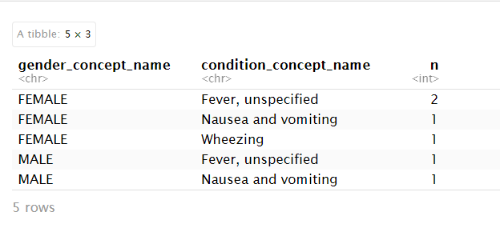

```{r setup, include = FALSE}
source("setup.R")
knitr::opts_chunk$set(fig.height = 6)
```

:::::::::::::::::::::::::::::::::::::: questions 

- What is OMOP?
- What information would you expect to find in the person table?
- What information would you expect to find in the condition_occurrence table?
- How can you join these tables to aggregate information?

::::::::::::::::::::::::::::::::::::::::::::::::

::::::::::::::::::::::::::::::::::::: objectives

- Examine the diagram of the OMOP tables and the data specification
- Interrogate the data in the tables
- Join these tables to find the concept names

::::::::::::::::::::::::::::::::::::::::::::::::
 
## Setting up R

### Getting started

Since we want to import the files called `*.csv` into our R
environment, we need to be able to tell our computer where the file is.
To do this, we will create a "Project" with RStudio that contains the
data we want to work with.
The "Projects" interface in RStudio not only creates a working directory for
you, but also remembers its location (allowing you to quickly navigate to it).
The interface also (optionally) preserves custom settings and open files to
make it easier to resume work after a break.


### Install the required packages

You will need the `dplyr`, `remotes` and `readr` packages from CRAN (the official package repository).
You will also need a package we have developed `omopcept`.
This can be installed with:

remotes::install_github("SAFEHR-data/omopcept")


### Create a new project


::::::::::::::::::::::::::::::::::::: group-tab

### Experienced
Create a new project in your environment.

### Need a reminder


- Under the `File` menu in RStudio, click on `New project`, choose
  `New directory`, then `New project`
- Enter a name for this new folder (or "directory") and choose a convenient
  location for it. This will be your **working directory** for the rest of the
  day (e.g., `~/Desktop/r-omop`).
- Click on `Create project`
- Create a new file where we will type our scripts. Go to File > New File > R
  script. Click the save icon on your toolbar and save your script as
  "`script.R`".
- Make sure you copy the data for the lesson into this folder, if they're
  not there already.
:::::::::::::::::::::::::::::::::::::::::::::::


:::::::::::::::::::::::::::::::::::::::::::::::::::::::::::::::::::: instructor

Make sure everyone 
- has R open 
- has a project
- has managed to download the data

::::::::::::::::::::::::::::::::::::::::::::::::::::::::::::::::::::::::::::::::

## Introduction

OMOP is a format for recording Electronic Healthcare Records. It allows you to follow a patient journey through a hospital by linking every aspect to a standard vocabulary thus enabling easy sharing of data between hospitals, trusts and even countries.

### OMOP CDM Diagram

{alt='A diagram showing the tables that occur in the OMOP-CDM , how they relate to each other and standard vocabularies.'}

OMOP CDM stands for the Observational Medical Outcomes Partnership Common Data Model. You don’t really need to remember what OMOP stands for. Remembering that CDM stands for Common Data Model can help you remember that it is a data standard that can be applied to different data sources to create data in a ‘Common’ (same) format.
The table diagram will look confusing to start with but you can use data in the OMOP CDM without needing to understand (or populate) all 37 tables.

::::::::::::::::::::::::::::::::::::: challenge 

## Test yourself

Look at the OMOP-CDM figure and answer the following questions:

1. Which table is the key to all the other tables?
2. Which table allows you to distinguish between different stays in hospital?

:::::::::::::::::::::::: solution 
1. The **Person** table

2. The **Visit_occurrence** table
:::::::::::::::::::::::::::::::::
:::::::::::::::::::::::::::::::::::::::::::::::

There are a handful of core tables and columns that contain key information about a patient's journey in the hospital. These are 7 tables to get you started :

- [person](https://ohdsi.github.io/CommonDataModel/cdm54.html#person) uniquely identifies each person or patient, and some demographic information. This is the central table that all other tables relate to.
- [condition_occurrence](https://ohdsi.github.io/CommonDataModel/cdm54.html#condition_occurrence) records relating to a Person suggesting the presence of a medical condition.
- [drug_exposure](https://ohdsi.github.io/CommonDataModel/cdm54.html#drug_exposure) records about exposure of a patient to a drug.
- [procedure_occurrence](https://ohdsi.github.io/CommonDataModel/cdm54.html#procedure_occurrence) activities carried out by a healthcare provider on the patient with a diagnostic or therapeutic purpose.
- [measurement](https://ohdsi.github.io/CommonDataModel/cdm54.html#measurement) numerical or categorical values obtained through standardized examination of a Person or Person’s sample.
- [observation](https://ohdsi.github.io/CommonDataModel/cdm54.html#observation) clinical facts about a Person obtained in the context of examination, questioning or a procedure.
- [visit_occurrence](https://ohdsi.github.io/CommonDataModel/cdm54.html#visit_occurrence) records of times where Persons engage with the healthcare system.


## Why use OMOP?

{alt='A diagram showing that different sources of data, transformed to OMOP, can then be used by multiple analysis tools.'}

Once a database has been converted to the OMOP CDM, evidence can be generated using standardized analytics tools. This means that different tools can also be shared and reused. So using OMOP can help make your research FAIR.

:::::::::::::::::::::::::::::::::::::::::::::::::::::::::::::::::::: instructor

Check that everyone knows what FAIR stands for

::::::::::::::::::::::::::::::::::::::::::::::::::::::::::::::::::::::::::::::::

## Some simple tables
### Loading Data

Now that we are set up with an Rstudio project, we are sure that the
data and scripts we are using are all in our working directory.
The data files should be located in the directory `data`, inside the working
directory. Now we can load the data into R, there are three data files `person.csv`, `condition_occurrence.csv` and `drug_exposure.csv`. Read each of these into a table with the same name.

::::::::::::::::::::::::::::::::::::: group-tab

### Experienced

Use the function read.csv() function from the readr package.

### Need a reminder
The expression `read.csv(...)` is a [function call](../learners/reference.md#function-call) that asks R to run the function `read.csv`.

`read.csv` has two [arguments](../learners/reference.md#argument): the name of the file we want to read, and whether the first line of the file contains names for the columns of data.

The filename needs to be a character string (or [string](../learners/reference.md#string) for short), so we put it in quotes. Assigning the second argument, `header`, to be `FALSE` indicates that the data file does not have column headers.  
:::::::::::::::::::::::::::::::::::::::::::::::

::::::::::::::::::::::::::::::::::::: instructor
I have used `read.csv` because using the more up to date package caused issues with types, which I would have gone into if it hadn't then caused issues with joining and I ran out of time
:::::::::::::::::::::::::::::::::::::::::::::::

::::::::::::::::::::::::::::::::::::: challenge 
## Read the Data

There are three data files `person.csv`, `condition_occurrence.csv` and `drug_exposure.csv`. Read each of these into a table with the same name.

NOTE: The data does have headers.

:::::::::::::::::::::::: solution 
```{r, warning = FALSE, message = FALSE}
person <- read.csv(file = "data/person.csv")
condition_occurrence <- read.csv(file = "data/condition_occurrence.csv")
drug_exposure <- read.csv(file = "data/drug_exposure.csv")
```
::::::::::::::::::::::::::::::::
:::::::::::::::::::::::::::::::::::::::::::::::

When you have read in the data, take some time to explore it.


## Adding concept names

You will have noticed that content of the tables are not terribly easy to understand. This is because everything in OMOP is viewed as a concept that allows it to be related to one or more standard vocabularies such as SNOMED, ICD-10, etc.

We have developed a package that makes it very easy to add concept names to the tables. 

You will need the function omopcept::omop_join_name_all(). This will look up the concept_id in the main table of concepts and add a column for the name of the concept associated with that id.


::::::::::::::::::::::::::::::::::::: challenge 

## Who's who?

By creating tables that also have the name of the concepts answer the following questions 

1. How old is the black gentleman?
2. In which month was an unspecified fever prevalent in the hospital?
3. What was the ethnicity of the patient not affected by this fever?
4. Give a description of the patient who received Amoxicillin because they were wheezing?

:::::::::::::::::::::::: hint 
```{r}
library(omopcept)
person_named <- person |> omop_join_name_all()
condition_occurrence_named <- condition_occurrence |> omop_join_name_all()
drug_exposure_named <- drug_exposure |> omop_join_name_all()
```
::::::::::::::::::::::::::::::::
:::::::::::::::::::::::: solution 

1. 25 (or 24 if he hasn't had his birthday this year)
2. July
3. Don't know - it hasn't been specified
4. A 53/54 white female
::::::::::::::::::::::::::::::::

:::::::::::::::::::::::::::::::::::::::::::::::


## Joining and interrogating the tables

### Using `join`

We established when looking at the diagram that the person table was the key to accessing all the other tables. In fact it is the person_id column that is the actual key that will allow us to join with other tables.

So we can join two of the tables together to get information about the different conditions suffered by each person.


I am going to use a left join because I want a record of every person and the conditions they may have.

```{r, warning = FALSE, message = FALSE}
library(dplyr)
person_condition <- 
  person_named |> 
  left_join(condition_occurrence_named, by = join_by(person_id) )
```
This produces a new table with all the column names from both tables and six rows.

### Using `count`

::::::::::::::::::::::::::::::::::::: group-tab
### Experienced

You know what count is

### Need a reminder

count: Count observations by group

Description
count() lets you quickly count the unique values of one or more variables: 

df |> count(a, b)

df is a common abbreviation for DataFrame in R.

:::::::::::::::::::::::::::::::::::::::::::::::

::::::::::::::::::::::::::::::::::::: challenge 
Count the number of people with each condition

:::::::::::::::::::::::: solution 
```{r, warning = FALSE, message = FALSE}
person_condition |> count(gender_concept_name, condition_concept_name)
```
:::::::::::::::::::::::::::::::::::::::::::::::
:::::::::::::::::::::::::::::::::::::::::::::::

This produces a table:

{alt='A table showing the different conditions listed with the n.umber of males and females suffering from them'}

::::::::::::::::::::::::::::::::::::: tab
### Happy-ish

Solve the questions in Who's who programmatically.

### Confident

The CDMConnector package allows connection to an OMOP Common Data Model in a database it also contains synthetic example data that can be used to demonstrate querying the data

```{r, warning = FALSE, message = FALSE}
library(CDMConnector)
```

A set of synthetic example data is called Eunomia and one example called GiBleed contains 2,600 patients representing a gastrointestinal bleeding study

Download these data
```{r, warning = FALSE, message = FALSE}
dbName <- "GiBleed"
CDMConnector::requireEunomia(datasetName = dbName)
```

We can use the DBI & duckdb packages to connect to this local database
```{r, warning = FALSE, message = FALSE}
db <- DBI::dbConnect(duckdb::duckdb(), dbdir = CDMConnector::eunomiaDir(datasetName = dbName))
```

Databases are organised into structures called schemas usually in an omop database we would have two schemas
1. cdm schema : containing the Common Data Model tables that have read-only access
2. write schema : a place where tables can be written

The Eunomia example data just has a single schema (called main) that we can use for both.

This is how we make a CDM reference from the database connection we made above.
```{r, warning = FALSE, message = FALSE}
cdm <- CDMConnector::cdmFromCon(con = db, cdmSchema = "main", writeSchema = "main") 
```

The data themselves are not actually read into the created cdm object.
Rather it is a reference that allows us to query the data from the database.

Typing `cdm` will give a summary of the tables in the database 
```{r, warning = FALSE, message = FALSE}
cdm
```

You may recognise table names from the simple examples. earlier
e.g. `person`, `condition_occurrence` and `drug_exposure`

You can get a glimpse of the data in each table with cdm$table_name e.g.
```{r, warning = FALSE, message = FALSE}
cdm$person
cdm$condition_occurrence
```

The names of the columns in each table can be seen with `colnames()`
```{r, warning = FALSE, message = FALSE}
colnames(cdm$condition_occurrence)
```

If you are familiar with commands from the dplyr and tidyverse packages these can be used on the cdm reference
```{r, warning = FALSE, message = FALSE}
library(dplyr)
```

For example this code counts the number of records per condition. 
Using collect() at the end performs the final database query and brings the data into R.
```{r, warning = FALSE, message = FALSE}
cdm$condition_occurrence |> 
  count(condition_concept_id, sort=TRUE) |> 
  collect() 
```

The command above gives us a list of concept ids. To get the names of the conditions you can use the omopcept package as before.

```{r}
cdm$condition_occurrence |> 
  count(condition_concept_id, sort=TRUE) |> 
  collect() |> 
  omop_join_name_all()
```

Alternatively using CDMConnector also gives us access to a table called `concept` that can be used to join on the concept names. 
NOTE: Because of the way `join` works, it is easier to `arrange` the table after it is collected.
```{r, warning = FALSE, message = FALSE}
cdm$condition_occurrence |> 
  count(condition_concept_id) |> 
  left_join(select(cdm$concept, concept_id, concept_name),
                   by = join_by(condition_concept_id == concept_id)) |>
  collect() |> 
  arrange(desc(n))
```
:::::::::::::::::::::::::::::::::::::::::::::::


::::::::::::::::::::::::::::::::::::: challenge 

## For the Confident
Using the "GiBleed" database work out the number of male and female patients with each condition_concept_id

:::::::::::::::::::::::: solution
```{r}
cdm$person |> 
  left_join( cdm$condition_occurrence, by = join_by(person_id) ) |> 
  group_by(condition_concept_id, gender_concept_id) |>
  summarise(num_persons = n_distinct(person_id)) |>
  collect() |>
  ungroup() |> 
  omopcept::omop_join_name_all() |> 
  #remove some columns to make display clearer
  select(-condition_concept_id, -gender_concept_id) |> 
  arrange(condition_concept_name)  
```
:::::::::::::::::::::::::::::::::::::::::::::::
:::::::::::::::::::::::::::::::::::::::::::::::
Solutions for working out Who's who programmatically.

::::::::::::::::::::::::::::::::::::: challenge
# How old is the black gentleman? 

:::::::::::::::::::::::: solution 

```{r}
library(dplyr)

year_of_birth <- person_named %>%
  filter(grepl("black", race_concept_name, ignore.case = TRUE)) %>%
  select(year_of_birth)

person_age <- year_of_birth$year_of_birth[1]  
age = 2025 - person_age

print(age)
```
:::::::::::::::::::::::::::::::::::::::::::::::
:::::::::::::::::::::::::::::::::::::::::::::::

::::::::::::::::::::::::::::::::::::: challenge 
# In which month was an unspecified fever prevalent in the hospital?
::::::::::::::::::::::::::::::::::: hint
The lubridate package has a function
```{r}
library(lubridate)
 month = month(ymd("2025-01-30"), label = TRUE)
 print(month)
```
which returns month = Jan
:::::::::::::::::::::::::::::::::::::::::::::
::::::::::::::::::::::::::::::::::: hint
The dyplr  package has a function that will allow you to add columns to a table
```{r}
 new_person_table = mutate(person, age = 2025-year_of_birth)
 print(new_person_table)
```
which adds a column called age to the person table
:::::::::::::::::::::::::::::::::::::::::::::
:::::::::::::::::::::::: solution 
```{r}
library(dplyr)
library(lubridate)

fever_months <- condition_occurrence_named %>%
  # Filter for rows where the condition name contains "fever"
  filter(grepl("fever", condition_concept_name, ignore.case = TRUE)) %>%
  # Extract month from the condition_start_date
  mutate(month = month(condition_start_date, label = TRUE)) %>%
  # Select just the month column for the results
  select(month) %>%
  # Count occurrences by month
  group_by(month) %>%
  summarise(count = n()) %>%
  # Sort by count (descending)
  arrange(desc(count))

# This gives us a table with the months where people had a fever and how many people had the fever each month. The question tells us that there is only one month so we select that.
fever <- fever_months$month[1]

# View the results
print(fever)

```
:::::::::::::::::::::::::::::::::::::::::::::::
::::::::::::::::::::::::::::::::::: 

::::::::::::::::::::::::::::::::::::: challenge
# What was the ethnicity of the patient not affected by this fever?

:::::::::::::::::::::::: solution 

```{r}
library(dplyr)

people_without_condition <- person_named %>%
  # we want to join with the people who do not meet the condition
  anti_join(condition_occurrence_named %>%
    filter(grepl("fever", condition_concept_name, ignore.case = TRUE)),           
    by = "person_id") 
  
  ethnicity <- people_without_condition$race_concept_name 

# View results
print(ethnicity)
```
:::::::::::::::::::::::::::::::::::::::::::::::
:::::::::::::::::::::::::::::::::::::::::::::::

::::::::::::::::::::::::::::::::::::: challenge
# Give a description of the patient who received Amoxicillin because they were wheezing?

:::::::::::::::::::::::: solution 

```{r}
library(dplyr)

# Query to find persons prescribed amoxicillin for wheezing
amoxicillin_for_wheezing <- person_named %>%
  # Join with condition_occurrence table 
  inner_join(condition_occurrence_named, by = "person_id") %>%
  # Filter for wheezing condition
  filter(grepl("wheez", condition_concept_name, ignore.case = TRUE)) %>%
  # Join with drug_exposure table to find medications
  inner_join(drug_exposure_named, by = "person_id") %>%
  # Filter for amoxicillin prescriptions
  filter(grepl("amoxicillin", drug_concept_name, ignore.case = TRUE)) 
  
  # again the question implies there is only one person
  age <- 2025-amoxicillin_for_wheezing$year_of_birth[1]
  gender <- amoxicillin_for_wheezing$gender_concept_name[1]
  ethnicity <- amoxicillin_for_wheezing$race_concept_name[1]

# View results
print(age)
print(gender)
print(ethnicity)
```
:::::::::::::::::::::::::::::::::::::::::::::::
:::::::::::::::::::::::::::::::::::::::::::::::


::::::::::::::::::::::::::::::::::::: keypoints 

- Using a standard makes it much easier to share data
- OMOP uses concepts to link dated to standard vocabularies
- R can be used to join and interrogate data

::::::::::::::::::::::::::::::::::::::::::::::::
