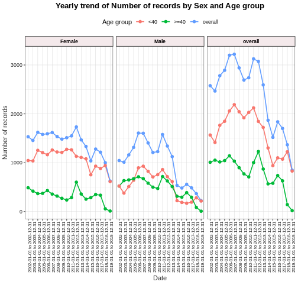

:::::::::::::::::::::::::::::::::::::: questions 

- What are some of the R tools that can work on OMOP CDM instances ?

::::::::::::::::::::::::::::::::::::::::::::::::

::::::::::::::::::::::::::::::::::::: objectives

- Brief outline of some R tools that will be useful for new OMOP users.
- Use Athena and other OHDSI tools for reference
- Describe the full landscape of OMOP tools and the community

::::::::::::::::::::::::::::::::::::::::::::::::


## Introduction

There are a range of community provided R tools that can help you work with instances of OMOP data.

We are going to show you a brief summary of some that are likely to be of use to new users.

With each you may need to balance the need to learn some new syntax with the benefits of the extra functionality that the package provides.


TODO maybe add a table with links to packages & brief descriptions.

* [OmopSketch](https://ohdsi.github.io/OmopSketch/index.html)
To summarise an OMOP database.

* [CodelistGenerator](https://darwin-eu.github.io/CodelistGenerator/)
To generate lists of OMOP concepts.


[OmopSketch](https://ohdsi.github.io/OmopSketch/index.html)
To summarise key information about an OMOP database.
To provide a broad characterisation of the data and to allow users to evaluate whether they are suitable for particular research.


  
First we can install the package and its dependencies and connect to some mock data.


``` r
#without dependencies=TRUE it failed needing omock & VisOmopResults
#with dependencies it installed 91 packages in 1.8 minutes
install.packages("OmopSketch", dependencies=TRUE, quiet=TRUE)

library(dplyr)
library(OmopSketch)

# Connect to mock database
cdm <- mockOmopSketch()
```

#### summarise* and table* functions

The package has the following types of functions :

function start | what it does
------------ | --------------------
summarise*   | generate results objects.
table*       | convert results objects to tables for display.

### Snapshot

Snapshot creates a broad summary of the database including person count, temporal extent and other metadata.


``` r
summariseOmopSnapshot(cdm) |>
  tableOmopSnapshot(type = "gt")
```

``` error
Error in loadNamespace(j <- i[[1L]], c(lib.loc, .libPaths()), versionCheck = vI[[j]]): namespace 'xfun' 0.53 is already loaded, but >= 0.54 is required
```

### Missing data

Summarise missing data in each column of one or many cdm tables.


``` r
missingData <- summariseMissingData(cdm, c("drug_exposure"))
tableMissingData(missingData)
```

``` error
Error in loadNamespace(j <- i[[1L]], c(lib.loc, .libPaths()), versionCheck = vI[[j]]): namespace 'xfun' 0.53 is already loaded, but >= 0.54 is required
```

### Clinical Records

Allows you to summarise omop tables from a cdm. By default it gives measures including records per person, how many concepts are standard and source vocabularies.


``` r
summariseClinicalRecords(cdm, "condition_occurrence") |>
  tableClinicalRecords(type = "gt")
```

``` error
Error in loadNamespace(j <- i[[1L]], c(lib.loc, .libPaths()), versionCheck = vI[[j]]): namespace 'xfun' 0.53 is already loaded, but >= 0.54 is required
```


You can also 

* apply to more than one table at a time
* reduce the measures of records per person
* reduce the number of rows by setting options to FALSE
* stratify by sex and/or age
* set a date range


``` r
summariseClinicalRecords(cdm, c("drug_exposure","measurement"),
                         recordsPerPerson = c("mean", "sd"),
                         inObservation = FALSE,
                         standardConcept = FALSE,
                         sourceVocabulary = FALSE,
                         domainId = FALSE,
                         typeConcept = FALSE,
                         sex = TRUE) |> 
                     tableClinicalRecords(type = "gt")
```

``` error
Error in loadNamespace(j <- i[[1L]], c(lib.loc, .libPaths()), versionCheck = vI[[j]]): namespace 'xfun' 0.53 is already loaded, but >= 0.54 is required
```

### Record counts over time

You can plot the number of records over time for any cdm table also stratified by age and sex (so behind the scenes this will be joining clinical tables to the person table).


``` r
recordCount <- summariseRecordCount(cdm, 
                                    omopTableName =  "drug_exposure",
                                    interval = "years",
                                    sex = TRUE,
                                    ageGroup =  list("<40" = c(0,39), ">=40" = c(40, Inf)),
                                    dateRange = as.Date(c("2002-01-01", NA))) 

plotRecordCount(recordCount, facet = "sex", colour = "age_group")
```



### Concept Id counts

You can get a summary of the numbers of concept ids in a cdm table. Unfortuntaely the summary doesn't display here but you can copy and paste the code into your console to see it.


``` r
result <- summariseConceptIdCounts(cdm = cdm, omopTableName = "condition_occurrence")
tableConceptIdCounts(head(result,5), display = "standard", type = "datatable")
```

<!--html_preserve--><div class="datatables html-widget html-fill-item" id="htmlwidget-694287d41210ea7f6b1c" style="width:100%;height:auto;"></div>
<script type="application/json" data-for="htmlwidget-694287d41210ea7f6b1c">{"x":{"filter":"bottom","vertical":false,"filterHTML":"<tr>\n  <td data-type=\"factor\" style=\"vertical-align: top;\">\n    <div class=\"form-group has-feedback\" style=\"margin-bottom: auto;\">\n      <input type=\"search\" placeholder=\"All\" class=\"form-control\" style=\"width: 100%;\" disabled=\"\"/>\n      <span class=\"glyphicon glyphicon-remove-circle form-control-feedback\"><\/span>\n    <\/div>\n    <div style=\"width: 100%; display: none;\">\n      <select multiple=\"multiple\" style=\"width: 100%;\" data-options=\"[&quot;condition_occurrence&quot;]\"><\/select>\n    <\/div>\n  <\/td>\n  <td data-type=\"character\" style=\"vertical-align: top;\">\n    <div class=\"form-group has-feedback\" style=\"margin-bottom: auto;\">\n      <input type=\"search\" placeholder=\"All\" class=\"form-control\" style=\"width: 100%;\"/>\n      <span class=\"glyphicon glyphicon-remove-circle form-control-feedback\"><\/span>\n    <\/div>\n  <\/td>\n  <td data-type=\"character\" style=\"vertical-align: top;\">\n    <div class=\"form-group has-feedback\" style=\"margin-bottom: auto;\">\n      <input type=\"search\" placeholder=\"All\" class=\"form-control\" style=\"width: 100%;\"/>\n      <span class=\"glyphicon glyphicon-remove-circle form-control-feedback\"><\/span>\n    <\/div>\n  <\/td>\n  <td data-type=\"number\" style=\"vertical-align: top;\">\n    <div class=\"form-group has-feedback\" style=\"margin-bottom: auto;\">\n      <input type=\"search\" placeholder=\"All\" class=\"form-control\" style=\"width: 100%;\" disabled=\"\"/>\n      <span class=\"glyphicon glyphicon-remove-circle form-control-feedback\"><\/span>\n    <\/div>\n    <div style=\"display: none;position: absolute;width: 200px;opacity: 1\">\n      <div data-min=\"0\" data-max=\"1\"><\/div>\n      <span style=\"float: left;\"><\/span>\n      <span style=\"float: right;\"><\/span>\n    <\/div>\n  <\/td>\n<\/tr>","class":"display","extensions":["FixedColumns","FixedHeader","Responsive","RowGroup","Scroller"],"data":[["condition_occurrence","condition_occurrence","condition_occurrence","condition_occurrence","condition_occurrence"],["Acute bacterial sinusitis","Angiodysplasia of stomach","Childhood asthma","Escherichia coli urinary tract infection","Sinusitis"],["4294548","4310024","4051466","4116491","4283893"],[100,100,100,100,100]],"container":"<table class='display'>\n<thead>\n<tr><th rowspan='2' style='text-align:center;'> <\/th><th rowspan='2' style='text-align:center;'>Standard concept name<\/th><th rowspan='2' style='text-align:center;'>Standard concept id<\/th><th style='text-align:center;'>mockOmopSketch<\/th><\/tr>\n<tr><th style='text-align:center;'>N records<\/th><\/tr>\n<\/thead>\n<\/table>","options":{"scrollX":true,"scrollY":400,"scrollCollapse":true,"pageLength":10,"lengthMenu":[5,10,20,50,100],"searchHighlight":true,"scroller":true,"deferRender":true,"fixedColumns":{"leftColumns":0,"rightColumns":0},"fixedHeader":true,"rowGroup":{"dataSrc":0},"columnDefs":[{"className":"dt-right","targets":3},{"orderable":false,"targets":0},{"name":" ","targets":0},{"name":"Standard concept name","targets":1},{"name":"Standard concept id","targets":2},{"name":"mockOmopSketch\nN records","targets":3}],"order":[],"autoWidth":false,"orderClasses":false,"responsive":true}},"evals":[],"jsHooks":[]}</script><!--/html_preserve-->


::::::::::::::::::::::::::::::::::::: keypoints 

- Brief outline of some R tools that will be useful for new OMOP users.

::::::::::::::::::::::::::::::::::::::::::::::::

[r-markdown]: https://rmarkdown.rstudio.com/
