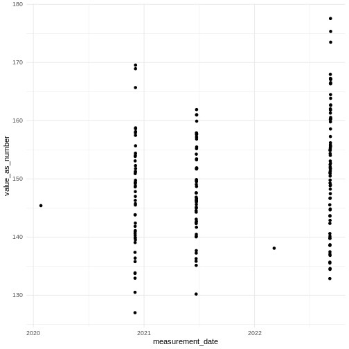
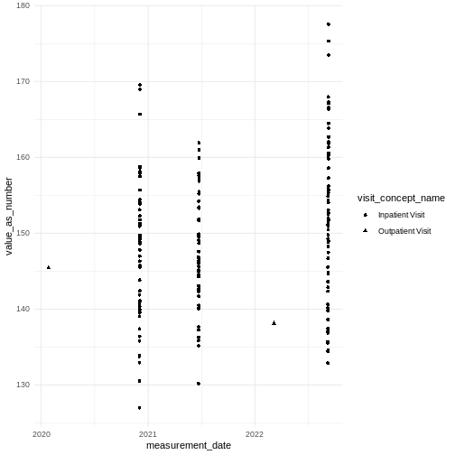
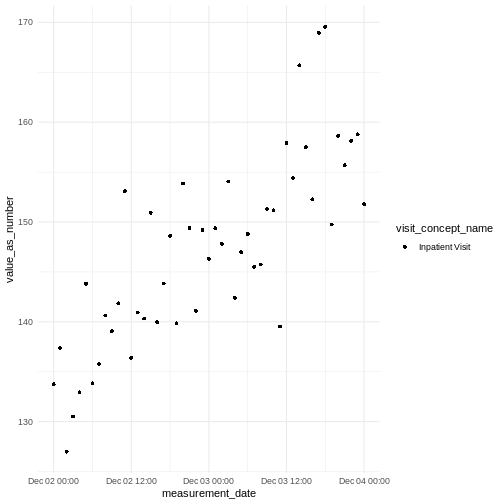

:::::::::::::::::::::::::::::::::::::: questions 

- What are visits and how can they be used ?

::::::::::::::::::::::::::::::::::::::::::::::::

::::::::::::::::::::::::::::::::::::: objectives

- Know that a visit is a period of time and patients can have multiple visits
- Understand that multiple measurements, conditions etc. can occur within and between visits
- Understand that for some analyses you will want to look within visits and for other analyses to sum across visits 
- Know that visits are recorded in the visit_occurrence table
- Know each visit is unique to a person
- Understand that other tables link to visits
- Understand how visits can be used to find co-occurrence of other events

::::::::::::::::::::::::::::::::::::::::::::::::

## Introduction

TODO not sure if this wants to be in a separate episode or a more general one about linking tables. It could always be renamed later.

The `visit_occurrence` table contains [events where Persons engage with the healthcare system for a duration of time](https://ohdsi.github.io/CommonDataModel/cdm54.html#visit_occurrence).


The main clinical tables `condition_occurrence`, `measurement`, `observation` and `drug_exposure` contain a `visit_occurrence_id` that links to this table.


`visit_concept_id` specifies the kind of visit that took place using standardised OMOP concepts. These include `Inpatient visit`, `Emergency Room Visit` and `Outpatient Visit`. Inpatient visits can last for longer than one day.    

The `visit_detail` table can contain information about time periods shorter than the visit (for example transfer between wards) but we will not cover that further here.

## Generating some example data

Firstly here is some code (from ChatGPT) to create some interesting example data.
TODO this code is lengthy, we may later want to hide it or save the output as .Rdata in the repo


``` r
#person, visit_occurrence, measurement, drug_exposure, condition_occurrence, and concept tables
#realistic blood pressure trends over time
#conditions and drugs co-occurring within visits
#concept table for joining concept names

# Install and load required packages
#install.packages(c("dplyr", "tibble", "lubridate", "uuid"), dependencies = TRUE)

library(dplyr)
library(tibble)
library(lubridate)
library(uuid)
library(tidyr)

set.seed(123)

# 1. Create 100 synthetic patients
n_patients <- 100

person <- tibble(
  person_id = 1:n_patients,
  gender_concept_id = sample(c(8507, 8532), n_patients, replace = TRUE),  # Male / Female
  year_of_birth = sample(1940:2000, n_patients, replace = TRUE)
)

# 2. Create multiple visits per patient
visits_per_person <- sample(2:5, n_patients, replace = TRUE)

visit_occurrence <- tibble(
  person_id = rep(person$person_id, times = visits_per_person)
) |>
  mutate(
    visit_occurrence_id = row_number(),
    visit_start_date = as_date("2020-01-01") + sample(0:1000, n(), replace = TRUE),
    visit_concept_id = sample(c(9201, 9202, 9203), n(), replace = TRUE),  # Inpatient, ER, Outpatient
    #ER & outpatient just a day
    visit_end_date = if_else( visit_concept_id == 9201,
                              visit_start_date + sample(1:3, n(), replace = TRUE),
                              visit_start_date),
  )

# Baseline + slope per patient in one tibble
bp_params <- tibble(
  person_id = 1:n_patients,
  bp_slope = rnorm(n_patients, mean = 0, sd = 0.3),   # mmHg per hour
  systolic_base = rnorm(n_patients, mean = 120, sd = 10)
)

measurement <- visit_occurrence |>
  left_join(bp_params, by = "person_id") |>
  rowwise() |>
  mutate(
    n_hours = as.numeric(interval(visit_start_date, visit_end_date) / hours(1)),
    hours_seq = list(visit_start_date + hours(0:n_hours))
  ) |>
  ungroup() |>
  select(person_id, visit_occurrence_id, bp_slope,
         systolic_base, visit_start_date, hours_seq) |>
  unnest(hours_seq) |>
  mutate(
    hours_since_start = as.numeric(difftime(hours_seq, visit_start_date, units = "hours")),
    systolic = systolic_base +
               (hours_since_start * bp_slope) +   # per-hour slope
               rnorm(n(), 0, 5),                 # noise
    measurement_id = UUIDgenerate(n = n()),
    measurement_concept_id = 3004249,  # systolic
    unit_concept_id = 8510,            # mmHg
    measurement_date = hours_seq
  ) |>
  select(measurement_id, person_id, visit_occurrence_id,
         measurement_date, measurement_concept_id,
         systolic, unit_concept_id) |>
  rename(value_as_number = systolic)


# 6. Define condition-drug co-occurrence map
condition_drug_map <- tribble(
  ~condition_concept_id, ~condition_name,            ~drug_concept_id, ~drug_name,
  201826,                "Type 2 diabetes mellitus",  1124300,          "Metformin",
  320128,                "Essential hypertension",    1112807,          "Lisinopril",
  319835,                "Hyperlipidemia",            19019073,         "Atorvastatin"
)

# 7. Generate conditions per visit
condition_occurrence <- visit_occurrence |>
  rowwise() |>
  do({
    #n_conditions <- sample(1:2, 1)
    #change n_conditions to 1 so that co-occurrence example works
    n_conditions <- 1
    selected_conditions <- condition_drug_map |>
      slice_sample(n = n_conditions)

    tibble(
      condition_occurrence_id = UUIDgenerate(n_conditions),
      person_id = .$person_id,
      visit_occurrence_id = .$visit_occurrence_id,
      condition_concept_id = selected_conditions$condition_concept_id,
      condition_start_date = .$visit_start_date
    )
  }) |>
  bind_rows()

# 8. Generate drug exposures that match conditions
drug_exposure <- condition_occurrence |>
  left_join(condition_drug_map, by = "condition_concept_id") |>
  group_by(person_id, visit_occurrence_id, drug_concept_id) |>
  summarise(
    drug_exposure_id = UUIDgenerate(1),
    drug_exposure_start_date = min(condition_start_date),
    .groups = "drop"
  ) |>
  mutate(days_supply = sample(30:90, n(), replace = TRUE))

# 9. Build concept table (with all used concepts)
concept <- tribble(
  ~concept_id, ~concept_name,
  3004249, "Systolic Blood Pressure",
  3012888, "Diastolic Blood Pressure",
  3027114, "Glucose",
  3016502, "Creatinine",
  1124300, "Metformin",
  1112807, "Lisinopril",
  19019073, "Atorvastatin",
  201826, "Type 2 diabetes mellitus",
  320128, "Essential hypertension",
  319835, "Hyperlipidemia",
  8510, "mm[Hg]",
  8713, "mg/dL",
  8840, "mmol/L",
  9201, "Inpatient Visit",
  9202, "Emergency Room Visit",
  9203, "Outpatient Visit",
  8507, "Male",
  8532, "Female"
)

# 10. Combine into synthetic CDM object
cdm <- list(
  person = person,
  visit_occurrence = visit_occurrence,
  measurement = measurement,
  condition_occurrence = condition_occurrence,
  drug_exposure = drug_exposure,
  concept = concept
)
```

## When do we need to consider visits ?

As we have seen we don't need to consider visits to answer all questions. For example if we can count the number of patients with a particular condition without considering visits.

Using visits can help us with :

1. different types of visits
1. selecting data from an indivual or selected visits
1. finding co-occurrence of events within a visit

We can query the `visit_occurrence` table to see what kinds of visits there are in the data.


``` r
library(dplyr)

cdm$visit_occurrence |> 
  count(visit_concept_id) |> 
  left_join(cdm$concept |> select(concept_id, concept_name), 
            by = c("visit_concept_id" = "concept_id"))
```

``` output
# A tibble: 3 × 3
  visit_concept_id     n concept_name        
             <dbl> <int> <chr>               
1             9201   105 Inpatient Visit     
2             9202   105 Emergency Room Visit
3             9203   125 Outpatient Visit    
```

``` r
cdm$visit_occurrence
```

``` output
# A tibble: 335 × 5
   person_id visit_occurrence_id visit_start_date visit_concept_id
       <int>               <int> <date>                      <dbl>
 1         1                   1 2020-12-02                   9201
 2         1                   2 2022-03-07                   9203
 3         1                   3 2020-01-26                   9203
 4         1                   4 2021-06-22                   9201
 5         1                   5 2022-09-07                   9201
 6         2                   6 2021-06-02                   9203
 7         2                   7 2022-08-13                   9203
 8         2                   8 2022-01-26                   9202
 9         2                   9 2021-10-27                   9202
10         2                  10 2021-07-06                   9203
# ℹ 325 more rows
# ℹ 1 more variable: visit_end_date <date>
```


Can you use `person_id` in the `visit_occurrence` table to find patients with more than one visit ?


``` r
visit_counts <- cdm$visit_occurrence |>
  group_by(person_id) |>
  summarise(n_visits = n()) |>
  filter(n_visits > 1) |>
  collect()

visit_counts |> head(4)
```

``` output
# A tibble: 4 × 2
  person_id n_visits
      <int>    <int>
1         1        5
2         2        5
3         3        3
4         4        4
```

Now we can choose one of the patients from the previous table and look at all of their visits.


``` r
example_person_id <- visit_counts$person_id[1]

patient_visits <- cdm$visit_occurrence |>
  filter(person_id == example_person_id) |>
  left_join(cdm$concept, by = c("visit_concept_id" = "concept_id")) |>
  select(
    visit_occurrence_id, visit_start_date, visit_end_date, concept_name
  ) |>
  arrange(visit_start_date) |>
  collect()

patient_visits
```

``` output
# A tibble: 5 × 4
  visit_occurrence_id visit_start_date visit_end_date concept_name    
                <int> <date>           <date>         <chr>           
1                   3 2020-01-26       2020-01-26     Outpatient Visit
2                   1 2020-12-02       2020-12-04     Inpatient Visit 
3                   4 2021-06-22       2021-06-24     Inpatient Visit 
4                   2 2022-03-07       2022-03-07     Outpatient Visit
5                   5 2022-09-07       2022-09-10     Inpatient Visit 
```

Outpatient and Emergency Room Visits usually end on the same day, where Inpatient visits can last longer.

Here is how we can plot a measurement (in this case blood pressure) over time for a patient. You may remember from a previous lesson that numeric measurements are stored in the column `value_as_number`.

First we filter the data.


``` r
# Define concept IDs
systolic_id <- 3004249
selected_patient <- 1

bp <- cdm$measurement |> 
  filter(person_id == selected_patient) |> 
  filter(measurement_concept_id %in% c(systolic_id))

head(bp,3)
```

``` output
# A tibble: 3 × 7
  measurement_id               person_id visit_occurrence_id measurement_date   
  <chr>                            <int>               <int> <dttm>             
1 abdf57e4-3952-45dc-ac8f-1ea…         1                   1 2020-12-02 00:00:00
2 1df7d854-f943-4536-afb8-cc7…         1                   1 2020-12-02 01:00:00
3 f1ddb03b-70d5-4c52-a428-cda…         1                   1 2020-12-02 02:00:00
# ℹ 3 more variables: measurement_concept_id <dbl>, value_as_number <dbl>,
#   unit_concept_id <dbl>
```

Then we can plot using ggplot2.


``` r
library(ggplot2)

ggplot(bp, aes(x = measurement_date, 
               y = value_as_number)) +
  geom_point() +
  theme_minimal()
```

<div class="figure" style="text-align: center">

<p class="caption">plot of blood pressure measurements for all visits</p>
</div>

You should be able to see some dates with single measurements and some with a few measurements very close to each other. Each separate group is a single visit.


::::::::::::::::::::::::::::::::::::: challenge 

Can you modify the query and plot to show the type of visit ?

::::::::::::::::::::::::hint
You can join to visit_occurrence to get visit_concept_id, and from that join to the concept table to get concept_name. You can add `shape =` to the aes() statement in the plot. 
::::::::::::::::::::::::::::

:::::::::::::::::::::::: solution


``` r
# Define concept IDs
systolic_id <- 3004249
selected_patient <- 1

bp2 <- cdm$measurement |> 
  filter(person_id == selected_patient) |> 
  filter(measurement_concept_id %in% c(systolic_id)) |> 
  left_join(cdm$visit_occurrence, by = c("visit_occurrence_id", "person_id")) |> 
  left_join(cdm$concept, by = join_by(visit_concept_id == concept_id)) |> 
  rename(visit_concept_name = concept_name)

ggplot(bp2, aes(x = measurement_date, y = value_as_number, shape = visit_concept_name)) +
  geom_point() +
  theme_minimal()
```

<div class="figure" style="text-align: center">

<p class="caption">plot of blood pressure measurements for all visits</p>
</div>
To indicate the type of visit we need to join to visit_occurrence to get the visit_concept_id and then join to the concept table to get a name for that concept.

Note that we join the visit_occurrence table to the measurement table using both `("visit_occurrence_id", "person_id")`. If we didn't include both, one of the columns would get duplicated and renamed making it difficult to select later. Se with `person_id` below. 


``` r
  cdm$measurement |> 
     left_join(cdm$visit_occurrence, by = c("visit_occurrence_id")) |> 
     names()
```

``` output
 [1] "measurement_id"         "person_id.x"            "visit_occurrence_id"   
 [4] "measurement_date"       "measurement_concept_id" "value_as_number"       
 [7] "unit_concept_id"        "person_id.y"            "visit_start_date"      
[10] "visit_concept_id"       "visit_end_date"        
```
:::::::::::::::::::::::::::::::::
:::::::::::::::::::::::::::::::::::::::::::::::


::::::::::::::::::::::::::::::::::::: challenge 

Can you plot the measurements for one of the Inpatient visits ?

::::::::::::::::::::::::hint
You can filter bp created in the previous challenge by one of the visit_occurrence_id from the table earlier. 
::::::::::::::::::::::::::::

:::::::::::::::::::::::: solution


``` r
bp3 <- bp2 |> filter( visit_occurrence_id == 1 )

ggplot(bp3, aes(x = measurement_date, y = value_as_number, shape = visit_concept_name)) +
  geom_point() +
  theme_minimal()
```

<div class="figure" style="text-align: center">

<p class="caption">plot of blood pressure measurements for one visit</p>
</div>

You should be able to see hourly blood pressure measurements within a visit.

:::::::::::::::::::::::::::::::::


:::::::::::::::::::::::::::::::::::::::::::::::


Here is an example where the visit can make a difference to an analysis.
Imagine we want to look at which drugs are associated with which conditions for patients.

If we were to join tables by `person_id` as we have seen in previous exercises we could get conditions and drugs that were separated by many years. Instead we can include `visit_occurrence_id` in the join to get co-occurrence of conditions and drugs in the same visit.


``` r
co_occurrence_by_visit <- cdm$condition_occurrence |>
  # Join with drug_exposure on person and visit
  inner_join(cdm$drug_exposure, by = c("person_id", "visit_occurrence_id")) |>
  # Count how often each condition–drug pair co-occurs in a visit
  group_by(condition_concept_id, drug_concept_id) |>
  summarise(co_occurrences = n(), .groups = "drop") |>
  
  # Join to get condition name
  left_join(
    cdm$concept |> select(concept_id, concept_name),
    by = c("condition_concept_id" = "concept_id")
  ) |>
  rename(condition_name = concept_name) |>
  
  # Join to get drug name
  left_join(
    cdm$concept |> select(concept_id, concept_name),
    by = c("drug_concept_id" = "concept_id")
  ) |>
  rename(drug_name = concept_name) |>
  select(condition_name, drug_name, co_occurrences)
  
  co_occurrence_by_visit
```

``` output
# A tibble: 3 × 3
  condition_name           drug_name    co_occurrences
  <chr>                    <chr>                 <int>
1 Type 2 diabetes mellitus Metformin               127
2 Hyperlipidemia           Atorvastatin             95
3 Essential hypertension   Lisinopril              113
```

Here we see a perfect co-occurrence between conditions & expected drugs for treating that condition (because we generated the example data that way). If instead you didn't use the visit_occurrence_id you would see more unexpected associations occurring across widely separated visits for the same patient.


::::::::::::::::::::::::::::::::::::: challenge 

Can you repeat the query without using `visit_occurrence_id` to see what results you get ?

:::::::::::::::::::::::: solution


``` r
co_occurrence <- cdm$condition_occurrence |>
  # Join with drug_exposure on person
  inner_join(cdm$drug_exposure, by = c("person_id")) |>
  # Count how often each condition–drug pair co-occurs
  group_by(condition_concept_id, drug_concept_id) |>
  summarise(co_occurrences = n(), .groups = "drop") |>
  
  # Join to get condition name
  left_join(
    cdm$concept |> select(concept_id, concept_name),
    by = c("condition_concept_id" = "concept_id")
  ) |>
  rename(condition_name = concept_name) |>
  
  # Join to get drug name
  left_join(
    cdm$concept |> select(concept_id, concept_name),
    by = c("drug_concept_id" = "concept_id")
  ) |>
  rename(drug_name = concept_name) |>
  select(condition_name, drug_name, co_occurrences)

co_occurrence
```

``` output
# A tibble: 9 × 3
  condition_name           drug_name    co_occurrences
  <chr>                    <chr>                 <int>
1 Type 2 diabetes mellitus Lisinopril              116
2 Type 2 diabetes mellitus Metformin               257
3 Type 2 diabetes mellitus Atorvastatin            103
4 Hyperlipidemia           Lisinopril               89
5 Hyperlipidemia           Metformin               103
6 Hyperlipidemia           Atorvastatin            179
7 Essential hypertension   Lisinopril              205
8 Essential hypertension   Metformin               116
9 Essential hypertension   Atorvastatin             89
```

Now we see that conditions co-occur with drugs unlikely to be used in their treatment because they came from visits further apart in time.


:::::::::::::::::::::::::::::::::

:::::::::::::::::::::::::::::::::::::::::::::::


::::::::::::::::::::::::::::::::::::: keypoints 

- Know that a visit is a period of time and patients can have multiple visits
- Understand that multiple measurements, conditions etc. can occur within and between visits
- Understand that for some analyses you will want to look within visits and for other analyses to sum across visits 
- Know that visits are recorded in the visit_occurrence table
- Know each visit is unique to a person
- Understand that other tables link to visits
- Understand how visits can be used to find co-occurrence of other events

::::::::::::::::::::::::::::::::::::::::::::::::

[r-markdown]: https://rmarkdown.rstudio.com/
